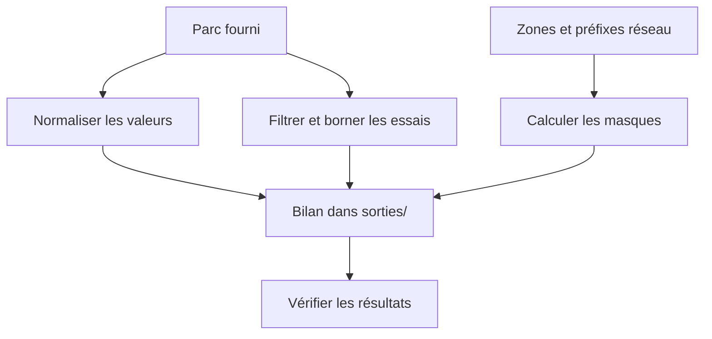

# TP 01 — Qualifier un parc et préparer ses réseaux

[Retour au parcours](../../README.md) — **85 minutes indicatives**, essais et autocorrection compris.

Vous débutez en Python ? Faites d’abord l’[atelier 0](../00/README.md). Si les boucles ou les listes ne sont pas encore
acquises, réalisez ce TP avec accompagnement et prévoyez davantage de temps.

## Ce que vous allez faire

**Ouvrez [depart.py](depart.py) dans votre éditeur : c’est le seul fichier à modifier.**
Il contient trois blocs et **cinq TODO à compléter**. Le reste du traitement est déjà écrit.
Vous travaillez sur un parc fictif de douze machines ; aucun serveur n’est contacté et aucun réseau n’est modifié.
Ce TP fonctionne aussi sur votre ordinateur personnel, sans Linux ni RustDesk.

| Étape | Repère dans `depart.py` | Votre travail | Durée |
| --- | --- | --- | --- |
| 1 | `# === TYPES` | Remplacer une valeur pour convertir « oui/non » en booléen. | 25 min |
| 2 | `# === BOUCLES` | Compléter une condition et ajouter une ligne dans la boucle `while`. | 20 min |
| 3 | `# === MASQUES` | Ajouter les octets du masque et lister les préfixes invalides. | 40 min |

**À conserver :** les imports, les données de [parc.py](parc.py), les repères `# ===`, les calculs déjà fournis
et l’appel final à `terminer(...)`. Vous n’avez pas à réécrire le bilan ni à créer un autre fichier Python.
Dans `parc.py`, commencez la lecture à `PARC = ...` (la liste est annotée `PARC: list[MachineBrute]`) ;
les classes au-dessus décrivent les types des données, elles ne sont pas à compléter.

## Démarrer et se vérifier

Ouvrez un terminal à la racine du projet, le dossier contenant `pyproject.toml`. Si l’environnement n’est pas encore
prêt :

```sh
uv sync --locked
```

Pour chaque étape : modifiez les TODO du bloc, **enregistrez**, puis lancez les deux commandes indiquées.
La première exécute uniquement ce bloc ; la seconde le relance et compare les résultats attendus aux résultats obtenus.
Vous pouvez donc laisser les autres blocs incomplets pendant que vous travaillez.

- `À revoir` : lisez les champs incorrects, corrigez puis relancez. Un code de sortie 1 est normal dans ce cas.
- `Conforme` : l’étape est réussie ; expliquez votre solution avant de passer à la suivante.
- Chaque exécution crée un nouvel essai dans `sorties/`. Le chemin affiché permet de retrouver son `bilan.json`.

Ne recopiez pas les résultats attendus dans le programme : calculez-les à partir des données fournies.
Les exemples « Comprendre » servent à lire la syntaxe ; ne les ajoutez pas à votre script.

## Vue d’ensemble



Les trois blocs sont indépendants : chacun repart de ses données. Les résultats sont rassemblés automatiquement.

<a id="types"></a>

## 1. Convertir l’état des machines — 25 min

**Objectif :** obtenir des booléens `True` et `False` à partir des textes `"oui"` et `"non"`.

### 1A. Modifier le TODO du bloc TYPES

1. Dans `parc.py`, observez une machine active (`"actif": "oui"`) et une inactive (`"actif": "non"`).
2. Revenez dans `depart.py`, au bloc `# === TYPES`.
3. Repérez la ligne `"actif": False,`. Remplacez seulement `False` par une comparaison entre
   `ligne["actif"]` et le texte `"oui"`, avec l’opérateur `==`. Gardez la virgule finale.
4. Enregistrez. Le nettoyage du nom, l’extraction du site, la conversion du port et le calcul du bilan sont déjà
   fournis.

### 1B. Exécuter et vérifier TYPES

```sh
uv run python outils/executer_etape.py tp01 types
uv run python outils/verifier.py tp01 --etape types
```

**Résultat attendu :** douze machines, dont neuf actives. Le contrôle doit afficher `Conforme`.

```json
{
  "machines": 12,
  "premier": "srv-paris-web-01",
  "port_entier": 22,
  "sites": [
    "lyon",
    "paris"
  ],
  "actives": 9
}
```

### 1C. Comprendre la conversion

`ligne` désigne le dictionnaire de la machine courante. `ligne["actif"]` lit son champ d’activité.
Une comparaison avec `==` produit directement un booléen :

```python
reponse = "oui"
accepte = reponse == "oui"  # True
```

`bool("non")` donnerait `True` : toute chaîne non vide est vraie, quel que soit son sens en français.
Le code fourni utilise `{**ligne, ...}` pour créer un nouveau dictionnaire avec les champs de la ligne source,
puis remplacer certains champs. Il conserve les données de `PARC` pour les autres étapes.

<details>
<summary>Voir la ligne corrigée et tester le corrigé</summary>

Remplacez la valeur du champ, à l’intérieur du dictionnaire existant :

```python
"actif": ligne["actif"] == "oui",
```

Le résultat vaut `True` pour « oui », `False` pour « non ». Le compteur d’actives additionne ensuite ces booléens.

```sh
uv run python outils/verifier.py tp01 --etape types --corrige
```

</details>

**Question de compréhension :** pourquoi conserver les données de `PARC` ?

<details>
<summary>Afficher la réponse</summary>

Pour comparer les données reçues aux données transformées et permettre aux autres étapes de repartir du même parc.

</details>

<a id="boucles"></a>

## 2. Filtrer les machines et limiter les essais — 20 min

**Objectif :** sélectionner les machines actives chargées, puis compter des tentatives de connexion simulées.

### 2A. Compléter les deux TODO du bloc BOUCLES

1. Dans le bloc `# === BOUCLES`, repérez `if False:`. Remplacez `False` par deux conditions reliées par `and` :
   le champ `ligne["actif"]` est égal à `"oui"` **et** `ligne["charge"]` est supérieur ou égal à `80`.
   Gardez les deux-points et la ligne `prioritaires.append(...)` déjà indentée sous le `if`.
2. Plus bas, repérez `while essais < 3 and not succes:`. Dans son bloc, **avant** `essais += 1`,
   ajoutez une affectation : `succes` doit recevoir l’élément `reponses[essais]`.
   Utilisez la même indentation que `essais += 1` (huit espaces).
3. Conservez le compteur des inactives, les listes simulées et la construction de `resultat` : tout cela est fourni.
4. Enregistrez. N’ajoutez pas d’appel réseau : `reponses` contient déjà les résultats simulés des connexions.

### 2B. Exécuter et vérifier BOUCLES

```sh
uv run python outils/executer_etape.py tp01 boucles
uv run python outils/verifier.py tp01 --etape boucles
```

**Résultat attendu :** trois machines prioritaires, trois inactives et respectivement deux puis trois tentatives.
Le contrôle doit afficher `Conforme`.

```json
{
  "prioritaires": [
    "srv-lyon-web-07",
    "srv-lyon-dns-10",
    "srv-lyon-db-12"
  ],
  "inactives": 3,
  "tentatives": [
    2,
    3
  ]
}
```

### 2C. Comprendre la boucle while

Contrairement à `for`, `while` répète un bloc **tant qu’une condition est vraie**.
Ici, on continue seulement si on a fait moins de trois essais **et** si aucun succès n’a été obtenu.
La lecture de la réponse doit précéder l’incrément : le premier indice de la liste est 0.

| Réponses simulées | Premier tour | Deuxième tour | Troisième tour | Arrêt |
| --- | --- | --- | --- | --- |
| `[False, True]` | Échec, compteur à 1 | Succès, compteur à 2 | Non exécuté | Succès obtenu |
| `[False, False, False]` | Échec, compteur à 1 | Échec, compteur à 2 | Échec, compteur à 3 | Limite atteinte |

<details>
<summary>Voir les deux modifications et tester le corrigé</summary>

Pour le filtre, remplacez uniquement la ligne `if False:` par :

```python
if ligne["actif"] == "oui" and ligne["charge"] >= 80:
```

Gardez la ligne `append` existante sous ce `if`. Pour les tentatives, le bloc complété devient :

```python
    while essais < 3 and not succes:
        succes = reponses[essais]
        essais += 1
```

Le compteur progresse après chaque réponse. Un succès empêche le tour suivant.

```sh
uv run python outils/verifier.py tp01 --etape boucles --corrige
```

</details>

**Question de compréhension :** avec un seuil de 85, quelles machines resteraient prioritaires ?
Une machine inactive chargée à 90 serait-elle sélectionnée ? Si vous testez, rétablissez 80 avant le contrôle.

<details>
<summary>Afficher la réponse</summary>

`srv-lyon-dns-10` et `srv-lyon-db-12` restent prioritaires. Une inactive reste exclue : les deux conditions doivent être
vraies. Le seuil change la sélection, pas la charge réelle des machines.

</details>

<a id="masques"></a>

## 3. Construire les masques réseau — 40 min

**Objectif :** compléter la conversion de quatre groupes de bits en masque IPv4 et repérer les préfixes invalides.

### 3A. Comprendre le calcul avant de modifier le code

Une adresse IPv4 contient 32 bits. Le préfixe `/24` signifie que les 24 premiers bits du masque valent 1,
et les 8 restants valent 0. Chaque groupe de 8 bits (un octet) devient un nombre entre 0 et 255.

```text
/24 → 11111111 11111111 11111111 00000000 → 255.255.255.0
```

Le script construit déjà la chaîne `bits`. La boucle `for debut in range(0, 32, 8)` donne successivement
les positions 0, 8, 16 et 24. Vous devez convertir le groupe qui commence à chacune de ces positions.

| Expression | Rôle | Exemple |
| --- | --- | --- |
| `bits[debut : debut + 8]` | Lire 8 caractères ; la borne de fin est exclue. | `"11100000"` |
| `int(groupe, 2)` | Interpréter ces caractères comme un nombre binaire. | `224` |
| `str(nombre)` | Revenir au texte pour pouvoir utiliser `join`. | `"224"` |
| `octets.append(texte)` | Ajouter ce texte à la liste des octets. | Un nouvel élément |

### 3B. Compléter les deux TODO du bloc MASQUES

1. Repérez `pass` dans la boucle `for debut in range(0, 32, 8)` du bloc `# === MASQUES`.
   Remplacez-le par `octets.append(...)`, avec la même indentation (huit espaces).
2. À l’intérieur de `append`, combinez les opérations du tableau : extraire `bits[debut : debut + 8]`,
   convertir avec `int(..., 2)`, puis convertir avec `str(...)`.
3. Plus bas, repérez `"prefixes_invalides": None,`. Remplacez seulement `None` par une liste calculée
   à partir de `[-1, 24, 33]`, qui conserve les valeurs inférieures à 0 ou supérieures à 32.
   Utilisez le modèle `[p for p in valeurs if condition]` ; un indice détaillé est disponible ci-dessous.
4. Conservez le calcul `".".join(octets)`, les capacités et les compteurs par site : ils sont déjà écrits.
5. Enregistrez. Ici, vous **listez** les valeurs invalides dans le bilan ; il n’est pas demandé de lever une exception.
   La boucle de calcul des masques utilise seulement les préfixes valides fournis : 24, 27 et 29.

### 3C. Exécuter et vérifier MASQUES

```sh
uv run python outils/executer_etape.py tp01 masques
uv run python outils/verifier.py tp01 --etape masques
```

**Résultat attendu :** chaque masque calculé correspond à la référence affichée. Le contrôle doit afficher `Conforme`.

```json
{
  "masques": [
    "255.255.255.0",
    "255.255.255.224",
    "255.255.255.248"
  ],
  "capacites": [
    254,
    30,
    6
  ],
  "prefixes_invalides": [
    -1,
    33
  ],
  "sites": {
    "lyon": 6,
    "paris": 6
  }
}
```

<details>
<summary>Indice : écrire une liste filtrée</summary>

Une compréhension de liste rassemble une boucle et un filtre dans une expression :

```python
valeurs = [-2, 4, 12]
hors_limites = [n for n in valeurs if n < 0 or n > 10]
# hors_limites contient [-2, 12].
```

Adaptez les valeurs et les limites à votre exercice. Ne recopiez pas directement la liste des résultats attendus.

</details>

<details>
<summary>Voir les deux modifications et tester le corrigé</summary>

À la place de `pass`, en gardant l’indentation de la boucle :

```python
        octets.append(str(int(bits[debut : debut + 8], 2)))
```

Pour la valeur du champ du dictionnaire :

```python
"prefixes_invalides": [p for p in [-1, 24, 33] if p < 0 or p > 32],
```

`or` retient une valeur dès qu’elle est en dehors d’une des deux limites ; 24 n’est donc pas retenu.

```sh
uv run python outils/verifier.py tp01 --etape masques --corrige
```

</details>

### 3D. Interpréter les capacités

Pour les trois réseaux étudiés, le calcul fourni retire deux adresses (réseau et diffusion) au total.
Cette règle ne doit pas être appliquée telle quelle aux préfixes `/31` et `/32`.

**Question de compréhension :** un `/29` suffit-il pour six machines et une passerelle distincte ?

<details>
<summary>Afficher la réponse</summary>

Non : il offre six adresses hôtes utilisables, alors que le besoin est de sept. Il faut prévoir aussi une marge
pour les futures machines avant de choisir la taille du réseau.

</details>

## Terminer le TP

Quand les trois contrôles par étape réussissent, vérifiez votre fichier complet :

```sh
uv run python ateliers/01/depart.py
uv run python outils/verifier.py tp01 --complet
```

**Le TP est terminé quand les trois étapes sont conformes et que vous pouvez expliquer les cinq TODO complétés.**
Les résultats sont dans le dossier d’essai affiché, sans compte rendu supplémentaire à rédiger.

<details>
<summary>En option : enregistrer un rapport de contrôle</summary>

```sh
uv run python outils/verifier.py tp01 --complet --rapport sorties/tp01/controle-complet.json
uv run python -m json.tool sorties/tp01/controle-complet.json
```

Le champ `dossier` indique les productions de l’essai vérifié. Chaque relance crée un nouvel essai.

</details>

Après votre essai, comparez votre code au [corrigé commenté](corrige.py).
[Dépannage](../../docs/depannage.md).
