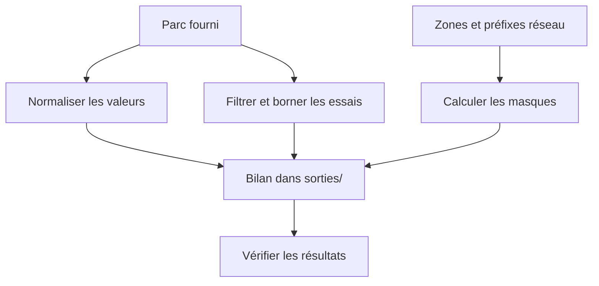

# TP 01 — Qualifier un parc et préparer ses réseaux

[Retour au parcours](../../README.md) — **85 minutes**, essais et autocorrection compris.

## Mission et production

Dimensionner trois zones réseau et présenter la répartition du parc. Le TP se déroule dans le poste Linux de formation ;
les données du parc restent fictives.

## Comprendre le traitement

Les trois branches correspondent aux blocs du script. Elles partent de leurs données de référence ; le bilan rassemble
les résultats.



Les essais de connexion sont simulés et le calcul d’adresses ne sonde aucun réseau.

## Fichiers et démarrage

Les réseaux et adresses du parc sont des données d’exercice. Ils ne désignent pas les postes de travail et ne doivent
pas être sondés sur le réseau.

```sh
uv run python ateliers/01/depart.py
uv run python outils/verifier.py tp01 --complet
```

Les commandes se lancent à la racine du projet dans le terminal Linux. Les valeurs « À compléter » sont normales au
départ. Complétez les repères TODO et conservez les données de référence. Les lectures, les chemins et une partie des
contrôles sont fournis ; le fichier de départ peut déjà produire des sorties incomplètes. Chaque essai produit un
dossier dans sorties/ ; le vérificateur relance votre code.

## Travailler avec les amorces

Les repères `TODO` désignent le travail à compléter. Lire aussi les lignes fournies : leur rôle doit pouvoir être
expliqué. Garder le dernier tiers de chaque créneau pour lancer, lire les résultats et répondre à la question de
transfert. Les corrigés détaillent les décisions et restent dans des fichiers séparés pour comparer votre version.

## Parcours

1. [Normaliser les données du parc](#types) — 25 min.
2. [Prioriser les contrôles](#boucles) — 20 min.
3. [Préparer le plan réseau](#masques) — 40 min.

<a id="types"></a>

## Normaliser les données du parc — 25 min

**Mise en pratique.** Normaliser un export de douze machines pour préparer une intervention.

**À écrire :** La conversion explicite du champ actif dans depart.py ; vérifier les conversions et le bilan fournis.

**Fourni :** PARC dans parc.py et les données sources.

**À observer :** Les types convertis et la source préservée.

1. Dans le terminal Linux, repérer le projet avec pwd et vérifier le nom du poste avec hostname. Ouvrir parc.py dans le
   même environnement. Les données du parc sont fictives, distinctes du poste de travail.
2. Lire PARC fourni dans parc.py : nom avec espaces/majuscules, port texte, actif oui/non et charge entière.
3. Construire une nouvelle liste sans modifier PARC : strip/lower sur le nom, site extrait du nom, port converti en
   entier, actif décodé explicitement.
4. Calculer le nombre de machines, les sites distincts triés et le nombre d’actives. Compléter le bilan à partir des
   valeurs normalisées.
5. Vérifier douze machines et neuf actives ; expliquer pourquoi bool("non") serait une erreur.

La vérification et la question de transfert sont incluses dans ce temps.

Depuis la racine du projet, lancer seulement cette étape, puis contrôler les résultats :

```sh
# 1. Exécuter votre code pour cette étape
uv run python outils/executer_etape.py tp01 types
# 2. Comparer les résultats et les fichiers au contrat
uv run python outils/verifier.py tp01 --etape types --rapport sorties/tp01/controle-types.json
# 3. Relire le contrôle et le chemin de son essai
uv run python -m json.tool sorties/tp01/controle-types.json
```

Au premier essai, « À revoir » et un code de sortie 1 du vérificateur sont attendus tant que les TODO manquent. Après
modification, relancer les mêmes commandes jusqu’à « Conforme ». Chaque lancement crée un nouvel essai ; ouvrir les
productions dans le champ `dossier` du dernier contrôle, puis comparer aux critères ci-dessous.

<details>
<summary>Exécuter la correction de cette étape</summary>

À utiliser après votre essai pour comparer les choix, sans remplacer votre fichier de départ :

```sh
uv run python outils/executer_etape.py tp01 types --corrige
uv run python outils/verifier.py tp01 --etape types --corrige
```

Lire les commentaires du corrigé et expliquer le rôle de chaque différence avec votre version.

</details>

<details>
<summary>Indice 1 - Piste conceptuelle</summary>

Séparez les données reçues de leur représentation utilisable. Une valeur qui ressemble à un nombre ou à un booléen reste
du texte tant que vous ne la convertissez pas. Construisez de nouvelles lignes pour conserver la source.

</details>

<details>
<summary>Indice 2 - Pseudo-code</summary>

Pseudo-code à traduire dans les fichiers demandés, à partir des données du TP :

```text
normalisées <- liste vide
POUR chaque ligne de PARC :
    copier la ligne
    nettoyer le nom et en extraire le site
    convertir le port en entier
    convertir explicitement oui/non en booléen
    ajouter la nouvelle ligne à normalisées
calculer le nombre de lignes, les sites distincts triés et les actives
construire resultat à partir de ces calculs
```

Repères du code fourni :

Le fichier parc.py est fourni et importé. {**ligne, "nom": nouveau_nom} permet de garder les champs non modifiés. Un set
retire les doublons, sorted fixe l’ordre.

</details>

<details>
<summary>Critères du contrôle de référence</summary>

Les résultats ci-dessous portent sur les données fournies. Les identités, dates et mesures du poste ne sont pas figées ;
leur cohérence est contrôlée.

```json
{
  "machines": 12,
  "premier": "srv-paris-web-01",
  "port_entier": 22,
  "sites": [
    "lyon",
    "paris"
  ],
  "actives": 9
}
```

</details>

**Question de transfert :** Pourquoi ne pas modifier directement les lignes de PARC ?

<details>
<summary>Éléments de réponse</summary>

Pour conserver la source et comparer les transformations ; chaque étape pourra repartir du même instantané.

</details>

<a id="boucles"></a>

## Prioriser les contrôles — 20 min

**Mise en pratique.** Prioriser les contrôles sur le parc et borner les tentatives.

**À écrire :** Le filtre, les compteurs et la boucle de tentatives.

**Fourni :** Le parc et les deux suites de réponses simulées.

**À observer :** Le seuil, les inactives et la condition d’arrêt.

1. Lire la boucle fournie qui repart de PARC. Ce bloc reste indépendant ; les noms sont normalisés au moment de l’ajout.
2. Sélectionner les noms des machines actives dont la charge est au moins 80. Compter séparément les trois inactives.
3. Simuler deux suites de réponses : [False, True] et [False, False, False]. Une boucle while s’arrête au premier succès
   ou après trois essais.
4. Produire prioritaires, inactives et tentatives. Justifier pourquoi une machine inactive chargée ne rejoint pas la
   même liste d’intervention.

La vérification et la question de transfert sont incluses dans ce temps.

Depuis la racine du projet, lancer seulement cette étape, puis contrôler les résultats :

```sh
# 1. Exécuter votre code pour cette étape
uv run python outils/executer_etape.py tp01 boucles
# 2. Comparer les résultats et les fichiers au contrat
uv run python outils/verifier.py tp01 --etape boucles --rapport sorties/tp01/controle-boucles.json
# 3. Relire le contrôle et le chemin de son essai
uv run python -m json.tool sorties/tp01/controle-boucles.json
```

Au premier essai, « À revoir » et un code de sortie 1 du vérificateur sont attendus tant que les TODO manquent. Après
modification, relancer les mêmes commandes jusqu’à « Conforme ». Chaque lancement crée un nouvel essai ; ouvrir les
productions dans le champ `dossier` du dernier contrôle, puis comparer aux critères ci-dessous.

<details>
<summary>Exécuter la correction de cette étape</summary>

À utiliser après votre essai pour comparer les choix, sans remplacer votre fichier de départ :

```sh
uv run python outils/executer_etape.py tp01 boucles --corrige
uv run python outils/verifier.py tp01 --etape boucles --corrige
```

Lire les commentaires du corrigé et expliquer le rôle de chaque différence avec votre version.

</details>

<details>
<summary>Indice 1 - Piste conceptuelle</summary>

Le choix des hôtes combine deux conditions indépendantes : état déclaré et charge. Pour les essais, chaque tour doit
faire progresser un compteur ; le succès et la limite sont deux raisons de s’arrêter.

</details>

<details>
<summary>Indice 2 - Pseudo-code</summary>

Pseudo-code à traduire dans les fichiers demandés, à partir des données du TP :

```text
reprendre la normalisation du parc dans ce bloc
prioritaires <- noms des hôtes actifs dont la charge atteint le seuil
inactives <- nombre d’hôtes dont actif est faux
POUR chaque suite de réponses fournie :
    essais <- 0 ; succès <- faux
    TANT QUE essais < limite ET succès est faux :
        lire la réponse à l’indice essais
        augmenter essais
    conserver le nombre d’essais effectués
construire resultat en gardant l’ordre du parc
```

Repères du code fourni :

Les hôtes prioritaires sont .7, .10 et .12. Garder l’ordre du parc ; and combine état et charge.

</details>

<details>
<summary>Critères du contrôle de référence</summary>

Les résultats ci-dessous portent sur les données fournies. Les identités, dates et mesures du poste ne sont pas figées ;
leur cohérence est contrôlée.

```json
{
  "prioritaires": [
    "srv-lyon-web-07",
    "srv-lyon-dns-10",
    "srv-lyon-db-12"
  ],
  "inactives": 3,
  "tentatives": [
    2,
    3
  ]
}
```

</details>

**Question de transfert :** Le seuil passe de 80 à 85 sur le même PARC. Quels hôtes restent prioritaires ? Une machine
inactive à 90 rejoint-elle cette liste ? Répondre en trois phrases : observation, conclusion, prochaine action.

<details>
<summary>Éléments de réponse</summary>

Deux actives : srv-lyon-dns-10 et srv-lyon-db-12 ; les inactives sont traitées séparément. Le changement de liste vient
du seuil, pas d’une baisse de charge. Contrôler fraîcheur et cause avant intervention.

</details>

<a id="masques"></a>

## Préparer le plan réseau — 40 min

**Mise en pratique.** Dimensionner trois zones réseau et présenter la répartition du parc.

**À écrire :** Le calcul du masque et le bilan par site.

**Fourni :** Les préfixes ; ipaddress sert de référence.

**À observer :** Les capacités et les besoins incluant une passerelle.

1. Pour /24, /27 et /29, calculer le masque avec 32 bits puis quatre conversions int(octet, 2).
2. Comparer chaque résultat à ip_network("192.0.2.0/prefixe").netmask. Lire num_addresses et déduire les capacités 254,
   30, 6 pour ces seuls préfixes.
3. Refuser -1 et 33 avant le calcul. Ne pas appliquer aveuglément la formule moins deux aux réseaux /31 et /32.
4. Compter les machines par site après normalisation de PARC : six à Lyon et six à Paris.
5. Expliquer si six hôtes occupent déjà toute la capacité d’un /29 et quelle marge prévoir avant une allocation réelle.

La vérification et la question de transfert sont incluses dans ce temps.

Depuis la racine du projet, lancer seulement cette étape, puis contrôler les résultats :

```sh
# 1. Exécuter votre code pour cette étape
uv run python outils/executer_etape.py tp01 masques
# 2. Comparer les résultats et les fichiers au contrat
uv run python outils/verifier.py tp01 --etape masques --rapport sorties/tp01/controle-masques.json
# 3. Relire le contrôle et le chemin de son essai
uv run python -m json.tool sorties/tp01/controle-masques.json
```

Au premier essai, « À revoir » et un code de sortie 1 du vérificateur sont attendus tant que les TODO manquent. Après
modification, relancer les mêmes commandes jusqu’à « Conforme ». Chaque lancement crée un nouvel essai ; ouvrir les
productions dans le champ `dossier` du dernier contrôle, puis comparer aux critères ci-dessous.

<details>
<summary>Exécuter la correction de cette étape</summary>

À utiliser après votre essai pour comparer les choix, sans remplacer votre fichier de départ :

```sh
uv run python outils/executer_etape.py tp01 masques --corrige
uv run python outils/verifier.py tp01 --etape masques --corrige
```

Lire les commentaires du corrigé et expliquer le rôle de chaque différence avec votre version.

</details>

<details>
<summary>Indice 1 - Piste conceptuelle</summary>

Le préfixe fixe une frontière dans un mot de 32 bits. Le masque exprime cette frontière, tandis que la capacité et le
besoin en adresses servent à décider du dimensionnement.

</details>

<details>
<summary>Indice 2 - Pseudo-code</summary>

Pseudo-code à traduire dans les fichiers demandés, à partir des données du TP :

```text
POUR chaque préfixe fourni :
    vérifier que c’est un entier dans l’intervalle autorisé
    bits <- préfixe bits à 1 suivis des bits à 0 restants
    découper bits en quatre groupes de huit
    convertir chaque groupe de base 2 en entier, puis en texte
    réunir les quatre groupes par des points
    comparer au masque de ip_network et lire le nombre d’adresses
tester les préfixes invalides sans poursuivre le calcul
compter les hôtes normalisés par site et comparer capacité/besoin
```

Repères du code fourni :

Le calcul binaire sert à comprendre ; ipaddress sera utilisé pour les allocations candidates. Le bilan sites est un
dictionnaire de compteurs.

</details>

<details>
<summary>Critères du contrôle de référence</summary>

Les résultats ci-dessous portent sur les données fournies. Les identités, dates et mesures du poste ne sont pas figées ;
leur cohérence est contrôlée.

```json
{
  "masques": [
    "255.255.255.0",
    "255.255.255.224",
    "255.255.255.248"
  ],
  "capacites": [
    254,
    30,
    6
  ],
  "prefixes_invalides": [
    -1,
    33
  ],
  "sites": {
    "lyon": 6,
    "paris": 6
  }
}
```

</details>

**Question de transfert :** Un /29 suffit-il pour six machines et une passerelle distincte ?

<details>
<summary>Éléments de réponse</summary>

Non : les six adresses hôtes seraient déjà occupées ; il faut inclure la passerelle et la marge dans le besoin.

</details>

## Comprendre la correction

Après votre essai, lire [corrige.py](corrige.py) et les fonctions partagées dans [admin_tools](../../src/admin_tools/).
Comparer les choix et leurs limites. Le corrigé garde ses sorties séparément. [Dépannage](../../docs/depannage.md).

```sh
uv run python ateliers/01/corrige.py
uv run python outils/verifier.py tp01 --corrige --complet
```
