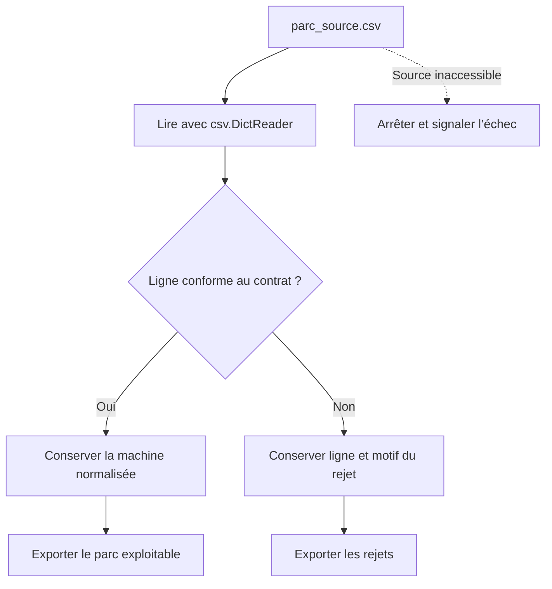

# TP 02 — Fiabiliser un import et réutiliser son code

[Retour au parcours](../../README.md) — **100 minutes**, essais et autocorrection compris.

## Mission et production

Recevoir un export de parc avec des anomalies et produire une liste exploitable pour l’intervention. Le TP se déroule
dans le poste Linux de formation ; les données du parc restent fictives.

## Comprendre le traitement

L’import applique vos règles réutilisables à chaque ligne. Une anomalie de donnée rejoint les rejets ; une source
inaccessible empêche l’import.



Les blocs sur la mutabilité et les fichiers permettent de fiabiliser ces règles avant l’import complet.

## Fichiers et démarrage

Pour les fonctions, compléter depart.py. Pour les modules, compléter inventaire_module.py ; le pilote prépare un projet
uv indépendant et utilise la bibliothèque fournie hors ligne.

```sh
uv run python ateliers/02/depart.py
uv run python outils/verifier.py tp02 --complet
```

Les commandes se lancent à la racine du projet dans le terminal Linux. Les valeurs « À compléter » sont normales au
départ. Complétez les repères TODO et conservez les données de référence. Les lectures, les chemins et une partie des
contrôles sont fournis ; le fichier de départ peut déjà produire des sorties incomplètes. Chaque essai produit un
dossier dans sorties/ ; le vérificateur relance votre code.

## Travailler avec les amorces

Les repères `TODO` désignent le travail à compléter. Lire aussi les lignes fournies : leur rôle doit pouvoir être
expliqué. Garder le dernier tiers de chaque créneau pour lancer, lire les résultats et répondre à la question de
transfert. Les corrigés détaillent les décisions et restent dans des fichiers séparés pour comparer votre version.

## Parcours

1. [Fonctions réutilisables](#fonctions) — 20 min.
2. [Mutabilité et effets de bord](#mutabilite) — 10 min.
3. [Fichiers et exceptions](#fichiers) — 20 min.
4. [Inventaire fiable](#inventaire) — 35 min.
5. [Modules et projet uv](#uv) — 15 min.

<a id="fonctions"></a>

## Fonctions réutilisables — 20 min

**Mise en pratique.** Rendre les règles de nommage et de masque réutilisables sans afficher au milieu du traitement.

**À écrire :** extraire_site et masque dans depart.py.

**Fourni :** Les cas d’appel et les données du TP01.

**À observer :** La valeur renvoyée et les entrées inchangées.

1. Compléter extraire_site(nom) avec une valeur de retour ; tester les noms Paris et Lyon.
2. Reprendre le calcul précédent dans masque(prefixe). À cette étape, les appels portent sur les entiers valides 24 et
   32.
3. Appeler les deux fonctions depuis le script et construire le bilan. Garder la présentation hors des fonctions.
4. Décrire oralement la réaction attendue à un nom mal formé ; la validation complète arrive dans l’import.

La vérification et la question de transfert sont incluses dans ce temps.

Depuis la racine du projet, lancer seulement cette étape, puis contrôler les résultats :

```sh
# 1. Exécuter votre code pour cette étape
uv run python outils/executer_etape.py tp02 fonctions
# 2. Comparer les résultats et les fichiers au contrat
uv run python outils/verifier.py tp02 --etape fonctions --rapport sorties/tp02/controle-fonctions.json
# 3. Relire le contrôle et le chemin de son essai
uv run python -m json.tool sorties/tp02/controle-fonctions.json
```

Au premier essai, « À revoir » et un code de sortie 1 du vérificateur sont attendus tant que les TODO manquent. Après
modification, relancer les mêmes commandes jusqu’à « Conforme ». Chaque lancement crée un nouvel essai ; ouvrir les
productions dans le champ `dossier` du dernier contrôle, puis comparer aux critères ci-dessous.

<details>
<summary>Exécuter la correction de cette étape</summary>

À utiliser après votre essai pour comparer les choix, sans remplacer votre fichier de départ :

```sh
uv run python outils/executer_etape.py tp02 fonctions --corrige
uv run python outils/verifier.py tp02 --etape fonctions --corrige
```

Lire les commentaires du corrigé et expliquer le rôle de chaque différence avec votre version.

</details>

<details>
<summary>Indice 1 - Piste conceptuelle</summary>

Une fonction de calcul reçoit ses entrées et renvoie une valeur. Les appels du script peuvent ensuite réutiliser cette
valeur sans dépendre d’un affichage ou d’un fichier.

</details>

<details>
<summary>Indice 2 - Pseudo-code</summary>

Pseudo-code à traduire dans les fichiers demandés, à partir des données du TP :

```text
FONCTION extraire_site(nom) :
    découper le nom selon le séparateur du contrat
    renvoyer le segment qui représente le site
FONCTION masque(préfixe) :
    reprendre le calcul des 32 bits et des quatre octets
    renvoyer le masque composé
appeler les fonctions sur les cas fournis
construire resultat avec les valeurs renvoyées
```

Repères du code fourni :

return transmet la donnée au client ; print ne constitue pas un résultat réutilisable.

</details>

<details>
<summary>Critères du contrôle de référence</summary>

Les résultats ci-dessous portent sur les données fournies. Les identités, dates et mesures du poste ne sont pas figées ;
leur cohérence est contrôlée.

```json
{
  "sites": [
    "paris",
    "lyon"
  ],
  "masques": [
    "255.255.255.0",
    "255.255.255.255"
  ]
}
```

</details>

**Question de transfert :** Pourquoi ne pas lire un fichier directement dans extraire_site ?

<details>
<summary>Éléments de réponse</summary>

La règle de nommage doit aussi fonctionner sur une valeur venant d’un CSV, d’une API ou d’un test.

</details>

<a id="mutabilite"></a>

## Mutabilité et effets de bord — 10 min

**Mise en pratique.** Éviter qu’ajouter un service à une machine modifie la configuration d’une autre.

**À écrire :** La copie et le paramètre par défaut à corriger.

**Fourni :** Deux cas montrant le partage involontaire.

**À observer :** Des collections indépendantes à chaque appel.

1. Observer l’alias copie = original ; le remplacer par une copie indépendante avant append("https").
2. Corriger le paramètre mutable de ajouter : None par défaut et création d’une liste dans la fonction.
3. Appeler ajouter("a") puis ajouter("b") et vérifier deux résultats indépendants ; expliquer le risque pour des listes
   de services.

La vérification et la question de transfert sont incluses dans ce temps.

Depuis la racine du projet, lancer seulement cette étape, puis contrôler les résultats :

```sh
# 1. Exécuter votre code pour cette étape
uv run python outils/executer_etape.py tp02 mutabilite
# 2. Comparer les résultats et les fichiers au contrat
uv run python outils/verifier.py tp02 --etape mutabilite --rapport sorties/tp02/controle-mutabilite.json
# 3. Relire le contrôle et le chemin de son essai
uv run python -m json.tool sorties/tp02/controle-mutabilite.json
```

Au premier essai, « À revoir » et un code de sortie 1 du vérificateur sont attendus tant que les TODO manquent. Après
modification, relancer les mêmes commandes jusqu’à « Conforme ». Chaque lancement crée un nouvel essai ; ouvrir les
productions dans le champ `dossier` du dernier contrôle, puis comparer aux critères ci-dessous.

<details>
<summary>Exécuter la correction de cette étape</summary>

À utiliser après votre essai pour comparer les choix, sans remplacer votre fichier de départ :

```sh
uv run python outils/executer_etape.py tp02 mutabilite --corrige
uv run python outils/verifier.py tp02 --etape mutabilite --corrige
```

Lire les commentaires du corrigé et expliquer le rôle de chaque différence avec votre version.

</details>

<details>
<summary>Indice 1 - Piste conceptuelle</summary>

Deux noms peuvent désigner la même liste. Il faut distinguer le partage volontaire d’un argument et la création d’une
collection propre à un nouvel appel.

</details>

<details>
<summary>Indice 2 - Pseudo-code</summary>

Pseudo-code à traduire dans les fichiers demandés, à partir des données du TP :

```text
copie <- nouvelle liste construite depuis original
ajouter le service seulement dans copie
FONCTION ajouter(élément, éléments = None) :
    SI éléments est None : créer une nouvelle liste
    ajouter l’élément à cette liste
    renvoyer cette liste
appeler deux fois sans fournir de liste
comparer original, copie et les deux résultats indépendants
```

Repères du code fourni :

Une copie superficielle suffit pour cette liste de chaînes. Une liste imbriquée resterait partagée : ne pas généraliser.

</details>

<details>
<summary>Critères du contrôle de référence</summary>

Les résultats ci-dessous portent sur les données fournies. Les identités, dates et mesures du poste ne sont pas figées ;
leur cohérence est contrôlée.

```json
{
  "original": [
    "ssh"
  ],
  "copie": [
    "ssh",
    "https"
  ],
  "premier": [
    "a"
  ],
  "second": [
    "b"
  ]
}
```

</details>

**Question de transfert :** Pourquoi une liste vide par défaut survit-elle à plusieurs appels ?

<details>
<summary>Éléments de réponse</summary>

La valeur par défaut est créée à la définition de la fonction, pas à chaque appel.

</details>

<a id="fichiers"></a>

## Fichiers et exceptions — 20 min

**Mise en pratique.** Copier une note d’intervention et une pièce binaire sans altérer leur contenu.

**À écrire :** Les lectures, copies et traitements d’erreurs dans depart.py.

**Fourni :** Les deux fichiers sources et les cas de debogage.py.

**À observer :** Les octets, les erreurs attendues et la fermeture des fichiers.

### Lire et corriger une erreur - 5 min dans les 20 min

```sh
uv run python ateliers/02/debogage.py --cas type
```

Lire le TypeError capturé : la charge "85" vient du CSV et reste une chaîne. Dans debogage.py, corriger prioritaire pour
convertir cette valeur avec int, puis relancer le même cas sans --corrige. Le résultat attendu devient Cas résolu :
True.

Pour la seconde erreur, lancer --cas chemin : le fichier créé s’appelle intervention.txt, mais lire_note demande
note.txt. Corriger le nom et relancer. Le message attendu est Cas résolu : Contrôle du parc. --corrige affiche la
référence si nécessaire.

Ces erreurs sont volontairement capturées et affichées par le pilote ; elles ne sont pas des pannes du kit. Réserver
cinq minutes à cette lecture/correction, dix aux fichiers ci-dessous et cinq au contrôle et à l’explication.

### Copier et traiter les erreurs prévues - 15 min

1. Lire message.txt en UTF-8 et écrire copie.txt dans dossier. Vérifier la présence du mot sécurité.
2. Lire exemple.bin en binaire et écrire copie.bin ; comparer les octets, pas seulement la taille.
3. Provoquer une source absente et une conversion invalide. Intercepter FileNotFoundError puis ValueError séparément.
4. Marquer le passage dans finally pour la conversion. Utiliser with pour fermer les fichiers.
5. Comparer le chemin du fichier source, le dossier courant et le dossier de sortie. Un refus de lecture est une erreur
   d’accès, distincte d’une donnée mal formée ; travailler dans votre dossier utilisateur.

La vérification et la question de transfert sont incluses dans ce temps.

Depuis la racine du projet, lancer seulement cette étape, puis contrôler les résultats :

```sh
# 1. Exécuter votre code pour cette étape
uv run python outils/executer_etape.py tp02 fichiers
# 2. Comparer les résultats et les fichiers au contrat
uv run python outils/verifier.py tp02 --etape fichiers --rapport sorties/tp02/controle-fichiers.json
# 3. Relire le contrôle et le chemin de son essai
uv run python -m json.tool sorties/tp02/controle-fichiers.json
```

Au premier essai, « À revoir » et un code de sortie 1 du vérificateur sont attendus tant que les TODO manquent. Après
modification, relancer les mêmes commandes jusqu’à « Conforme ». Chaque lancement crée un nouvel essai ; ouvrir les
productions dans le champ `dossier` du dernier contrôle, puis comparer aux critères ci-dessous.

<details>
<summary>Exécuter la correction de cette étape</summary>

À utiliser après votre essai pour comparer les choix, sans remplacer votre fichier de départ :

```sh
uv run python outils/executer_etape.py tp02 fichiers --corrige
uv run python outils/verifier.py tp02 --etape fichiers --corrige
```

Lire les commentaires du corrigé et expliquer le rôle de chaque différence avec votre version.

</details>

<details>
<summary>Indice 1 - Piste conceptuelle</summary>

Choisissez le mode de lecture selon la nature du contenu. La copie doit préserver les valeurs, et les erreurs attendues
doivent être traitées séparément des erreurs de programmation.

</details>

<details>
<summary>Indice 2 - Pseudo-code</summary>

Pseudo-code à traduire dans les fichiers demandés, à partir des données du TP :

```text
dans les cas de débogage, examiner type de charge et nom du fichier
lire le texte avec un encodage explicite et écrire sa copie
lire le binaire sans décodage et écrire ses octets
comparer le contenu binaire source/copie
ESSAYER de lire la source volontairement absente
    SI FileNotFoundError : conserver cette erreur prévue
ESSAYER la conversion volontairement invalide
    SI ValueError : conserver cette autre erreur prévue
    ENFIN : marquer le passage dans finally
construire les critères depuis les fichiers relus et les erreurs conservées
```

Repères du code fourni :

Les 256 octets du fichier de référence ne sont pas du texte. Garder les chemins sous le dossier de sortie fourni.

</details>

<details>
<summary>Critères du contrôle de référence</summary>

Les résultats ci-dessous portent sur les données fournies. Les identités, dates et mesures du poste ne sont pas figées ;
leur cohérence est contrôlée.

```json
{
  "accent": true,
  "octets": 256,
  "copie_identique": true,
  "erreurs": [
    "fichier absent",
    "conversion impossible"
  ],
  "finally": true
}
```

</details>

**Question de transfert :** Une erreur sur une ligne doit-elle interrompre tout un import ?

<details>
<summary>Éléments de réponse</summary>

Cela dépend du contrat : une donnée rejetable peut être signalée puis ignorée ; une source inaccessible empêche le
traitement.

</details>

<a id="inventaire"></a>

## Inventaire fiable — 35 min

**Mise en pratique.** Recevoir un export de parc avec des anomalies et produire une liste exploitable pour
l’intervention.

**À écrire :** La validation, les rejets et les exports dans depart.py.

**Fourni :** importer, le lecteur CSV, les rejets, les exports et les contrôles IP/actif. Compléter valider_ligne et le
cas de source absente.

**À observer :** Les lignes acceptées et la cause de chaque rejet.

1. Lire importer et valider_ligne dans depart.py. Le lecteur et les exports sont fournis. Ouvrir donnees/parc_source.csv
   avec encoding="utf-8-sig", newline="" et csv.DictReader(delimiter=";"). Vérifier les colonnes nom, ip, actif, charge.
2. Pour chaque ligne, contrôler les champs manquants, valider ip avec ipaddress.ip_address, décoder oui/non et convertir
   charge en entier de 0 à 100.
3. Garder les machines valides ; en cas de ValueError, conserver lecteur.line_num et le motif dans rejets. L’ouverture
   reste hors du try par ligne.
4. Écrire rapport.txt avec un nom par ligne et rejets.json avec json.dumps(..., ensure_ascii=False, indent=2). Vérifier
   huit acceptations et deux rejets aux lignes physiques 10 et 11.
5. Appeler votre importeur avec un chemin absent et constater FileNotFoundError sans produire de rapport de réussite.

La vérification et la question de transfert sont incluses dans ce temps.

Depuis la racine du projet, lancer seulement cette étape, puis contrôler les résultats :

```sh
# 1. Exécuter votre code pour cette étape
uv run python outils/executer_etape.py tp02 inventaire
# 2. Comparer les résultats et les fichiers au contrat
uv run python outils/verifier.py tp02 --etape inventaire --rapport sorties/tp02/controle-inventaire.json
# 3. Relire le contrôle et le chemin de son essai
uv run python -m json.tool sorties/tp02/controle-inventaire.json
```

Au premier essai, « À revoir » et un code de sortie 1 du vérificateur sont attendus tant que les TODO manquent. Après
modification, relancer les mêmes commandes jusqu’à « Conforme ». Chaque lancement crée un nouvel essai ; ouvrir les
productions dans le champ `dossier` du dernier contrôle, puis comparer aux critères ci-dessous.

<details>
<summary>Exécuter la correction de cette étape</summary>

À utiliser après votre essai pour comparer les choix, sans remplacer votre fichier de départ :

```sh
uv run python outils/executer_etape.py tp02 inventaire --corrige
uv run python outils/verifier.py tp02 --etape inventaire --corrige
```

Lire les commentaires du corrigé et expliquer le rôle de chaque différence avec votre version.

</details>

<details>
<summary>Indice 1 - Piste conceptuelle</summary>

La lecture du fichier et la validation d’une ligne n’ont pas la même portée. Une ligne rejetée garde sa provenance ; une
source inaccessible empêche de commencer l’import.

</details>

<details>
<summary>Indice 2 - Pseudo-code</summary>

Pseudo-code à traduire dans les fichiers demandés, à partir des données du TP :

```text
ouvrir la source avec l’encodage et le séparateur du contrat
vérifier l’en-tête avec DictReader
POUR chaque ligne :
    ESSAYER : vérifier les champs, l’IP, oui/non et la charge
        ajouter la machine convertie aux acceptées
    SI ValueError : conserver lecteur.line_num, motif et ligne source
écrire les noms acceptés et les rejets dans les sorties prévues
tester une source absente sans masquer son erreur d’ouverture
construire resultat depuis les listes et fichiers produits
```

Repères du code fourni :

La référence lire_inventaire dans admin_tools.metier montre la séparation lecture/validation. Les guillemets et
séparateurs d’un CSV sont gérés par DictReader, pas par split.

</details>

<details>
<summary>Critères du contrôle de référence</summary>

Les résultats ci-dessous portent sur les données fournies. Les identités, dates et mesures du poste ne sont pas figées ;
leur cohérence est contrôlée.

```json
{
  "acceptes": 8,
  "rejetes": 2,
  "lignes_rejetees": [
    10,
    11
  ],
  "absence_signalee": true
}
```

</details>

**Question de transfert :** Importer donnees/transfert/parc_champ_absent.csv sans corriger le fichier. Faut-il
interrompre toute la collecte ? Répondre en trois phrases : observation, conclusion, prochaine action.

<details>
<summary>Éléments de réponse</summary>

Une machine acceptée ; une ligne rejetée (ligne 3, quatrième champ absent). C’est une anomalie de ligne, pas une source
inaccessible. Conserver le rejet et demander un export corrigé ; ne pas inventer de charge.

</details>

<a id="uv"></a>

## Modules et projet uv — 15 min

**Mise en pratique.** Isoler un utilitaire de parc et installer une petite bibliothèque sans accès Internet pendant
l’exercice.

**À écrire :** La fonction dans inventaire_module.py ; lancer la commande uv demandée.

**Fourni :** Le pilote projet_uv et le wheel local.

**À observer :** L’import sans effet de bord et l’installation dans le bon projet.

1. Compléter inventaire_module.py : etiquette(nom) renvoie "Hôte " suivi du nom. Protéger l’affichage de démonstration
   avec `__main__`.
2. Exécuter le module puis l’importer : l’import ne doit pas déclencher son affichage de démonstration.
3. Dans un nouveau dossier d’essai (à créer une seule fois), installer vous-même la bibliothèque fournie. Depuis la
   racine du kit :

   ```sh
   env -u VIRTUAL_ENV uv init --bare --vcs none --no-workspace --python 3.13.13 sorties/essai-lib
   env -u VIRTUAL_ENV uv add --project sorties/essai-lib --offline donnees/wheels/pyx_parc-1.0.0-py3-none-any.whl
   env -u VIRTUAL_ENV uv run --project sorties/essai-lib --offline python -c "import pyx_parc; print(pyx_parc.normaliser_nom(' SRV-WEB '))"
   ```

   `env -u VIRTUAL_ENV` évite d’imposer l’environnement du cours au projet d’essai, même dans un terminal activé par VS
   Code. Vérifier `srv-web`. uv init crée le projet ; uv add déclare et installe le wheel ; uv run utilise cet
   environnement. Relire projet_uv dans admin_tools.pilotes : le contrôle refait la même installation dans un dossier
   neuf.
4. Exécuter l’étape et inspecter projet_uv/pyproject.toml, uv.lock et .venv. La bibliothèque installée normalise "
   SRV-WEB " en "srv-web".

La manipulation manuelle, la vérification et la question de transfert sont incluses dans les quinze minutes.

Depuis la racine du projet, lancer seulement cette étape, puis contrôler les résultats :

```sh
# 1. Exécuter votre code pour cette étape
uv run python outils/executer_etape.py tp02 uv
# 2. Comparer les résultats et les fichiers au contrat
uv run python outils/verifier.py tp02 --etape uv --rapport sorties/tp02/controle-uv.json
# 3. Relire le contrôle et le chemin de son essai
uv run python -m json.tool sorties/tp02/controle-uv.json
```

Au premier essai, « À revoir » et un code de sortie 1 du vérificateur sont attendus tant que les TODO manquent. Après
modification, relancer les mêmes commandes jusqu’à « Conforme ». Chaque lancement crée un nouvel essai ; ouvrir les
productions dans le champ `dossier` du dernier contrôle, puis comparer aux critères ci-dessous.

<details>
<summary>Exécuter la correction de cette étape</summary>

À utiliser après votre essai pour comparer les choix, sans remplacer votre fichier de départ :

```sh
uv run python outils/executer_etape.py tp02 uv --corrige
uv run python outils/verifier.py tp02 --etape uv --corrige
```

Lire les commentaires du corrigé et expliquer le rôle de chaque différence avec votre version.

</details>

<details>
<summary>Indice 1 - Piste conceptuelle</summary>

Le module expose une fonction ; son éventuelle démonstration reste protégée. L’installation concerne un projet d’essai
séparé pour garder l’environnement du cours reproductible.

</details>

<details>
<summary>Indice 2 - Pseudo-code</summary>

Pseudo-code à traduire dans les fichiers demandés, à partir des données du TP :

```text
dans inventaire_module.py, compléter la fonction demandée
placer la démonstration sous le garde __main__
lancer le pilote fourni pour préparer le projet uv d’essai
lire pyproject.toml et uv.lock dans ce projet
exécuter la commande uv add donnée dans l’énoncé sur le wheel local
exécuter le client avec uv run et relire l’étiquette produite
vérifier qu’un import ne lance pas la démonstration
```

Repères du code fourni :

Le pilote prépare l’essai dans une sortie neuve. Les commandes uv init, uv add et uv run sont à comprendre ; l’écriture
d’un wheel n’est pas demandée.

</details>

<details>
<summary>Critères du contrôle de référence</summary>

Les résultats ci-dessous portent sur les données fournies. Les identités, dates et mesures du poste ne sont pas figées ;
leur cohérence est contrôlée.

```json
{
  "projet": true,
  "verrouillage": true,
  "environnement": true,
  "etiquette": "Hôte srv-web"
}
```

</details>

**Question de transfert :** Pourquoi requests.py est-il un mauvais nom pour votre script ?

<details>
<summary>Éléments de réponse</summary>

Il peut masquer la bibliothèque requests lors de la résolution des imports.

</details>

## Comprendre la correction

Après votre essai, lire [corrige.py](corrige.py) et les fonctions partagées dans [admin_tools](../../src/admin_tools/).
Comparer les choix et leurs limites. Le corrigé garde ses sorties séparément. [Dépannage](../../docs/depannage.md).

```sh
uv run python ateliers/02/corrige.py
uv run python outils/verifier.py tp02 --corrige --complet
```
