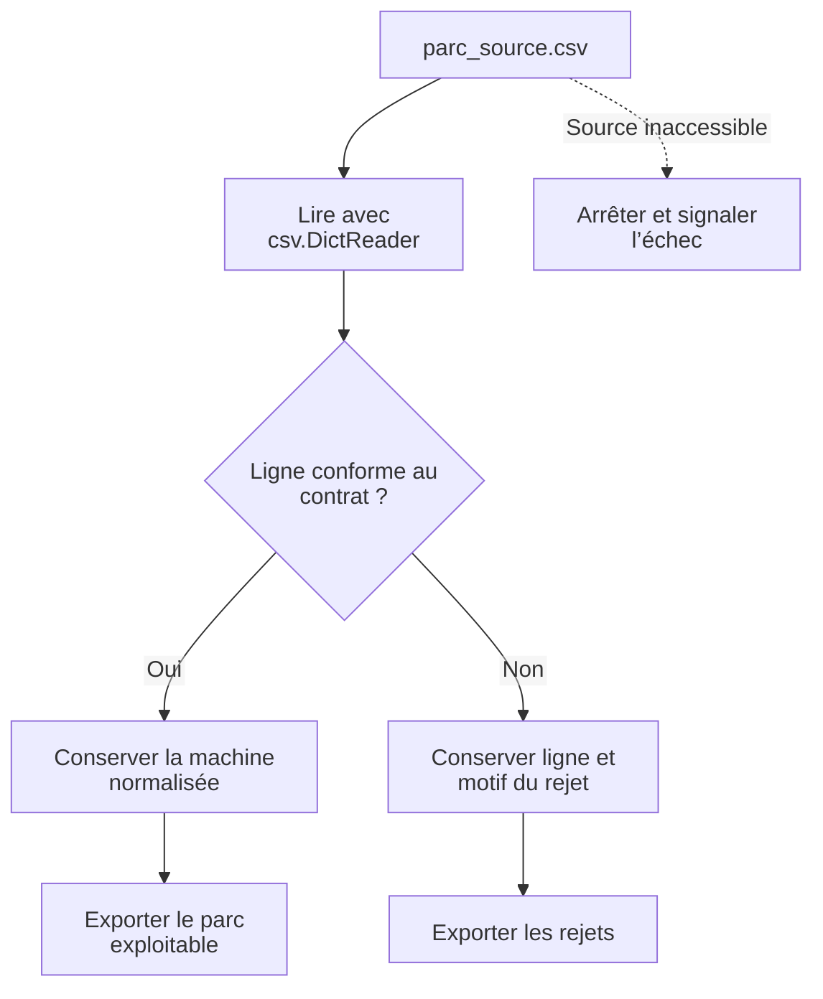
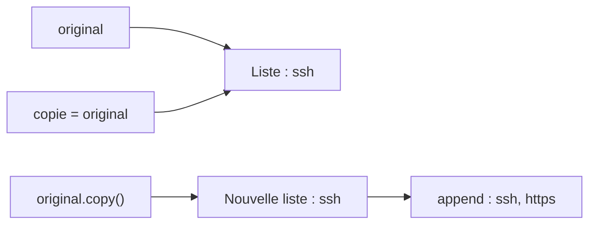

# TP 02 — Fiabiliser un import et réutiliser son code

**Première lecture :** [repérer votre travail et les aides fournies](../../docs/lire-le-code.md).

[Retour au parcours](../../README.md) — **100 minutes**, essais et autocorrection compris.

## Mission et production

Recevoir un export de parc avec des anomalies et produire une liste exploitable pour l’intervention. Le TP se déroule
dans le poste Linux de formation ; les données du parc restent fictives.

## Comprendre le traitement

L’import applique vos règles réutilisables à chaque ligne. Une anomalie de donnée rejoint les rejets ; une source
inaccessible empêche l’import.



Les blocs sur la mutabilité et les fichiers permettent de fiabiliser ces règles avant l’import complet.

## Où travailler et quoi modifier

**Commencez par la première ligne du tableau ci-dessous.** Les fichiers existent déjà ; ouvrez-les dans l’éditeur.
Les chemins du tableau sont relatifs à ce dossier de TP. Enregistrez après chaque modification.

| Étape | Fichier à ouvrir | Travail demandé |
| --- | --- | --- |
| [fonctions](#fonctions) | [depart.py](depart.py) | Deux retours de fonctions |
| [mutabilite](#mutabilite) | [depart.py](depart.py) | Deux partages de liste à corriger |
| [fichiers](#fichiers) | [depart.py](depart.py) et [debogage.py](debogage.py) | Une copie binaire et trois traitements d’erreur |
| [inventaire](#inventaire) | [depart.py](depart.py) | Valider une ligne, puis traiter un fichier absent |
| [uv](#uv) | [inventaire_module.py](inventaire_module.py) | Une valeur de retour et un projet d’essai |

Les imports, les données de référence, les repères `# ===` et l’enregistrement des résultats sont fournis.
Ne réécrivez pas tout le script et ne remplacez pas les calculs par les résultats attendus.
`TODO` signifie « partie à compléter » ; les exemples et extraits du README sont à lire, pas à copier en bloc.

Toutes les commandes se lancent dans un terminal à la racine du projet, où se trouve `pyproject.toml`.
Si nécessaire, préparez l’environnement avec `uv sync --locked`. Avancez avec le contrôle de chaque étape ;
le contrôle complet n’est demandé qu’à la fin. Un résultat `À revoir` est normal avant de compléter votre code.
Le vérificateur relance l’étape et compare vos productions. Les chemins de sorties changent à chaque essai.

## Voir les données avant de coder

Extrait réel de [donnees/parc_source.csv](../../donnees/parc_source.csv) :

```csv
nom;ip;actif;charge
srv-paris-web-01;192.0.2.1;oui;20
srv-paris-web-02;192.0.2.2;oui;65
srv-paris-web-03;192.0.2.3;non;90
srv-paris-web-04;192.0.2.4;oui;10
```

Extrait réel de [donnees/message.txt](../../donnees/message.txt) :

```text
Rapport de sécurité
Trois machines vérifiées.
```

Le séparateur du CSV est `;`. Les nombres et « oui/non » sont lus comme du texte avant conversion. Les lignes invalides
doivent être rejetées sans perdre les valides.

## Parcours

1. [Fonctions réutilisables](#fonctions) — 20 min.
2. [Mutabilité et effets de bord](#mutabilite) — 10 min.
3. [Fichiers et exceptions](#fichiers) — 20 min.
4. [Inventaire fiable](#inventaire) — 35 min.
5. [Modules et projet uv](#uv) — 15 min.

<a id="fonctions"></a>

## Fonctions réutilisables — 20 min

**Votre objectif :** Deux retours de fonctions.

**Fichier à modifier :** `depart.py`. Repérez le bloc `# === FONCTIONS`.

**À faire dans l’ordre :**

1. Dans `extraire_site`, remplacez `return None` par le retour du deuxième élément de `morceaux` (indice 1). Retirez le
   `print` d’observation.
2. Dans `masque`, remplacez `return None` par le retour des chaînes de `octets` réunies avec `".".join(...)`. Retirez le
   `print` d’observation.

**Déjà fourni — à conserver :** Découpage du nom, calcul des octets et appels de test.

Depuis la racine du projet, lancer seulement cette étape, puis contrôler les résultats :

```sh
uv run python outils/executer_etape.py tp02 fonctions
uv run python outils/verifier.py tp02 --etape fonctions
```

Au premier essai, « À revoir » et un code de sortie 1 du vérificateur sont attendus tant que les TODO manquent. Après
modification, relancer les mêmes commandes jusqu’à « Conforme ». Chaque lancement crée un nouvel essai ; ouvrir les
productions dans le dossier d’essai indiqué par le dernier contrôle, puis comparer aux critères ci-dessous.

**Étape terminée :** le contrôle affiche `Conforme` et vous pouvez expliquer les modifications réalisées.

<details>
<summary>Exécuter la correction de cette étape</summary>

À utiliser après votre essai pour comparer les choix, sans remplacer votre fichier de départ :

```sh
uv run python outils/executer_etape.py tp02 fonctions --corrige
uv run python outils/verifier.py tp02 --etape fonctions --corrige
```

Lire les commentaires du corrigé et expliquer le rôle de chaque différence avec votre version.

</details>

<details>
<summary>Indice 1 - Piste conceptuelle</summary>

Une fonction de calcul reçoit ses entrées et renvoie une valeur. Les appels du script peuvent ensuite réutiliser cette
valeur sans dépendre d’un affichage ou d’un fichier.

</details>

<details>
<summary>Indice 2 - Pseudo-code</summary>

Ce pseudo-code décrit le traitement complet, y compris les parties déjà fournies. Il sert à comprendre ;
ne réécrivez que les éléments indiqués dans « À faire dans l’ordre ».

```text
FONCTION extraire_site(nom) :
    découper le nom selon le séparateur du contrat
    renvoyer le segment qui représente le site
FONCTION masque(préfixe) :
    reprendre le calcul des 32 bits et des quatre octets
    renvoyer le masque composé
appeler les fonctions sur les cas fournis
construire resultat avec les valeurs renvoyées
```

Repères du code fourni :

return transmet la donnée au client ; print ne constitue pas un résultat réutilisable.

</details>

**Repères de réussite sur les données fournies :**

| Champ du bilan | Valeur attendue |
| --- | --- |
| `sites` | `["paris", "lyon"]` |
| `masques` | `["255.255.255.0", "255.255.255.255"]` |

<details>
<summary>Critères du contrôle de référence</summary>

Les résultats ci-dessous portent sur les données fournies. Les identités, dates et mesures du poste ne sont pas figées ;
leur cohérence est contrôlée.

```json
{
  "sites": [
    "paris",
    "lyon"
  ],
  "masques": [
    "255.255.255.0",
    "255.255.255.255"
  ]
}
```

</details>

**Question de transfert :** Pourquoi ne pas lire un fichier directement dans extraire_site ?

<details>
<summary>Éléments de réponse</summary>

La règle de nommage doit aussi fonctionner sur une valeur venant d’un CSV, d’une API ou d’un test.

</details>

<a id="mutabilite"></a>

## Mutabilité et effets de bord — 10 min

### Deux noms ou deux listes ?



Avec une affectation simple, les deux noms désignent la même liste. La copie sépare les deux listes pour cet exemple de
chaînes.

**Votre objectif :** Deux partages de liste à corriger.

**Fichier à modifier :** `depart.py`. Repérez le bloc `# === MUTABILITE`.

**À faire dans l’ordre :**

1. Remplacez `copie = original` par une copie avec `original.copy()` ; conservez ensuite le `append` fourni.
2. Dans la définition de `ajouter`, remplacez le défaut `elements=[]` par `elements=None`.
3. Au début de cette fonction, ajoutez `if elements is None:` puis `elements = []` dans son bloc. Gardez `append` et
   `return` après ce bloc.

**Déjà fourni — à conserver :** Les appels successifs qui révèlent les effets de bord.

Depuis la racine du projet, lancer seulement cette étape, puis contrôler les résultats :

```sh
uv run python outils/executer_etape.py tp02 mutabilite
uv run python outils/verifier.py tp02 --etape mutabilite
```

Au premier essai, « À revoir » et un code de sortie 1 du vérificateur sont attendus tant que les TODO manquent. Après
modification, relancer les mêmes commandes jusqu’à « Conforme ». Chaque lancement crée un nouvel essai ; ouvrir les
productions dans le dossier d’essai indiqué par le dernier contrôle, puis comparer aux critères ci-dessous.

**Étape terminée :** le contrôle affiche `Conforme` et vous pouvez expliquer les modifications réalisées.

<details>
<summary>Exécuter la correction de cette étape</summary>

À utiliser après votre essai pour comparer les choix, sans remplacer votre fichier de départ :

```sh
uv run python outils/executer_etape.py tp02 mutabilite --corrige
uv run python outils/verifier.py tp02 --etape mutabilite --corrige
```

Lire les commentaires du corrigé et expliquer le rôle de chaque différence avec votre version.

</details>

<details>
<summary>Indice 1 - Piste conceptuelle</summary>

Deux noms peuvent désigner la même liste. Il faut distinguer le partage volontaire d’un argument et la création d’une
collection propre à un nouvel appel.

</details>

<details>
<summary>Indice 2 - Pseudo-code</summary>

Ce pseudo-code décrit le traitement complet, y compris les parties déjà fournies. Il sert à comprendre ;
ne réécrivez que les éléments indiqués dans « À faire dans l’ordre ».

```text
copie <- nouvelle liste construite depuis original
ajouter le service seulement dans copie
FONCTION ajouter(élément, éléments = None) :
    SI éléments est None : créer une nouvelle liste
    ajouter l’élément à cette liste
    renvoyer cette liste
appeler deux fois sans fournir de liste
comparer original, copie et les deux résultats indépendants
```

Repères du code fourni :

Une copie superficielle suffit pour cette liste de chaînes. Une liste imbriquée resterait partagée : ne pas généraliser.

</details>

**Repères de réussite sur les données fournies :**

| Champ du bilan | Valeur attendue |
| --- | --- |
| `original` | `["ssh"]` |
| `copie` | `["ssh", "https"]` |
| `premier` | `["a"]` |

<details>
<summary>Critères du contrôle de référence</summary>

Les résultats ci-dessous portent sur les données fournies. Les identités, dates et mesures du poste ne sont pas figées ;
leur cohérence est contrôlée.

```json
{
  "original": [
    "ssh"
  ],
  "copie": [
    "ssh",
    "https"
  ],
  "premier": [
    "a"
  ],
  "second": [
    "b"
  ]
}
```

</details>

**Question de transfert :** Pourquoi une liste vide par défaut survit-elle à plusieurs appels ?

<details>
<summary>Éléments de réponse</summary>

La valeur par défaut est créée à la définition de la fonction, pas à chaque appel.

</details>

<a id="fichiers"></a>

## Fichiers et exceptions — 20 min

**Votre objectif :** Une copie binaire et trois traitements d’erreur.

**Fichier à modifier :** `depart.py et debogage.py`.

**À faire dans l’ordre :**

1. Dans le bloc FICHIERS, après la lecture de `octets`, ouvrez `dossier / "copie.bin"` en mode `"wb"` avec `with`, puis
   écrivez `octets` avec `write`.
2. Dans `except FileNotFoundError`, remplacez `pass` par un ajout de `"fichier absent"` à la liste `erreurs`.
3. Dans `except ValueError`, remplacez `pass` par un ajout de `"conversion impossible"` à cette même liste.
4. Dans `finally`, remplacez `pass` par `passage_finally = True`. Ne provoquez pas d’autres erreurs : les deux cas sont
   déjà écrits.
5. Réalisez aussi les deux petites corrections de `debogage.py` décrites ci-dessous.

**Déjà fourni — à conserver :** Lecture et copie du texte, lecture binaire, exceptions provoquées et comparaison des
copies.

### Lire et corriger une erreur - 5 min dans les 20 min

```sh
uv run python ateliers/02/debogage.py --cas type
```

Lire le TypeError capturé : la charge "85" vient du CSV et reste une chaîne. Dans debogage.py, corriger prioritaire pour
convertir cette valeur avec int, puis relancer le même cas sans --corrige. Le résultat attendu devient Cas résolu :
True.

Pour la seconde erreur, lancer --cas chemin : le fichier créé s’appelle intervention.txt, mais lire_note demande
note.txt. Corriger le nom et relancer. Le message attendu est Cas résolu : Contrôle du parc. --corrige affiche la
référence si nécessaire.

Ces erreurs sont volontairement capturées et affichées par le pilote ; elles ne sont pas des pannes du kit. Réserver
cinq minutes à cette lecture/correction, dix aux fichiers ci-dessous et cinq au contrôle et à l’explication.

Depuis la racine du projet, lancer seulement cette étape, puis contrôler les résultats :

```sh
uv run python outils/executer_etape.py tp02 fichiers
uv run python outils/verifier.py tp02 --etape fichiers
```

Au premier essai, « À revoir » et un code de sortie 1 du vérificateur sont attendus tant que les TODO manquent. Après
modification, relancer les mêmes commandes jusqu’à « Conforme ». Chaque lancement crée un nouvel essai ; ouvrir les
productions dans le dossier d’essai indiqué par le dernier contrôle, puis comparer aux critères ci-dessous.

**Étape terminée :** le contrôle affiche `Conforme` et vous pouvez expliquer les modifications réalisées.

<details>
<summary>Exécuter la correction de cette étape</summary>

À utiliser après votre essai pour comparer les choix, sans remplacer votre fichier de départ :

```sh
uv run python outils/executer_etape.py tp02 fichiers --corrige
uv run python outils/verifier.py tp02 --etape fichiers --corrige
```

Lire les commentaires du corrigé et expliquer le rôle de chaque différence avec votre version.

</details>

<details>
<summary>Indice 1 - Piste conceptuelle</summary>

Choisissez le mode de lecture selon la nature du contenu. La copie doit préserver les valeurs, et les erreurs attendues
doivent être traitées séparément des erreurs de programmation.

</details>

<details>
<summary>Indice 2 - Pseudo-code</summary>

Ce pseudo-code décrit le traitement complet, y compris les parties déjà fournies. Il sert à comprendre ;
ne réécrivez que les éléments indiqués dans « À faire dans l’ordre ».

```text
dans les cas de débogage, examiner type de charge et nom du fichier
lire le texte avec un encodage explicite et écrire sa copie
lire le binaire sans décodage et écrire ses octets
comparer le contenu binaire source/copie
ESSAYER de lire la source volontairement absente
    SI FileNotFoundError : conserver cette erreur prévue
ESSAYER la conversion volontairement invalide
    SI ValueError : conserver cette autre erreur prévue
    ENFIN : marquer le passage dans finally
construire les critères depuis les fichiers relus et les erreurs conservées
```

Repères du code fourni :

Les 256 octets du fichier de référence ne sont pas du texte. Garder les chemins sous le dossier de sortie fourni.

</details>

**Repères de réussite sur les données fournies :**

| Champ du bilan | Valeur attendue |
| --- | --- |
| `accent` | `true` |
| `octets` | `256` |
| `copie_identique` | `true` |

<details>
<summary>Critères du contrôle de référence</summary>

Les résultats ci-dessous portent sur les données fournies. Les identités, dates et mesures du poste ne sont pas figées ;
leur cohérence est contrôlée.

```json
{
  "accent": true,
  "octets": 256,
  "copie_identique": true,
  "erreurs": [
    "fichier absent",
    "conversion impossible"
  ],
  "finally": true
}
```

</details>

**Question de transfert :** Une erreur sur une ligne doit-elle interrompre tout un import ?

<details>
<summary>Éléments de réponse</summary>

Cela dépend du contrat : une donnée rejetable peut être signalée puis ignorée ; une source inaccessible empêche le
traitement.

</details>

Deux dernières lignes réelles de [parc_source.csv](../../donnees/parc_source.csv), à examiner sans les modifier :

```csv
ligne;incomplete
srv-test;192.0.2.9;oui;inconnue
```

| Ligne du fichier (en-tête compris) | Problème | Traitement attendu |
| --- | --- | --- |
| 10 | Deux champs au lieu de quatre | Enregistrer un rejet, poursuivre l’import. |
| 11 | Charge non convertible en entier | Enregistrer un rejet, poursuivre l’import. |

<a id="inventaire"></a>

## Inventaire fiable — 35 min

**Votre objectif :** Valider une ligne, puis traiter un fichier absent.

**Fichier à modifier :** `depart.py`. Repérez le bloc `# === INVENTAIRE`.

**À faire dans l’ordre :**

1. Dans `valider_ligne`, après la conversion de `charge`, ajoutez un test qui lève `ValueError` si la charge est hors de
   0 à 100 inclus.
2. Remplacez `return None` par un dictionnaire contenant `nom` nettoyé avec `strip().lower()`, `ip`, `actif` converti
   par comparaison à `"oui"`, et `charge` entière. Retirez le `print` d’observation.
3. Après les exports, initialisez `absence_signalee` à `False`. Appelez `importer(dossier / "absent.txt")` dans un
   `try` ; dans `except FileNotFoundError`, passez `absence_signalee` à `True`.

**Déjà fourni — à conserver :** Lecture CSV, validation IP et état, capture des lignes rejetées, écriture du rapport et
des rejets.

Depuis la racine du projet, lancer seulement cette étape, puis contrôler les résultats :

```sh
uv run python outils/executer_etape.py tp02 inventaire
uv run python outils/verifier.py tp02 --etape inventaire
```

Au premier essai, « À revoir » et un code de sortie 1 du vérificateur sont attendus tant que les TODO manquent. Après
modification, relancer les mêmes commandes jusqu’à « Conforme ». Chaque lancement crée un nouvel essai ; ouvrir les
productions dans le dossier d’essai indiqué par le dernier contrôle, puis comparer aux critères ci-dessous.

**Étape terminée :** le contrôle affiche `Conforme` et vous pouvez expliquer les modifications réalisées.

<details>
<summary>Exécuter la correction de cette étape</summary>

À utiliser après votre essai pour comparer les choix, sans remplacer votre fichier de départ :

```sh
uv run python outils/executer_etape.py tp02 inventaire --corrige
uv run python outils/verifier.py tp02 --etape inventaire --corrige
```

Lire les commentaires du corrigé et expliquer le rôle de chaque différence avec votre version.

</details>

<details>
<summary>Indice 1 - Piste conceptuelle</summary>

La lecture du fichier et la validation d’une ligne n’ont pas la même portée. Une ligne rejetée garde sa provenance ; une
source inaccessible empêche de commencer l’import.

</details>

<details>
<summary>Indice 2 - Pseudo-code</summary>

Ce pseudo-code décrit le traitement complet, y compris les parties déjà fournies. Il sert à comprendre ;
ne réécrivez que les éléments indiqués dans « À faire dans l’ordre ».

```text
ouvrir la source avec l’encodage et le séparateur du contrat
vérifier l’en-tête avec DictReader
POUR chaque ligne :
    ESSAYER : vérifier les champs, l’IP, oui/non et la charge
        ajouter la machine convertie aux acceptées
    SI ValueError : conserver lecteur.line_num, motif et ligne source
écrire les noms acceptés et les rejets dans les sorties prévues
tester une source absente sans masquer son erreur d’ouverture
construire resultat depuis les listes et fichiers produits
```

Repères du code fourni :

La référence lire_inventaire dans admin_tools.metier montre la séparation lecture/validation. Les guillemets et
séparateurs d’un CSV sont gérés par DictReader, pas par split.

</details>

**Repères de réussite sur les données fournies :**

| Champ du bilan | Valeur attendue |
| --- | --- |
| `acceptes` | `8` |
| `rejetes` | `2` |
| `lignes_rejetees` | `[10, 11]` |

<details>
<summary>Critères du contrôle de référence</summary>

Les résultats ci-dessous portent sur les données fournies. Les identités, dates et mesures du poste ne sont pas figées ;
leur cohérence est contrôlée.

```json
{
  "acceptes": 8,
  "rejetes": 2,
  "lignes_rejetees": [
    10,
    11
  ],
  "absence_signalee": true
}
```

</details>

**Question de transfert :** Importer donnees/transfert/parc_champ_absent.csv sans corriger le fichier. Faut-il
interrompre toute la collecte ? Répondre en trois phrases : observation, conclusion, prochaine action.

<details>
<summary>Éléments de réponse</summary>

Une machine acceptée ; une ligne rejetée (ligne 3, quatrième champ absent). C’est une anomalie de ligne, pas une source
inaccessible. Conserver le rejet et demander un export corrigé ; ne pas inventer de charge.

</details>

<a id="uv"></a>

## Modules et projet uv — 15 min

**Votre objectif :** Une valeur de retour et un projet d’essai.

**Fichier à modifier :** `inventaire_module.py`.

**À faire dans l’ordre :**

1. Dans `etiquette`, remplacez `return None` par le retour d’une f-string contenant `Hôte`, un espace, puis `nom`.
2. Conservez le bloc `if __name__ == "__main__":` : il protège déjà la démonstration lors de l’import.
3. Lancez les commandes du projet d’essai ci-dessous ; aucun changement n’est demandé dans le bloc UV de `depart.py`.

**Déjà fourni — à conserver :** Protection du point d’entrée, bibliothèque locale et pilote d’installation.

**Distinguer exécution et import :**

```sh
uv run python ateliers/02/inventaire_module.py
uv run python -c "import sys; sys.path.insert(0, 'ateliers/02'); import inventaire_module"
```

La première commande doit afficher `Hôte srv-web`. La seconde ne doit rien afficher : elle importe le module
sans exécuter la démonstration protégée par `__main__`.

**Manipulation guidée :** ces commandes s’exécutent dans un terminal Linux ou macOS. Créez ce dossier une seule fois ;
s’il existe déjà, choisissez un autre nom partout dans les trois commandes.

```sh
env -u VIRTUAL_ENV uv init --bare --vcs none --no-workspace --python 3.13.13 sorties/essai-lib
env -u VIRTUAL_ENV uv add --project sorties/essai-lib --offline donnees/wheels/pyx_parc-1.0.0-py3-none-any.whl
env -u VIRTUAL_ENV uv run --project sorties/essai-lib --offline python -c "import pyx_parc; print(pyx_parc.normaliser_nom(' SRV-WEB '))"
```

Résultat attendu : `srv-web`. `uv init` crée le projet, `uv add` installe la bibliothèque fournie, `uv run` l’utilise.

Depuis la racine du projet, lancer seulement cette étape, puis contrôler les résultats :

```sh
uv run python outils/executer_etape.py tp02 uv
uv run python outils/verifier.py tp02 --etape uv
```

Au premier essai, « À revoir » et un code de sortie 1 du vérificateur sont attendus tant que les TODO manquent. Après
modification, relancer les mêmes commandes jusqu’à « Conforme ». Chaque lancement crée un nouvel essai ; ouvrir les
productions dans le dossier d’essai indiqué par le dernier contrôle, puis comparer aux critères ci-dessous.

**Étape terminée :** le contrôle affiche `Conforme` et vous pouvez expliquer les modifications réalisées.

<details>
<summary>Exécuter la correction de cette étape</summary>

À utiliser après votre essai pour comparer les choix, sans remplacer votre fichier de départ :

```sh
uv run python outils/executer_etape.py tp02 uv --corrige
uv run python outils/verifier.py tp02 --etape uv --corrige
```

Lire les commentaires du corrigé et expliquer le rôle de chaque différence avec votre version.

</details>

<details>
<summary>Indice 1 - Piste conceptuelle</summary>

Le module expose une fonction ; son éventuelle démonstration reste protégée. L’installation concerne un projet d’essai
séparé pour garder l’environnement du cours reproductible.

</details>

<details>
<summary>Indice 2 - Pseudo-code</summary>

Ce pseudo-code décrit le traitement complet, y compris les parties déjà fournies. Il sert à comprendre ;
ne réécrivez que les éléments indiqués dans « À faire dans l’ordre ».

```text
dans inventaire_module.py, compléter la fonction demandée
placer la démonstration sous le garde __main__
lancer le pilote fourni pour préparer le projet uv d’essai
lire pyproject.toml et uv.lock dans ce projet
exécuter la commande uv add donnée dans l’énoncé sur le wheel local
exécuter le client avec uv run et relire l’étiquette produite
vérifier qu’un import ne lance pas la démonstration
```

Repères du code fourni :

Le pilote prépare l’essai dans une sortie neuve. Les commandes uv init, uv add et uv run sont à comprendre ; l’écriture
d’un wheel n’est pas demandée.

</details>

**Repères de réussite sur les données fournies :**

| Champ du bilan | Valeur attendue |
| --- | --- |
| `projet` | `true` |
| `verrouillage` | `true` |
| `environnement` | `true` |

<details>
<summary>Critères du contrôle de référence</summary>

Les résultats ci-dessous portent sur les données fournies. Les identités, dates et mesures du poste ne sont pas figées ;
leur cohérence est contrôlée.

```json
{
  "projet": true,
  "verrouillage": true,
  "environnement": true,
  "etiquette": "Hôte srv-web"
}
```

</details>

**Question de transfert :** Pourquoi requests.py est-il un mauvais nom pour votre script ?

<details>
<summary>Éléments de réponse</summary>

Il peut masquer la bibliothèque requests lors de la résolution des imports.

</details>

## Valider votre travail

Depuis la racine du projet, après avoir terminé les étapes :

```sh
uv run python outils/verifier.py tp02 --complet
```

## Comprendre la correction

Après votre essai, lire [corrige.py](corrige.py) et les fonctions partagées dans [admin_tools](../../src/admin_tools/).
Comparer les choix et leurs limites. Le corrigé garde ses sorties séparément. [Dépannage](../../docs/depannage.md).

```sh
uv run python ateliers/02/corrige.py
uv run python outils/verifier.py tp02 --corrige --complet
```
