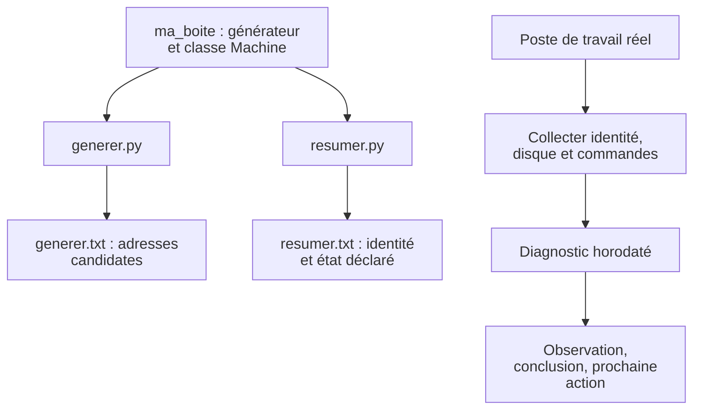
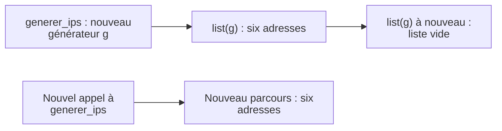

# TP 03 — Préparer un adressage et diagnostiquer un hôte

**Première lecture :** [repérer votre travail et les aides fournies](../../docs/lire-le-code.md).

[Retour au parcours](../../README.md) — **100 minutes**, essais et autocorrection compris.

## Mission et production

Produire un diagnostic horodaté du poste Linux pour préparer une escalade. Le TP se déroule dans le poste Linux de
formation ; les données du parc restent fictives.

## Comprendre le traitement

La bibliothèque est commune aux deux clients. Le diagnostic observe séparément le poste qui exécute Python.



Une adresse candidate est issue du plan fourni ; elle n’est pas une preuve de disponibilité sur le réseau.

## Où travailler et quoi modifier

**Commencez par la première ligne du tableau ci-dessous.** Les fichiers existent déjà ; ouvrez-les dans l’éditeur.
Les chemins du tableau sont relatifs à ce dossier de TP. Enregistrez après chaque modification.

| Étape | Fichier à ouvrir | Travail demandé |
| --- | --- | --- |
| [generateur](#generateur) | [ma_boite/reseau.py](ma_boite/reseau.py) | Exclure les réservations puis produire une adresse |
| [classe](#classe) | [ma_boite/modeles.py](ma_boite/modeles.py) | Compléter uniquement la méthode resume |
| [bibliotheque](#bibliotheque) | [generer.py](generer.py) et [resumer.py](resumer.py) | Réutiliser votre package, sans nouveau code |
| [diagnostic](#diagnostic) | [depart.py](depart.py) | Rédiger trois interprétations et leur contrôle |

Les imports, les données de référence, les repères `# ===` et l’enregistrement des résultats sont fournis.
Ne réécrivez pas tout le script et ne remplacez pas les calculs par les résultats attendus.
`TODO` signifie « partie à compléter » ; les exemples et extraits du README sont à lire, pas à copier en bloc.

Toutes les commandes se lancent dans un terminal à la racine du projet, où se trouve `pyproject.toml`.
Si nécessaire, préparez l’environnement avec `uv sync --locked`. Avancez avec le contrôle de chaque étape ;
le contrôle complet n’est demandé qu’à la fin. Un résultat `À revoir` est normal avant de compléter votre code.
Le vérificateur relance l’étape et compare vos productions. Les chemins de sorties changent à chaque essai.

**Dépendance :** l’étape `bibliotheque` réutilise votre générateur et votre classe ; terminez ces deux étapes avant.

## Voir les données avant de coder

Extrait réel de [ateliers/03/generer.py](../../ateliers/03/generer.py) :

```python
from ma_boite.reseau import generer_ips

for ip in generer_ips("192.0.2.0/29"):
    print(ip)
```

## Parcours

1. [Générateur d’IP](#generateur) — 30 min.
2. [Classe Machine](#classe) — 20 min.
3. [Bibliothèque et deux clients](#bibliotheque) — 15 min.
4. [Diagnostic de la machine](#diagnostic) — 35 min.

<a id="generateur"></a>

## Générateur d’IP — 30 min

La validation des entrées est fournie. Compléter les deux TODO du parcours, puis essayer les réservations, les limites 0
et 3 et l’épuisement du générateur. Répartir le créneau entre lecture (5 min), modifications et essais (15 min),
contrôle et explication (10 min).

### Un générateur se consomme



Le second parcours du même objet est vide ; un nouvel appel crée un générateur indépendant.

**Votre objectif :** Exclure les réservations puis produire une adresse.

**Fichier à modifier :** `ma_boite/reseau.py`.

**À faire dans l’ordre :**

1. Dans la boucle `for adresse in net.hosts():`, ajoutez `if adresse in exclusions:` puis `continue` dans son bloc.
2. Remplacez `yield from ()` par `yield str(adresse)`, au même niveau que le `if` (dans la boucle).
3. Conservez le compteur et la limite après `yield`. Ils doivent compter les adresses produites, pas les réservations.

**Déjà fourni — à conserver :** Validation des paramètres, parcours des hôtes, limite et appels du bloc GENERATEUR.

Depuis la racine du projet, lancer seulement cette étape, puis contrôler les résultats :

```sh
uv run python outils/executer_etape.py tp03 generateur
uv run python outils/verifier.py tp03 --etape generateur
```

Au premier essai, « À revoir » et un code de sortie 1 du vérificateur sont attendus tant que les TODO manquent. Après
modification, relancer les mêmes commandes jusqu’à « Conforme ». Chaque lancement crée un nouvel essai ; ouvrir les
productions dans le dossier d’essai indiqué par le dernier contrôle, puis comparer aux critères ci-dessous.

**Étape terminée :** le contrôle affiche `Conforme` et vous pouvez expliquer les modifications réalisées.

<details>
<summary>Exécuter la correction de cette étape</summary>

À utiliser après votre essai pour comparer les choix, sans remplacer votre fichier de départ :

```sh
uv run python outils/executer_etape.py tp03 generateur --corrige
uv run python outils/verifier.py tp03 --etape generateur --corrige
```

Lire les commentaires du corrigé et expliquer le rôle de chaque différence avec votre version.

</details>

<details>
<summary>Indice 1 - Piste conceptuelle</summary>

Un générateur conserve sa progression. La limite compte les valeurs effectivement produites après exclusion des
réservations, et un second parcours du même objet ne repart pas du début.

</details>

<details>
<summary>Indice 2 - Pseudo-code</summary>

Ce pseudo-code décrit le traitement complet, y compris les parties déjà fournies. Il sert à comprendre ;
ne réécrivez que les éléments indiqués dans « À faire dans l’ordre ».

```text
valider réseau IPv4, limite et réservations
SI limite vaut zéro : terminer sans produire
produites <- 0
POUR chaque adresse de hosts() :
    SI elle est réservée : passer à la suivante
    produire sa représentation texte avec yield
    augmenter produites
    SI la limite est atteinte : terminer
consommer deux fois le même générateur, puis un nouvel objet
comparer les parcours complets et les candidates limitées
```

Repères du code fourni :

La limite porte sur les adresses produites, pas sur celles examinées. hosts() gère aussi les cas /31 et /32.

</details>

**Repères de réussite sur les données fournies :**

| Champ du bilan | Valeur attendue |
| --- | --- |
| `adresses` | `["192.0.2.1", "192.0.2.2", "192.0.2.3", "192.0.2.4", "192.0.2.5", "192.0.2.6"]` |
| `longueurs` | `[6, 0, 6]` |
| `candidates` | `["192.0.2.2", "192.0.2.4", "192.0.2.5"]` |

<details>
<summary>Critères du contrôle de référence</summary>

Les résultats ci-dessous portent sur les données fournies. Les identités, dates et mesures du poste ne sont pas figées ;
leur cohérence est contrôlée.

```json
{
  "adresses": [
    "192.0.2.1",
    "192.0.2.2",
    "192.0.2.3",
    "192.0.2.4",
    "192.0.2.5",
    "192.0.2.6"
  ],
  "longueurs": [
    6,
    0,
    6
  ],
  "candidates": [
    "192.0.2.2",
    "192.0.2.4",
    "192.0.2.5"
  ]
}
```

</details>

**Question de transfert :** Ces IP sont-elles garanties libres sur le réseau ?

<details>
<summary>Éléments de réponse</summary>

Non. Elles sont seulement non réservées dans notre référentiel ; il manque les vérifications du processus d’allocation
réel.

</details>

<a id="classe"></a>

## Classe Machine — 20 min

**Votre objectif :** Compléter uniquement la méthode resume.

**Fichier à modifier :** `ma_boite/modeles.py`.

**À faire dans l’ordre :**

1. Dans `resume`, créez un texte d’état : `"actif"` si `self.actif` est vrai, sinon `"inactif"`.
2. Remplacez `return None` par une f-string au format `nom | ip | état`, avec les espaces autour de `|` et les attributs
   `self.nom`, `self.ip`.
3. Ne modifiez pas `__init__` : le constructeur et ses trois attributs sont déjà fournis.

**Déjà fourni — à conserver :** Constructeur, deux instances et modification de l’état de beta.

Depuis la racine du projet, lancer seulement cette étape, puis contrôler les résultats :

```sh
uv run python outils/executer_etape.py tp03 classe
uv run python outils/verifier.py tp03 --etape classe
```

Au premier essai, « À revoir » et un code de sortie 1 du vérificateur sont attendus tant que les TODO manquent. Après
modification, relancer les mêmes commandes jusqu’à « Conforme ». Chaque lancement crée un nouvel essai ; ouvrir les
productions dans le dossier d’essai indiqué par le dernier contrôle, puis comparer aux critères ci-dessous.

**Étape terminée :** le contrôle affiche `Conforme` et vous pouvez expliquer les modifications réalisées.

<details>
<summary>Exécuter la correction de cette étape</summary>

À utiliser après votre essai pour comparer les choix, sans remplacer votre fichier de départ :

```sh
uv run python outils/executer_etape.py tp03 classe --corrige
uv run python outils/verifier.py tp03 --etape classe --corrige
```

Lire les commentaires du corrigé et expliquer le rôle de chaque différence avec votre version.

</details>

<details>
<summary>Indice 1 - Piste conceptuelle</summary>

La classe décrit un type ; chaque instance porte son propre état. La présentation traduit cet état sans déclencher une
mesure réseau.

</details>

<details>
<summary>Indice 2 - Pseudo-code</summary>

Ce pseudo-code décrit le traitement complet, y compris les parties déjà fournies. Il sert à comprendre ;
ne réécrivez que les éléments indiqués dans « À faire dans l’ordre ».

```text
CLASSE Machine :
    initialisation : stocker nom, ip et actif sur l’instance
    méthode resume :
        choisir le libellé d’état selon actif
        renvoyer nom, ip et libellé au format demandé
créer les deux instances prévues
modifier actif sur une seule instance
comparer leurs résumés et vérifier l’état de l’autre
```

Repères du code fourni :

Utiliser self pour l’état de l’instance. Ne pas mettre une liste de services mutable au niveau de la classe.

</details>

**Repères de réussite sur les données fournies :**

| Champ du bilan | Valeur attendue |
| --- | --- |
| `resumes` | `["alpha \| 192.0.2.1 \| actif", "beta \| 192.0.2.2 \| inactif"]` |
| `alpha_active` | `true` |

<details>
<summary>Critères du contrôle de référence</summary>

Les résultats ci-dessous portent sur les données fournies. Les identités, dates et mesures du poste ne sont pas figées ;
leur cohérence est contrôlée.

```json
{
  "resumes": [
    "alpha | 192.0.2.1 | actif",
    "beta | 192.0.2.2 | inactif"
  ],
  "alpha_active": true
}
```

</details>

**Question de transfert :** L’objet prouve-t-il que la machine répond ?

<details>
<summary>Éléments de réponse</summary>

Non : actif est ici une donnée déclarée, pas une mesure réseau.

</details>

<a id="bibliotheque"></a>

## Bibliothèque et deux clients — 15 min

**Votre objectif :** Réutiliser votre package, sans nouveau code.

**Fichiers à lire :** `generer.py` et `resumer.py`. Aucun fichier à modifier pour cette étape.

**À faire dans l’ordre :**

1. Terminez les étapes `generateur` et `classe` : les deux clients utilisent les fichiers que vous venez de compléter.
2. Ouvrez `generer.py` et `resumer.py` et repérez les imports de `ma_boite`.
3. Lancez `uv run python ateliers/03/generer.py`, puis `uv run python ateliers/03/resumer.py` : vous devez voir six
   adresses, puis six résumés.
4. Exécutez le contrôle ci-dessous. Aucun nouveau TODO n’est demandé pour cette étape.

**Déjà fourni — à conserver :** Les deux clients et leur pilote. Cette étape dépend des deux précédentes.

Depuis la racine du projet, lancer seulement cette étape, puis contrôler les résultats :

```sh
uv run python outils/executer_etape.py tp03 bibliotheque
uv run python outils/verifier.py tp03 --etape bibliotheque
```

Au premier essai, « À revoir » et un code de sortie 1 du vérificateur sont attendus tant que les TODO manquent. Après
modification, relancer les mêmes commandes jusqu’à « Conforme ». Chaque lancement crée un nouvel essai ; ouvrir les
productions dans le dossier d’essai indiqué par le dernier contrôle, puis comparer aux critères ci-dessous.

**Étape terminée :** le contrôle affiche `Conforme` et vous pouvez expliquer les modifications réalisées.

<details>
<summary>Exécuter la correction de cette étape</summary>

À utiliser après votre essai pour comparer les choix, sans remplacer votre fichier de départ :

```sh
uv run python outils/executer_etape.py tp03 bibliotheque --corrige
uv run python outils/verifier.py tp03 --etape bibliotheque --corrige
```

Lire les commentaires du corrigé et expliquer le rôle de chaque différence avec votre version.

</details>

<details>
<summary>Indice 1 - Piste conceptuelle</summary>

Les deux clients doivent appeler une seule implémentation des règles. Une modification du module commun doit bénéficier
aux deux sans copier son contenu dans les scripts.

</details>

<details>
<summary>Indice 2 - Pseudo-code</summary>

Ce pseudo-code décrit le traitement complet, y compris les parties déjà fournies. Il sert à comprendre ;
ne réécrivez que les éléments indiqués dans « À faire dans l’ordre ».

```text
vérifier les fonctions et la classe complétées dans ma_boite
relire les imports de generer.py et resumer.py
lancer les deux clients fournis avec le même package
relire les adresses de generer.txt et les résumés de resumer.txt
modifier temporairement l’entrée réseau d’un client et prédire sa sortie
rétablir les données de référence avant le contrôle
comparer identités, nombre de résultats et règle partagée
```

Repères du code fourni :

La solution est dans solution/ma_boite. Importer un départ complet lancerait ses blocs : importer des modules de
fonctions.

</details>

**Repères de réussite sur les données fournies :**

| Champ du bilan | Valeur attendue |
| --- | --- |
| `nombre` | `6` |
| `premier` | `"h1 \| 192.0.2.1 \| actif"` |
| `dernier` | `"h6 \| 192.0.2.6 \| actif"` |

<details>
<summary>Critères du contrôle de référence</summary>

Les résultats ci-dessous portent sur les données fournies. Les identités, dates et mesures du poste ne sont pas figées ;
leur cohérence est contrôlée.

```json
{
  "nombre": 6,
  "premier": "h1 | 192.0.2.1 | actif",
  "dernier": "h6 | 192.0.2.6 | actif",
  "clients_identiques": true
}
```

</details>

**Question de transfert :** Où corriger une réservation mal traitée pour en faire bénéficier les deux clients ?

<details>
<summary>Éléments de réponse</summary>

Dans la fonction unique du module réseau, puis relancer les clients.

</details>

<a id="diagnostic"></a>

## Diagnostic de la machine — 35 min

La collecte, l’écriture et les essais de commande sont fournis. Lire les mesures et leurs statuts, compléter les trois
interprétations et leur contrôle. Prévoir 10 min de lecture/exécution, 15 min d’interprétation et 10 min de
vérification/explication.

| Observation | Source déjà lue par le code | Limite de l’interprétation |
| --- | --- | --- |
| Mémoire | `/proc/meminfo`, dont `MemAvailable` | Un instantané ne prouve pas une fuite mémoire. |
| Réseau | `ip -j address` et `ip -j route` | La configuration ne prouve pas la connectivité. |
| Services | `systemctl --failed` | Une commande inaccessible ne prouve pas l’absence d’échec. |

Les mesures décrivent **le poste où vous lancez le code**. Ce diagnostic s’étudie sur Linux ; les valeurs ne sont pas
à recopier depuis un autre poste. L’échec enfant de code 4 et le délai dépassé sont des essais contrôlés déjà fournis.

**Votre objectif :** Rédiger trois interprétations et leur contrôle.

**Fichier à modifier :** `depart.py`. Repérez le bloc `# === DIAGNOSTIC`.

**À faire dans l’ordre :**

1. Exécutez d’abord le bloc DIAGNOSTIC pour lire les trois observations affichées : mémoire, réseau et services.
2. Dans la boucle sur `observations_linux`, remplacez les chaînes vides `conclusion` et `action` par des phrases
   adaptées à chaque source et à son `statut`. Utilisez des branches `if/elif/else` sur `nom` si nécessaire.
3. Conservez `observation` telle qu’elle a été collectée. Si une source est indisponible, écrivez que son état est
   inconnu et proposez une vérification.
4. Remplacez `observations_interpretees: None` (la clé est entre guillemets dans le code) par un contrôle calculé :
   trois interprétations, chacune avec une conclusion et une action non vides.
5. Relisez `interpretation.json` dans le dossier annoncé. Des phrases non vides ne suffisent pas : justifiez leur sens à
   partir des mesures.

**Déjà fourni — à conserver :** Collecte locale, fichiers JSON/TXT, journal, code d’échec simulé et dépassement de
délai.

Depuis la racine du projet, lancer seulement cette étape, puis contrôler les résultats :

```sh
uv run python outils/executer_etape.py tp03 diagnostic
uv run python outils/verifier.py tp03 --etape diagnostic
```

Au premier essai, « À revoir » et un code de sortie 1 du vérificateur sont attendus tant que les TODO manquent. Après
modification, relancer les mêmes commandes jusqu’à « Conforme ». Chaque lancement crée un nouvel essai ; ouvrir les
productions dans le dossier d’essai indiqué par le dernier contrôle, puis comparer aux critères ci-dessous.

**Étape terminée :** le contrôle affiche `Conforme` et vous pouvez expliquer les modifications réalisées.

<details>
<summary>Exécuter la correction de cette étape</summary>

À utiliser après votre essai pour comparer les choix, sans remplacer votre fichier de départ :

```sh
uv run python outils/executer_etape.py tp03 diagnostic --corrige
uv run python outils/verifier.py tp03 --etape diagnostic --corrige
```

Lire les commentaires du corrigé et expliquer le rôle de chaque différence avec votre version.

</details>

<details>
<summary>Indice 1 - Piste conceptuelle</summary>

Chaque mesure décrit un poste, une date et une source précise. Une observation indisponible reste inconnue, et une
mesure ponctuelle ne suffit pas à établir une cause.

</details>

<details>
<summary>Indice 2 - Pseudo-code</summary>

Ce pseudo-code décrit le traitement complet, y compris les parties déjà fournies. Il sert à comprendre ;
ne réécrivez que les éléments indiqués dans « À faire dans l’ordre ».

```text
dans journal_execution, relever identité, date UTC et volume
appeler les commandes de contexte avec lancer
ajouter observer_linux fourni et conserver ses statuts
enregistrer diagnostic.json et diagnostic.txt
POUR mémoire, réseau et services :
    écrire observation, conclusion limitée et prochaine vérification
    SI la source est indisponible : conserver le statut inconnu
exécuter les deux commandes enfant d’échec/délai contrôlés
construire resultat depuis les observations et relire execution.log
```

Repères du code fourni :

Imports utiles : datetime/timezone, getpass, platform, socket, shutil, sys, Path et RACINE. lancer et enregistrer sont
fournis dans admin_tools.systeme ; collecter_local présente le schéma complet. Le chemin mesure un volume, pas la
capacité physique totale du serveur. observer_linux est fourni : il faut assembler et interpréter les observations, pas
réécrire ses parseurs.

</details>

**Repères de réussite sur les données fournies :**

| Champ du bilan | Valeur attendue |
| --- | --- |
| `identite` | `true` |
| `disque_coherent` | `true` |
| `commande_reussie` | `true` |

<details>
<summary>Critères du contrôle de référence</summary>

Les résultats ci-dessous portent sur les données fournies. Les identités, dates et mesures du poste ne sont pas figées ;
leur cohérence est contrôlée.

```json
{
  "identite": true,
  "disque_coherent": true,
  "commande_reussie": true,
  "code_echec": 4,
  "delai_depasse": true,
  "contexte_complet": true,
  "commandes_systeme_reussies": true,
  "observations_interpretees": true
}
```

</details>

**Question de transfert :** Mémoire utilisée à 91 %, systemctl inaccessible : peut-on conclure à une fuite mémoire ou à
des services sains ? Répondre en trois phrases : observation, conclusion, prochaine action.

<details>
<summary>Éléments de réponse</summary>

La pression mémoire est observée à un instant ; l’état des services reste inconnu. Ni fuite ni bon état global ne sont
établis. Comparer plusieurs relevés, les processus et les droits/gestionnaire de services.

</details>

## Valider votre travail

Depuis la racine du projet, après avoir terminé les étapes :

```sh
uv run python outils/verifier.py tp03 --complet
```

## Comprendre la correction

Après votre essai, lire [corrige.py](corrige.py) et les fonctions partagées dans [admin_tools](../../src/admin_tools/).
Comparer les choix et leurs limites. Le corrigé garde ses sorties séparément. [Dépannage](../../docs/depannage.md).

```sh
uv run python ateliers/03/corrige.py
uv run python outils/verifier.py tp03 --corrige --complet
```
