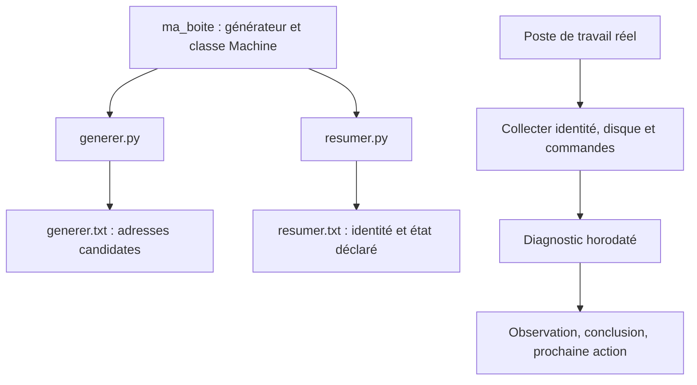

# TP 03 — Préparer un adressage et diagnostiquer un hôte

[Retour au parcours](../../README.md) — **100 minutes**, essais et autocorrection compris.

## Mission et production

Produire un diagnostic horodaté du poste Linux pour préparer une escalade. Le TP se déroule dans le poste Linux de
formation ; les données du parc restent fictives.

## Comprendre le traitement

La bibliothèque est commune aux deux clients. Le diagnostic observe séparément le poste qui exécute Python.



Une adresse candidate est issue du plan fourni ; elle n’est pas une preuve de disponibilité sur le réseau.

## Fichiers et démarrage

Compléter ma_boite/reseau.py et ma_boite/modeles.py, puis lire les deux clients generer.py et resumer.py. La partie
diagnostic est dans depart.py. Ajouter les imports nécessaires dans le préambule commun.

```sh
uv run python ateliers/03/depart.py
uv run python outils/verifier.py tp03 --complet
```

Les commandes se lancent à la racine du projet dans le terminal Linux. Les valeurs « À compléter » sont normales au
départ. Complétez les repères TODO et conservez les données de référence. Les lectures, les chemins et une partie des
contrôles sont fournis ; le fichier de départ peut déjà produire des sorties incomplètes. Chaque essai produit un
dossier dans sorties/ ; le vérificateur relance votre code.

## Travailler avec les amorces

Les repères `TODO` désignent le travail à compléter. Lire aussi les lignes fournies : leur rôle doit pouvoir être
expliqué. Garder le dernier tiers de chaque créneau pour lancer, lire les résultats et répondre à la question de
transfert. Les corrigés détaillent les décisions et restent dans des fichiers séparés pour comparer votre version.

## Parcours

1. [Générateur d’IP](#generateur) — 30 min.
2. [Classe Machine](#classe) — 20 min.
3. [Bibliothèque et deux clients](#bibliotheque) — 15 min.
4. [Diagnostic de la machine](#diagnostic) — 35 min.

<a id="generateur"></a>

## Générateur d’IP — 30 min

La validation des entrées est fournie. Compléter les deux TODO du parcours, puis essayer les réservations, les limites 0
et 3 et l’épuisement du générateur. Répartir le créneau entre lecture (5 min), modifications et essais (15 min),
contrôle et explication (10 min).

**Mise en pratique.** Proposer des adresses candidates en excluant les réservations du plan réseau.

**À écrire :** Les deux TODO de generer_ips : exclure les réservations et produire une candidate avec yield.

**Fourni :** Validation, parcours hosts, compteur, limite et appels du pilote.

**À observer :** La consommation du générateur et les adresses candidates.

1. Compléter ma_boite/reseau.py : generer_ips(reseau, reservees=(), limite=None). Utiliser ip_network puis hosts,
   convertir les réservations en objets IP.
2. Lire les contrôles fournis et vérifier qu’ils refusent une limite négative/non entière et une réservation hors
   réseau. Avec limite=0, ne rien produire. Limiter le TP à IPv4.
3. Ignorer les adresses réservées, yield str(adresse), puis arrêter après le nombre demandé ; si le réseau est épuisé,
   terminer normalement.
4. Sur 192.0.2.0/29 avec .1 et .3 réservées, demander trois candidates : .2, .4, .5. Comparer avec le parcours complet
   de six hôtes.
5. Consommer deux fois le même générateur, puis en créer un nouveau : longueurs 6, 0, 6.

La vérification et la question de transfert sont incluses dans ce temps.

Depuis la racine du projet, lancer seulement cette étape, puis contrôler les résultats :

```sh
# 1. Exécuter votre code pour cette étape
uv run python outils/executer_etape.py tp03 generateur
# 2. Comparer les résultats et les fichiers au contrat
uv run python outils/verifier.py tp03 --etape generateur --rapport sorties/tp03/controle-generateur.json
# 3. Relire le contrôle et le chemin de son essai
uv run python -m json.tool sorties/tp03/controle-generateur.json
```

Au premier essai, « À revoir » et un code de sortie 1 du vérificateur sont attendus tant que les TODO manquent. Après
modification, relancer les mêmes commandes jusqu’à « Conforme ». Chaque lancement crée un nouvel essai ; ouvrir les
productions dans le champ `dossier` du dernier contrôle, puis comparer aux critères ci-dessous.

<details>
<summary>Exécuter la correction de cette étape</summary>

À utiliser après votre essai pour comparer les choix, sans remplacer votre fichier de départ :

```sh
uv run python outils/executer_etape.py tp03 generateur --corrige
uv run python outils/verifier.py tp03 --etape generateur --corrige
```

Lire les commentaires du corrigé et expliquer le rôle de chaque différence avec votre version.

</details>

<details>
<summary>Indice 1 - Piste conceptuelle</summary>

Un générateur conserve sa progression. La limite compte les valeurs effectivement produites après exclusion des
réservations, et un second parcours du même objet ne repart pas du début.

</details>

<details>
<summary>Indice 2 - Pseudo-code</summary>

Pseudo-code à traduire dans les fichiers demandés, à partir des données du TP :

```text
valider réseau IPv4, limite et réservations
SI limite vaut zéro : terminer sans produire
produites <- 0
POUR chaque adresse de hosts() :
    SI elle est réservée : passer à la suivante
    produire sa représentation texte avec yield
    augmenter produites
    SI la limite est atteinte : terminer
consommer deux fois le même générateur, puis un nouvel objet
comparer les parcours complets et les candidates limitées
```

Repères du code fourni :

La limite porte sur les adresses produites, pas sur celles examinées. hosts() gère aussi les cas /31 et /32.

</details>

<details>
<summary>Critères du contrôle de référence</summary>

Les résultats ci-dessous portent sur les données fournies. Les identités, dates et mesures du poste ne sont pas figées ;
leur cohérence est contrôlée.

```json
{
  "adresses": [
    "192.0.2.1",
    "192.0.2.2",
    "192.0.2.3",
    "192.0.2.4",
    "192.0.2.5",
    "192.0.2.6"
  ],
  "longueurs": [
    6,
    0,
    6
  ],
  "candidates": [
    "192.0.2.2",
    "192.0.2.4",
    "192.0.2.5"
  ]
}
```

</details>

**Question de transfert :** Ces IP sont-elles garanties libres sur le réseau ?

<details>
<summary>Éléments de réponse</summary>

Non. Elles sont seulement non réservées dans notre référentiel ; il manque les vérifications du processus d’allocation
réel.

</details>

<a id="classe"></a>

## Classe Machine — 20 min

**Mise en pratique.** Représenter l’identité et l’état d’une machine sans mélanger collecte et présentation.

**À écrire :** La méthode resume dans ma_boite/modeles.py.

**Fourni :** Les deux instances créées par depart.py.

**À observer :** Les attributs de chaque instance et le résultat de resume.

1. Lire le constructeur fourni : `__init__(nom, ip, actif=True)` stocke les attributs de chaque instance.
2. Compléter resume() pour renvoyer "nom | IP | actif" ou "nom | IP | inactif".
3. Créer alpha et beta, rendre seulement beta inactive, puis vérifier les deux résumés.
4. Expliquer pourquoi une simple fonction suffirait à un traitement sans état et pourquoi la classe ne doit pas ouvrir
   une connexion dans `__init__`.

La vérification et la question de transfert sont incluses dans ce temps.

Depuis la racine du projet, lancer seulement cette étape, puis contrôler les résultats :

```sh
# 1. Exécuter votre code pour cette étape
uv run python outils/executer_etape.py tp03 classe
# 2. Comparer les résultats et les fichiers au contrat
uv run python outils/verifier.py tp03 --etape classe --rapport sorties/tp03/controle-classe.json
# 3. Relire le contrôle et le chemin de son essai
uv run python -m json.tool sorties/tp03/controle-classe.json
```

Au premier essai, « À revoir » et un code de sortie 1 du vérificateur sont attendus tant que les TODO manquent. Après
modification, relancer les mêmes commandes jusqu’à « Conforme ». Chaque lancement crée un nouvel essai ; ouvrir les
productions dans le champ `dossier` du dernier contrôle, puis comparer aux critères ci-dessous.

<details>
<summary>Exécuter la correction de cette étape</summary>

À utiliser après votre essai pour comparer les choix, sans remplacer votre fichier de départ :

```sh
uv run python outils/executer_etape.py tp03 classe --corrige
uv run python outils/verifier.py tp03 --etape classe --corrige
```

Lire les commentaires du corrigé et expliquer le rôle de chaque différence avec votre version.

</details>

<details>
<summary>Indice 1 - Piste conceptuelle</summary>

La classe décrit un type ; chaque instance porte son propre état. La présentation traduit cet état sans déclencher une
mesure réseau.

</details>

<details>
<summary>Indice 2 - Pseudo-code</summary>

Pseudo-code à traduire dans les fichiers demandés, à partir des données du TP :

```text
CLASSE Machine :
    initialisation : stocker nom, ip et actif sur l’instance
    méthode resume :
        choisir le libellé d’état selon actif
        renvoyer nom, ip et libellé au format demandé
créer les deux instances prévues
modifier actif sur une seule instance
comparer leurs résumés et vérifier l’état de l’autre
```

Repères du code fourni :

Utiliser self pour l’état de l’instance. Ne pas mettre une liste de services mutable au niveau de la classe.

</details>

<details>
<summary>Critères du contrôle de référence</summary>

Les résultats ci-dessous portent sur les données fournies. Les identités, dates et mesures du poste ne sont pas figées ;
leur cohérence est contrôlée.

```json
{
  "resumes": [
    "alpha | 192.0.2.1 | actif",
    "beta | 192.0.2.2 | inactif"
  ],
  "alpha_active": true
}
```

</details>

**Question de transfert :** L’objet prouve-t-il que la machine répond ?

<details>
<summary>Éléments de réponse</summary>

Non : actif est ici une donnée déclarée, pas une mesure réseau.

</details>

<a id="bibliotheque"></a>

## Bibliothèque et deux clients — 15 min

**Mise en pratique.** Utiliser les mêmes règles réseau depuis deux outils de préparation du parc.

**À écrire :** Aucun nouveau module ; réutiliser les fonctions et la classe déjà complétées.

**Fourni :** Le package et le pilote clients_bibliotheque.

**À observer :** Les mêmes règles et des imports sans lancement automatique.

1. Les fonctions et la classe sont déjà écrites dans les étapes précédentes. Relire les imports de generer.py et
   resumer.py.
2. Lancer les deux clients depuis la racine :

   ```sh
   uv run python ateliers/03/generer.py
   uv run python ateliers/03/resumer.py
   ```

   Ils utilisent le même package ma_boite.
3. Modifier temporairement un réseau dans un client, prédire son résultat, puis rétablir /29 pour le contrôle de
   référence.
4. Vérifier generer.txt et resumer.txt : six adresses et six résumés cohérents, sans recopier les fonctions entre les
   scripts.

La vérification et la question de transfert sont incluses dans ce temps.

Depuis la racine du projet, lancer seulement cette étape, puis contrôler les résultats :

```sh
# 1. Exécuter votre code pour cette étape
uv run python outils/executer_etape.py tp03 bibliotheque
# 2. Comparer les résultats et les fichiers au contrat
uv run python outils/verifier.py tp03 --etape bibliotheque --rapport sorties/tp03/controle-bibliotheque.json
# 3. Relire le contrôle et le chemin de son essai
uv run python -m json.tool sorties/tp03/controle-bibliotheque.json
```

Au premier essai, « À revoir » et un code de sortie 1 du vérificateur sont attendus tant que les TODO manquent. Après
modification, relancer les mêmes commandes jusqu’à « Conforme ». Chaque lancement crée un nouvel essai ; ouvrir les
productions dans le champ `dossier` du dernier contrôle, puis comparer aux critères ci-dessous.

<details>
<summary>Exécuter la correction de cette étape</summary>

À utiliser après votre essai pour comparer les choix, sans remplacer votre fichier de départ :

```sh
uv run python outils/executer_etape.py tp03 bibliotheque --corrige
uv run python outils/verifier.py tp03 --etape bibliotheque --corrige
```

Lire les commentaires du corrigé et expliquer le rôle de chaque différence avec votre version.

</details>

<details>
<summary>Indice 1 - Piste conceptuelle</summary>

Les deux clients doivent appeler une seule implémentation des règles. Une modification du module commun doit bénéficier
aux deux sans copier son contenu dans les scripts.

</details>

<details>
<summary>Indice 2 - Pseudo-code</summary>

Pseudo-code à traduire dans les fichiers demandés, à partir des données du TP :

```text
vérifier les fonctions et la classe complétées dans ma_boite
relire les imports de generer.py et resumer.py
lancer les deux clients fournis avec le même package
relire les adresses de generer.txt et les résumés de resumer.txt
modifier temporairement l’entrée réseau d’un client et prédire sa sortie
rétablir les données de référence avant le contrôle
comparer identités, nombre de résultats et règle partagée
```

Repères du code fourni :

La solution est dans solution/ma_boite. Importer un départ complet lancerait ses blocs : importer des modules de
fonctions.

</details>

<details>
<summary>Critères du contrôle de référence</summary>

Les résultats ci-dessous portent sur les données fournies. Les identités, dates et mesures du poste ne sont pas figées ;
leur cohérence est contrôlée.

```json
{
  "nombre": 6,
  "premier": "h1 | 192.0.2.1 | actif",
  "dernier": "h6 | 192.0.2.6 | actif",
  "clients_identiques": true
}
```

</details>

**Question de transfert :** Où corriger une réservation mal traitée pour en faire bénéficier les deux clients ?

<details>
<summary>Éléments de réponse</summary>

Dans la fonction unique du module réseau, puis relancer les clients.

</details>

<a id="diagnostic"></a>

## Diagnostic de la machine — 35 min

La collecte, l’écriture et les essais de commande sont fournis. Lire les mesures et leurs statuts, compléter les trois
interprétations et leur contrôle. Prévoir 10 min de lecture/exécution, 15 min d’interprétation et 10 min de
vérification/explication.

**Mise en pratique.** Produire un diagnostic horodaté du poste Linux pour préparer une escalade.

**À écrire :** Les trois interprétations et leur contrôle dans depart.py.

**Fourni :** collecter_local, enregistrement JSON/TXT, observation Linux, essais de commande et journal.

**À observer :** Le poste mesuré, les statuts et les limites des conclusions.

1. Identifier une seule fois le poste, le compte et le volume. Le poste distant est le système observé ; ses mesures ne
   décrivent pas votre ordinateur personnel.
2. Lire collecter_local dans admin_tools.systeme : rapport contient la date UTC
   (datetime.now(timezone.utc).isoformat()), getpass.getuser(), socket.gethostname(), platform.system(), le chemin
   absolu et shutil.disk_usage(dossier). Conserver les valeurs en octets et le pourcentage.
3. Suivre les appels fournis à lancer pour uname, id et df. Lire
   observations_linux=observer_linux() fourni : /proc/meminfo (MemAvailable), ip -j address/route et systemctl --failed.
   Conserver les statuts et sorties ; une commande absente ou inaccessible signifie inconnu.
4. Lire diagnostic.json et diagnostic.txt, puis écrire interpretation.json avec trois clés memoire/reseau/services,
   chacune contenant observation (objet collecté), conclusion (phrase) et action (prochaine vérification). Mémoire :
   instantané sans preuve de fuite ; réseau : configuration sans preuve de connectivité ; services : unités en échec
   connues de systemd. Utiliser le contexte journal_execution(dossier) fourni : journal.info pour une étape réalisée,
   journal.error pour les échecs contrôlés, extra={"etape": ..., "cible": ...}. execution.log reçoit la date UTC, le
   niveau et le contexte.
5. Avec [sys.executable, str(RACINE / "outils/commande_enfant.py"), "echec"], vérifier le code 4 ; avec attente et
   timeout=0.1, observer le dépassement de délai. Ces échecs sont contrôlés, les valeurs du poste restent variables.
6. Compléter le contrôle des interprétations et expliquer les sept autres critères fournis. Garder la répartition de 35
   minutes annoncée ci-dessus ; aucun paquet à installer pendant ce créneau.

La vérification et la question de transfert sont incluses dans ce temps.

Depuis la racine du projet, lancer seulement cette étape, puis contrôler les résultats :

```sh
# 1. Exécuter votre code pour cette étape
uv run python outils/executer_etape.py tp03 diagnostic
# 2. Comparer les résultats et les fichiers au contrat
uv run python outils/verifier.py tp03 --etape diagnostic --rapport sorties/tp03/controle-diagnostic.json
# 3. Relire le contrôle et le chemin de son essai
uv run python -m json.tool sorties/tp03/controle-diagnostic.json
```

Au premier essai, « À revoir » et un code de sortie 1 du vérificateur sont attendus tant que les TODO manquent. Après
modification, relancer les mêmes commandes jusqu’à « Conforme ». Chaque lancement crée un nouvel essai ; ouvrir les
productions dans le champ `dossier` du dernier contrôle, puis comparer aux critères ci-dessous.

<details>
<summary>Exécuter la correction de cette étape</summary>

À utiliser après votre essai pour comparer les choix, sans remplacer votre fichier de départ :

```sh
uv run python outils/executer_etape.py tp03 diagnostic --corrige
uv run python outils/verifier.py tp03 --etape diagnostic --corrige
```

Lire les commentaires du corrigé et expliquer le rôle de chaque différence avec votre version.

</details>

<details>
<summary>Indice 1 - Piste conceptuelle</summary>

Chaque mesure décrit un poste, une date et une source précise. Une observation indisponible reste inconnue, et une
mesure ponctuelle ne suffit pas à établir une cause.

</details>

<details>
<summary>Indice 2 - Pseudo-code</summary>

Pseudo-code à traduire dans les fichiers demandés, à partir des données du TP :

```text
dans journal_execution, relever identité, date UTC et volume
appeler les commandes de contexte avec lancer
ajouter observer_linux fourni et conserver ses statuts
enregistrer diagnostic.json et diagnostic.txt
POUR mémoire, réseau et services :
    écrire observation, conclusion limitée et prochaine vérification
    SI la source est indisponible : conserver le statut inconnu
exécuter les deux commandes enfant d’échec/délai contrôlés
construire resultat depuis les observations et relire execution.log
```

Repères du code fourni :

Imports utiles : datetime/timezone, getpass, platform, socket, shutil, sys, Path et RACINE. lancer et enregistrer sont
fournis dans admin_tools.systeme ; collecter_local présente le schéma complet. Le chemin mesure un volume, pas la
capacité physique totale du serveur. observer_linux est fourni : il faut assembler et interpréter les observations, pas
réécrire ses parseurs.

</details>

<details>
<summary>Critères du contrôle de référence</summary>

Les résultats ci-dessous portent sur les données fournies. Les identités, dates et mesures du poste ne sont pas figées ;
leur cohérence est contrôlée.

```json
{
  "identite": true,
  "disque_coherent": true,
  "commande_reussie": true,
  "code_echec": 4,
  "delai_depasse": true,
  "contexte_complet": true,
  "commandes_systeme_reussies": true,
  "observations_interpretees": true
}
```

</details>

**Question de transfert :** Mémoire utilisée à 91 %, systemctl inaccessible : peut-on conclure à une fuite mémoire ou à
des services sains ? Répondre en trois phrases : observation, conclusion, prochaine action.

<details>
<summary>Éléments de réponse</summary>

La pression mémoire est observée à un instant ; l’état des services reste inconnu. Ni fuite ni bon état global ne sont
établis. Comparer plusieurs relevés, les processus et les droits/gestionnaire de services.

</details>

## Comprendre la correction

Après votre essai, lire [corrige.py](corrige.py) et les fonctions partagées dans [admin_tools](../../src/admin_tools/).
Comparer les choix et leurs limites. Le corrigé garde ses sorties séparément. [Dépannage](../../docs/depannage.md).

```sh
uv run python ateliers/03/corrige.py
uv run python outils/verifier.py tp03 --corrige --complet
```
