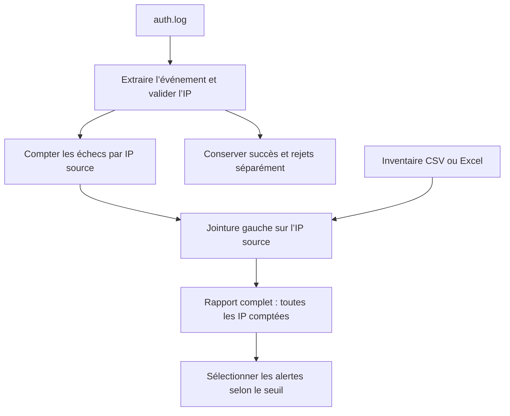
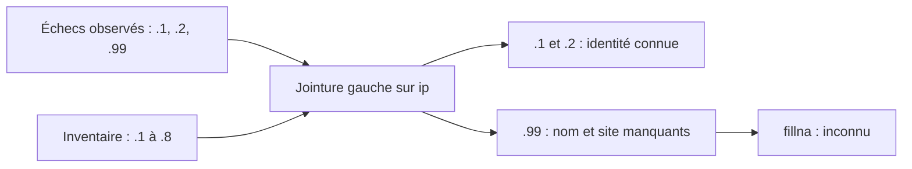

# TP 04 — Analyser un incident SSH et Web

[Retour au parcours](../../README.md) — **100 minutes**, essais et autocorrection compris.

## Mission et production

Rapprocher les observations et le parc pour indiquer quelles machines examiner. Le TP se déroule dans le poste Linux de
formation ; les données du parc restent fictives.

## Comprendre le traitement

Cette vue suit les événements SSH. Les erreurs Web sont comptées dans un bloc indépendant.



La jointure conserve les IP inconnues. Une alerte demande une investigation ; elle ne prouve pas une intrusion.

## Où travailler et quoi modifier

**Commencez par la première ligne du tableau ci-dessous.** Les fichiers existent déjà ; ouvrez-les dans l’éditeur.
Les chemins du tableau sont relatifs à ce dossier de TP. Enregistrez après chaque modification.

| Étape | Fichier à ouvrir | Travail demandé |
| --- | --- | --- |
| [logs](#logs) | [depart.py](depart.py) | Trois compteurs à compléter |
| [arguments](#arguments) | [cli.py](cli.py) | Ajouter une option au parseur |
| [pandas](#pandas) | [depart.py](depart.py) | Remplir la colonne site avant l’export |
| [rapport](#rapport) | [depart.py](depart.py) | Conserver les IP inconnues dans la jointure |

Les imports, les données de référence, les repères `# ===` et l’enregistrement des résultats sont fournis.
Ne réécrivez pas tout le script et ne remplacez pas les calculs par les résultats attendus.
`TODO` signifie « partie à compléter » ; les exemples et extraits du README sont à lire, pas à copier en bloc.

Toutes les commandes se lancent dans un terminal à la racine du projet, où se trouve `pyproject.toml`.
Si nécessaire, préparez l’environnement avec `uv sync --locked`. Avancez avec le contrôle de chaque étape ;
le contrôle complet n’est demandé qu’à la fin. Un résultat `À revoir` est normal avant de compléter votre code.
Le vérificateur relance l’étape et compare vos productions. Les chemins de sorties changent à chaque essai.

## Voir les données avant de coder

Extrait réel de [donnees/auth.log](../../donnees/auth.log) :

```text
Oct  5 09:00:00 srv-bastion sshd[1234]: Failed password for root from 192.0.2.1 port 50222 ssh2
Oct  5 09:00:01 srv-bastion sshd[1234]: Failed password for invalid user admin from 192.0.2.1 port 50222 ssh2
```

Extrait réel de [donnees/inventaire.csv](../../donnees/inventaire.csv) :

```csv
nom,ip,site,actif,charge
srv-paris-web-01,192.0.2.1,paris,True,20
srv-paris-web-02,192.0.2.2,paris,True,65
```

Les adresses des logs sont les IP sources des événements. Le rapprochement avec l’inventaire est une convention de cet
exercice, pas une preuve d’identité en situation réelle.

## Parcours

1. [Analyser des logs](#logs) — 40 min.
2. [Arguments de commande](#arguments) — 15 min.
3. [CSV et Excel avec Pandas](#pandas) — 20 min.
4. [Rapport complet et alertes](#rapport) — 25 min.

<a id="logs"></a>

## Analyser des logs — 40 min

La regex, la lecture et les rejets sont fournis. Compléter les trois compteurs dans les branches identifiées, puis
expliquer l’analyse Web fournie. Réserver 10 min au format, 20 min aux modifications/essais et 10 min au
contrôle/transfert.

**Votre objectif :** Trois compteurs à compléter.

**Fichier à modifier :** `depart.py`. Repérez le bloc `# === LOGS`.

**À faire dans l’ordre :**

1. Après la validation de l’IP, ajoutez `valides += 1` au TODO 1.
2. Dans la branche `Accepted publickey`, remplacez `pass` par `succes += 1`.
3. Dans la branche `else`, remplacez `pass` par `compteurs[ip] = compteurs.get(ip, 0) + 1`.
4. Lisez le motif `MOTIF` dans `src/admin_tools/metier.py` et expliquez les deux rejets. Aucune regex n’est à réécrire
   ici.

**Déjà fourni — à conserver :** Expression régulière, lecture, validation IP, rejets, filtre des alertes et analyse Web.

**À observer après le contrôle :**

| Fichier ou traitement fourni | Observation à expliquer |
| --- | --- |
| `MOTIF` dans `src/admin_tools/metier.py` | Quels groupes extraient le statut et l’IP ? |
| Validation par `ipaddress` | Pourquoi la regex seule ne suffit-elle pas pour `999.0.0.1` ? |
| `donnees/access.log` et `analyser_web` | Distinguer succès HTTP, erreurs 4xx et erreurs 5xx. |
| Compteurs SSH | Une connexion réussie ne doit pas augmenter le nombre d’échecs. |

Depuis la racine du projet, lancer seulement cette étape, puis contrôler les résultats :

```sh
uv run python outils/executer_etape.py tp04 logs
uv run python outils/verifier.py tp04 --etape logs
```

Au premier essai, « À revoir » et un code de sortie 1 du vérificateur sont attendus tant que les TODO manquent. Après
modification, relancer les mêmes commandes jusqu’à « Conforme ». Chaque lancement crée un nouvel essai ; ouvrir les
productions dans le dossier d’essai indiqué par le dernier contrôle, puis comparer aux critères ci-dessous.

**Étape terminée :** le contrôle affiche `Conforme` et vous pouvez expliquer les modifications réalisées.

<details>
<summary>Exécuter la correction de cette étape</summary>

À utiliser après votre essai pour comparer les choix, sans remplacer votre fichier de départ :

```sh
uv run python outils/executer_etape.py tp04 logs --corrige
uv run python outils/verifier.py tp04 --etape logs --corrige
```

Lire les commentaires du corrigé et expliquer le rôle de chaque différence avec votre version.

</details>

<details>
<summary>Indice 1 - Piste conceptuelle</summary>

L’extraction, la validation et le comptage sont trois opérations distinctes. Un succès ne compte pas comme un échec ;
les lignes rejetées et les faibles compteurs restent visibles.

</details>

<details>
<summary>Indice 2 - Pseudo-code</summary>

Ce pseudo-code décrit le traitement complet, y compris les parties déjà fournies. Il sert à comprendre ;
ne réécrivez que les éléments indiqués dans « À faire dans l’ordre ».

```text
initialiser compteurs, rejets, événements valides et succès
POUR chaque ligne SSH avec son numéro :
    tenter fullmatch avec MOTIF fourni
    SI format inconnu : conserver un rejet et poursuivre
    valider l’IP ; SI invalide : conserver un rejet et poursuivre
    augmenter le nombre d’événements valides
    SI statut est un refus : augmenter le compteur de cette IP
    SINON : augmenter le nombre de succès
sélectionner les alertes depuis les compteurs sans les modifier
pour le Web, extraire status et distinguer 4xx, 5xx et rejets
contrôler le volume puis revenir au fichier SSH de référence
```

Repères du code fourni :

Motifs fournis, algorithme de comptage à écrire. Accepted publickey est un succès d’authentification ; Failed password
inclut le cas invalid user. Ne pas supposer qu’une regex valide une IP.

</details>

**Repères de réussite sur les données fournies :**

| Champ du bilan | Valeur attendue |
| --- | --- |
| `compteurs` | `{"192.0.2.1": 3, "192.0.2.2": 2, "192.0.2.99": 1}` |
| `valides` | `7` |
| `succes` | `1` |

<details>
<summary>Critères du contrôle de référence</summary>

Les résultats ci-dessous portent sur les données fournies. Les identités, dates et mesures du poste ne sont pas figées ;
leur cohérence est contrôlée.

```json
{
  "compteurs": {
    "192.0.2.1": 3,
    "192.0.2.2": 2,
    "192.0.2.99": 1
  },
  "valides": 7,
  "succes": 1,
  "rejets": 2,
  "alertes": {
    "192.0.2.1": 3,
    "192.0.2.2": 2
  },
  "web": {
    "4xx": 2,
    "5xx": 2,
    "rejets": 1
  }
}
```

</details>

**Question de transfert :** Analyser donnees/transfert/auth-variante.log. Le seuil passe de 2 à 3 : que changent les
alertes et que deviennent les rejets ? Répondre en trois phrases : observation, conclusion, prochaine action.

<details>
<summary>Éléments de réponse</summary>

Deux échecs pour 192.0.2.42, un succès, deux rejets ; une alerte à 2, aucune à 3. Le seuil change la sélection, pas les
événements. Conserver les rejets, la période et le contexte avant de conclure à une intrusion.

</details>

<a id="arguments"></a>

## Arguments de commande — 15 min

Compléter `--sortie` dans cli.py puis lancer :

```sh
uv run python ateliers/04/cli.py --help
uv run python ateliers/04/cli.py donnees/auth.log --seuil 2 --sortie sorties/essai-cli
uv run python ateliers/04/cli.py donnees/auth.log --seuil 0
```

Le dernier appel doit refuser le seuil et terminer avec le code 2. Les deux fichiers JSON du cas valide sont dans
`sorties/essai-cli/`.

**Votre objectif :** Ajouter une option au parseur.

**Fichier à modifier :** `cli.py`.

**À faire dans l’ordre :**

1. Dans `parseur_logs`, ajoutez l’option `"--sortie"` avec `type=Path` et `default=Path("sorties/logs")` via
   `parser.add_argument(...)`.
2. Gardez les autres options et la gestion d’erreur. Enregistrez puis affichez l’aide avec
   `uv run python ateliers/04/cli.py --help`.
3. Lancez `uv run python ateliers/04/cli.py donnees/auth.log --seuil 2 --sortie sorties/essai-cli` : résultat attendu,
   `3 IP, 2 alertes`.

**Déjà fourni — à conserver :** Argument source, seuil positif, analyse, exports et cas d’erreurs du pilote.

Depuis la racine du projet, lancer seulement cette étape, puis contrôler les résultats :

```sh
uv run python outils/executer_etape.py tp04 arguments
uv run python outils/verifier.py tp04 --etape arguments
```

Au premier essai, « À revoir » et un code de sortie 1 du vérificateur sont attendus tant que les TODO manquent. Après
modification, relancer les mêmes commandes jusqu’à « Conforme ». Chaque lancement crée un nouvel essai ; ouvrir les
productions dans le dossier d’essai indiqué par le dernier contrôle, puis comparer aux critères ci-dessous.

**Étape terminée :** le contrôle affiche `Conforme` et vous pouvez expliquer les modifications réalisées.

<details>
<summary>Exécuter la correction de cette étape</summary>

À utiliser après votre essai pour comparer les choix, sans remplacer votre fichier de départ :

```sh
uv run python outils/executer_etape.py tp04 arguments --corrige
uv run python outils/verifier.py tp04 --etape arguments --corrige
```

Lire les commentaires du corrigé et expliquer le rôle de chaque différence avec votre version.

</details>

<details>
<summary>Indice 1 - Piste conceptuelle</summary>

L’interface valide l’usage avant de traiter les données. Le contrat distingue une erreur d’argument, une erreur d’accès
et une exécution réussie.

</details>

<details>
<summary>Indice 2 - Pseudo-code</summary>

Ce pseudo-code décrit le traitement complet, y compris les parties déjà fournies. Il sert à comprendre ;
ne réécrivez que les éléments indiqués dans « À faire dans l’ordre ».

```text
définir source, seuil strictement positif et sortie dans argparse
lire les arguments avant d’ouvrir la source
ESSAYER : analyser la source et écrire le bilan complet
    sélectionner séparément les alertes puis écrire leur JSON
SI erreur d’entrée/sortie prévue : écrire le diagnostic sur stderr
    renvoyer le code prévu pour cette erreur
SINON : afficher le résumé et renvoyer le code de réussite
faire transmettre le code de main au processus appelant
laisser le pilote contrôler aide, arguments invalides et source absente
```

Repères du code fourni :

Le pilote verifier_arguments lance les essais. L’aide ne doit pas lire de fichier ni lancer la collecte.

</details>

**Repères de réussite sur les données fournies :**

| Champ du bilan | Valeur attendue |
| --- | --- |
| `codes_help_invalide_zero_absent` | `[0, 2, 2, 1]` |
| `rapport_cree` | `true` |

<details>
<summary>Critères du contrôle de référence</summary>

Les résultats ci-dessous portent sur les données fournies. Les identités, dates et mesures du poste ne sont pas figées ;
leur cohérence est contrôlée.

```json
{
  "codes_help_invalide_zero_absent": [
    0,
    2,
    2,
    1
  ],
  "rapport_cree": true
}
```

</details>

**Question de transfert :** Pourquoi exposer le seuil plutôt que le coder en dur ?

<details>
<summary>Éléments de réponse</summary>

Le seuil dépend du volume et du besoin ; il doit pouvoir varier sans réécrire la règle.

</details>

<a id="pandas"></a>

## CSV et Excel avec Pandas — 20 min

**Votre objectif :** Remplir la colonne site avant l’export.

**Fichier à modifier :** `depart.py`. Repérez le bloc `# === PANDAS`.

**À faire dans l’ordre :**

1. Dans le bloc PANDAS, au TODO, affectez à `variante["site"]` le résultat de `variante["site"].fillna("inconnu")`.
2. Placez cette affectation avant `variante.to_excel(...)`. Appeler `fillna` sans conserver son résultat ne suffit pas.
3. Gardez les lectures et la relecture de `nettoye.xlsx` ; vérifiez qu’un site manquant devient `inconnu`.

**Déjà fourni — à conserver :** Lectures CSV/Excel, export, relecture et comptages.

Depuis la racine du projet, lancer seulement cette étape, puis contrôler les résultats :

```sh
uv run python outils/executer_etape.py tp04 pandas
uv run python outils/verifier.py tp04 --etape pandas
```

Au premier essai, « À revoir » et un code de sortie 1 du vérificateur sont attendus tant que les TODO manquent. Après
modification, relancer les mêmes commandes jusqu’à « Conforme ». Chaque lancement crée un nouvel essai ; ouvrir les
productions dans le dossier d’essai indiqué par le dernier contrôle, puis comparer aux critères ci-dessous.

**Étape terminée :** le contrôle affiche `Conforme` et vous pouvez expliquer les modifications réalisées.

<details>
<summary>Exécuter la correction de cette étape</summary>

À utiliser après votre essai pour comparer les choix, sans remplacer votre fichier de départ :

```sh
uv run python outils/executer_etape.py tp04 pandas --corrige
uv run python outils/verifier.py tp04 --etape pandas --corrige
```

Lire les commentaires du corrigé et expliquer le rôle de chaque différence avec votre version.

</details>

<details>
<summary>Indice 1 - Piste conceptuelle</summary>

L’IP sert ici d’identifiant textuel. Un site absent doit être rendu explicite en conservant la machine ; relire l’export
vérifie la donnée réellement enregistrée.

</details>

<details>
<summary>Indice 2 - Pseudo-code</summary>

Ce pseudo-code décrit le traitement complet, y compris les parties déjà fournies. Il sert à comprendre ;
ne réécrivez que les éléments indiqués dans « À faire dans l’ordre ».

```text
lire le CSV et l’Excel avec ip conservée comme texte
comparer lignes et colonnes sur les deux formats de référence
lire la variante avec site manquant
remplacer uniquement les valeurs absentes de site par inconnu
compter les sites sur la référence
exporter la variante en Excel sans index technique
relire cet export et compter les sites inconnus
construire resultat depuis référence et variante relue
```

Repères du code fourni :

Utiliser fillna sur la colonne site, pas une suppression globale des lignes. index=False évite une colonne technique
dans le rapport.

</details>

**Repères de réussite sur les données fournies :**

| Champ du bilan | Valeur attendue |
| --- | --- |
| `lignes` | `8` |
| `formats_identiques` | `true` |
| `sites_reference` | `{"lyon": 4, "paris": 4}` |

<details>
<summary>Critères du contrôle de référence</summary>

Les résultats ci-dessous portent sur les données fournies. Les identités, dates et mesures du poste ne sont pas figées ;
leur cohérence est contrôlée.

```json
{
  "lignes": 8,
  "formats_identiques": true,
  "sites_reference": {
    "lyon": 4,
    "paris": 4
  },
  "inconnus_variante": 1,
  "colonnes": [
    "nom",
    "ip",
    "site",
    "actif",
    "charge"
  ]
}
```

</details>

**Question de transfert :** Une IP peut-elle servir de clé immuable du parc ?

<details>
<summary>Éléments de réponse</summary>

Pas toujours : attribution et historique peuvent changer. Le TP suppose explicitement une IP unique dans cet instantané.

</details>

<a id="rapport"></a>

## Rapport complet et alertes — 25 min

La création du tableau et les exports sont fournis. Corriger le type de jointure, le traitement des inconnus et leur
compteur ; observer la ligne perdue avant la correction.

### Pourquoi garder le tableau de gauche ?



Une jointure interne supprimerait .99 et ferait disparaître une observation utile du rapport.

**Votre objectif :** Conserver les IP inconnues dans la jointure.

**Fichier à modifier :** `depart.py`. Repérez le bloc `# === RAPPORT`.

**À faire dans l’ordre :**

1. Dans le bloc RAPPORT, remplacez `how="inner"` par `how="left"` dans `bilan.merge(...)` : le tableau de gauche
   contient les IP observées.
2. Avant la sélection finale des colonnes, remplissez les valeurs manquantes des colonnes `nom` et `site` avec
   `"inconnu"` et réaffectez le résultat.
3. Dans `resultat`, remplacez la valeur `None` de `inconnus` par le nombre de lignes où `rapport["nom"] == "inconnu"`
   (somme convertie avec `int`).

**Déjà fourni — à conserver :** Comptage des logs, tri, filtre d’alertes, exports CSV/Excel.

Depuis la racine du projet, lancer seulement cette étape, puis contrôler les résultats :

```sh
uv run python outils/executer_etape.py tp04 rapport
uv run python outils/verifier.py tp04 --etape rapport
```

Au premier essai, « À revoir » et un code de sortie 1 du vérificateur sont attendus tant que les TODO manquent. Après
modification, relancer les mêmes commandes jusqu’à « Conforme ». Chaque lancement crée un nouvel essai ; ouvrir les
productions dans le dossier d’essai indiqué par le dernier contrôle, puis comparer aux critères ci-dessous.

**Étape terminée :** le contrôle affiche `Conforme` et vous pouvez expliquer les modifications réalisées.

<details>
<summary>Exécuter la correction de cette étape</summary>

À utiliser après votre essai pour comparer les choix, sans remplacer votre fichier de départ :

```sh
uv run python outils/executer_etape.py tp04 rapport --corrige
uv run python outils/verifier.py tp04 --etape rapport --corrige
```

Lire les commentaires du corrigé et expliquer le rôle de chaque différence avec votre version.

</details>

<details>
<summary>Indice 1 - Piste conceptuelle</summary>

Partez des événements pour conserver les sources inconnues. Le rapport complet et la sélection d’alertes ont des rôles
distincts ; la jointure ne doit pas multiplier les lignes.

</details>

<details>
<summary>Indice 2 - Pseudo-code</summary>

Ce pseudo-code décrit le traitement complet, y compris les parties déjà fournies. Il sert à comprendre ;
ne réécrivez que les éléments indiqués dans « À faire dans l’ordre ».

```text
transformer les compteurs en une table ip/echecs
lire l’inventaire et vérifier l’unicité de sa clé ip
joindre les compteurs à gauche sur ip avec validation one_to_one
remplacer les noms et sites absents par inconnu
exporter le rapport complet sous son nom propre
filtrer les alertes au seuil et les exporter sous un autre nom
relire nombres de lignes, sommes et inconnues
construire resultat sans supprimer les événements hors seuil
```

Repères du code fourni :

La référence rapprocher dans admin_tools.rapports refuse les IP dupliquées. Ne pas corriger une jointure en supprimant
arbitrairement ses doublons.

</details>

**Repères de réussite sur les données fournies :**

| Champ du bilan | Valeur attendue |
| --- | --- |
| `lignes` | `3` |
| `echecs` | `6` |
| `inconnus` | `1` |

<details>
<summary>Critères du contrôle de référence</summary>

Les résultats ci-dessous portent sur les données fournies. Les identités, dates et mesures du poste ne sont pas figées ;
leur cohérence est contrôlée.

```json
{
  "lignes": 3,
  "echecs": 6,
  "inconnus": 1,
  "alertes": 2,
  "echecs_alertes": 5
}
```

</details>

**Question de transfert :** Pourquoi garder .99 même si elle n’est pas inventoriée ?

<details>
<summary>Éléments de réponse</summary>

L’absence de correspondance est une information ; une jointure interne ferait disparaître cette observation.

</details>

## Valider votre travail

Depuis la racine du projet, après avoir terminé les étapes :

```sh
uv run python outils/verifier.py tp04 --complet
```

## Comprendre la correction

Après votre essai, lire [corrige.py](corrige.py) et les fonctions partagées dans [admin_tools](../../src/admin_tools/).
Comparer les choix et leurs limites. Le corrigé garde ses sorties séparément. [Dépannage](../../docs/depannage.md).

```sh
uv run python ateliers/04/corrige.py
uv run python outils/verifier.py tp04 --corrige --complet
```
