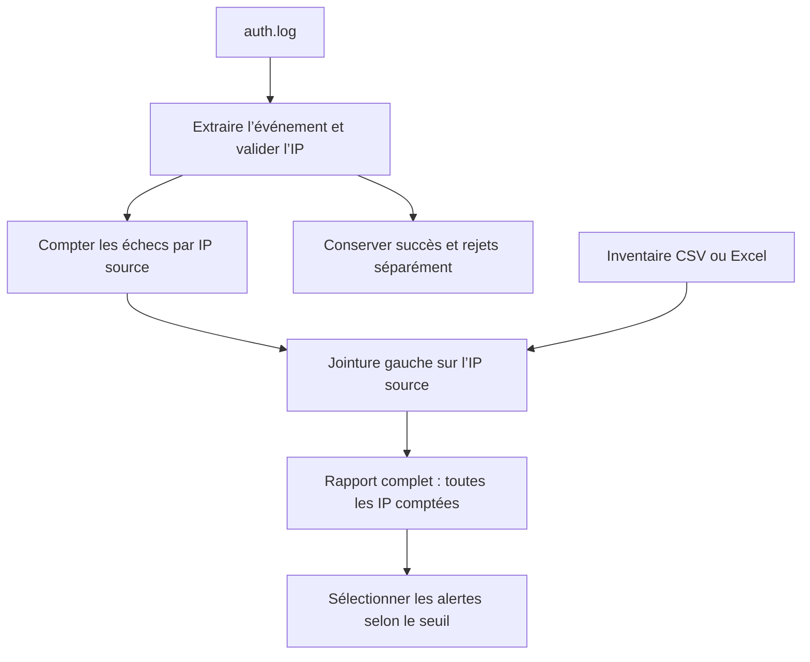

# TP 04 — Analyser un incident SSH et Web

[Retour au parcours](../../README.md) — **100 minutes**, essais et autocorrection compris.

## Mission et production

Rapprocher les observations et le parc pour indiquer quelles machines examiner. Le TP se déroule dans le poste Linux de
formation ; les données du parc restent fictives.

## Comprendre le traitement

Cette vue suit les événements SSH. Les erreurs Web sont comptées dans un bloc indépendant.



La jointure conserve les IP inconnues. Une alerte demande une investigation ; elle ne prouve pas une intrusion.

## Fichiers et démarrage

Compléter cli.py pour argparse. L’IP après from dans un événement SSH est la source ; le nom avant sshd est la cible. Le
rapprochement porte ici sur les sources connues. Le parseur vise le format fourni, pas tous les journaux OpenSSH.

```sh
uv run python ateliers/04/depart.py
uv run python outils/verifier.py tp04 --complet
```

Les commandes se lancent à la racine du projet dans le terminal Linux. Les valeurs « À compléter » sont normales au
départ. Complétez les repères TODO et conservez les données de référence. Les lectures, les chemins et une partie des
contrôles sont fournis ; le fichier de départ peut déjà produire des sorties incomplètes. Chaque essai produit un
dossier dans sorties/ ; le vérificateur relance votre code.

## Travailler avec les amorces

Les repères `TODO` désignent le travail à compléter. Lire aussi les lignes fournies : leur rôle doit pouvoir être
expliqué. Garder le dernier tiers de chaque créneau pour lancer, lire les résultats et répondre à la question de
transfert. Les corrigés détaillent les décisions et restent dans des fichiers séparés pour comparer votre version.

## Parcours

1. [Analyser des logs](#logs) — 40 min.
2. [Arguments de commande](#arguments) — 15 min.
3. [CSV et Excel avec Pandas](#pandas) — 20 min.
4. [Rapport complet et alertes](#rapport) — 25 min.

<a id="logs"></a>

## Analyser des logs — 40 min

La regex, la lecture et les rejets sont fournis. Compléter les trois compteurs dans les branches identifiées, puis
expliquer l’analyse Web fournie. Réserver 10 min au format, 20 min aux modifications/essais et 10 min au
contrôle/transfert.

**Mise en pratique.** Qualifier des échecs SSH et des erreurs Web avant de demander une investigation.

**À écrire :** Les trois incréments dans depart.py ; expliquer les rejets fournis.

**Fourni :** Motifs, lecture, validation IP, rejets, filtre d’alertes et analyse Web.

**À observer :** IP source, cible, succès, échecs et rejets distincts.

1. Lire les neuf lignes de auth.log : formats OpenSSH synthétiques, dont invalid user, clé acceptée, IP invalide et
   ligne non reconnue.
2. Utiliser le MOTIF fourni dans admin_tools.metier ; fullmatch puis groupes statut et ip. Valider l’IP avec ipaddress
   avant de compter.
3. Construire compteurs, rejets, valides et succes ; conserver trois IP ayant 3, 2 et 1 échecs. Garder les alertes >=2
   séparément.
4. Lire analyser_web et son motif MOTIF_WEB : expliquer le comptage des 4xx/5xx et des lignes rejetées
   dans resultat["web"].
5. Sur auth_volume.log, vérifier que vingt répétitions donnent 180 lignes, 140 événements acceptés et 40 rejets. Le
   contrôle de référence reste sur auth.log.
6. Après le contrôle de référence, observer un log ou un journal disponible sur le poste Linux : identifier service,
   date et format. La commande et la source sont choisies selon le poste. Une absence de log ou un format différent ne
   modifie pas les résultats attendus sur les fichiers fournis.

La vérification et la question de transfert sont incluses dans ce temps.

Depuis la racine du projet, lancer seulement cette étape, puis contrôler les résultats :

```sh
# 1. Exécuter votre code pour cette étape
uv run python outils/executer_etape.py tp04 logs
# 2. Comparer les résultats et les fichiers au contrat
uv run python outils/verifier.py tp04 --etape logs --rapport sorties/tp04/controle-logs.json
# 3. Relire le contrôle et le chemin de son essai
uv run python -m json.tool sorties/tp04/controle-logs.json
```

Au premier essai, « À revoir » et un code de sortie 1 du vérificateur sont attendus tant que les TODO manquent. Après
modification, relancer les mêmes commandes jusqu’à « Conforme ». Chaque lancement crée un nouvel essai ; ouvrir les
productions dans le champ `dossier` du dernier contrôle, puis comparer aux critères ci-dessous.

<details>
<summary>Exécuter la correction de cette étape</summary>

À utiliser après votre essai pour comparer les choix, sans remplacer votre fichier de départ :

```sh
uv run python outils/executer_etape.py tp04 logs --corrige
uv run python outils/verifier.py tp04 --etape logs --corrige
```

Lire les commentaires du corrigé et expliquer le rôle de chaque différence avec votre version.

</details>

<details>
<summary>Indice 1 - Piste conceptuelle</summary>

L’extraction, la validation et le comptage sont trois opérations distinctes. Un succès ne compte pas comme un échec ;
les lignes rejetées et les faibles compteurs restent visibles.

</details>

<details>
<summary>Indice 2 - Pseudo-code</summary>

Pseudo-code à traduire dans les fichiers demandés, à partir des données du TP :

```text
initialiser compteurs, rejets, événements valides et succès
POUR chaque ligne SSH avec son numéro :
    tenter fullmatch avec MOTIF fourni
    SI format inconnu : conserver un rejet et poursuivre
    valider l’IP ; SI invalide : conserver un rejet et poursuivre
    augmenter le nombre d’événements valides
    SI statut est un refus : augmenter le compteur de cette IP
    SINON : augmenter le nombre de succès
sélectionner les alertes depuis les compteurs sans les modifier
pour le Web, extraire status et distinguer 4xx, 5xx et rejets
contrôler le volume puis revenir au fichier SSH de référence
```

Repères du code fourni :

Motifs fournis, algorithme de comptage à écrire. Accepted publickey est un succès d’authentification ; Failed password
inclut le cas invalid user. Ne pas supposer qu’une regex valide une IP.

</details>

<details>
<summary>Critères du contrôle de référence</summary>

Les résultats ci-dessous portent sur les données fournies. Les identités, dates et mesures du poste ne sont pas figées ;
leur cohérence est contrôlée.

```json
{
  "compteurs": {
    "192.0.2.1": 3,
    "192.0.2.2": 2,
    "192.0.2.99": 1
  },
  "valides": 7,
  "succes": 1,
  "rejets": 2,
  "alertes": {
    "192.0.2.1": 3,
    "192.0.2.2": 2
  },
  "web": {
    "4xx": 2,
    "5xx": 2,
    "rejets": 1
  }
}
```

</details>

**Question de transfert :** Analyser donnees/transfert/auth-variante.log. Le seuil passe de 2 à 3 : que changent les
alertes et que deviennent les rejets ? Répondre en trois phrases : observation, conclusion, prochaine action.

<details>
<summary>Éléments de réponse</summary>

Deux échecs pour 192.0.2.42, un succès, deux rejets ; une alerte à 2, aucune à 3. Le seuil change la sélection, pas les
événements. Conserver les rejets, la période et le contexte avant de conclure à une intrusion.

</details>

<a id="arguments"></a>

## Arguments de commande — 15 min

Compléter `--sortie` dans cli.py puis lancer :

```sh
uv run python ateliers/04/cli.py --help
uv run python ateliers/04/cli.py donnees/auth.log --seuil 2 --sortie sorties/essai-cli
uv run python ateliers/04/cli.py donnees/auth.log --seuil 0
```

Le dernier appel doit refuser le seuil et terminer avec le code 2. Les deux fichiers JSON du cas valide sont dans
`sorties/essai-cli/`.

**Mise en pratique.** Rendre l’analyse utilisable sur un autre fichier sans éditer le code.

**À écrire :** L’option --sortie dans cli.py ; observer les autres options et erreurs fournies.

**Fourni :** Le format des résultats et les cas de contrôle.

**À observer :** L’aide, les codes retour, stdout et stderr.

1. Compléter cli.py : source positionnelle, --seuil validé par positif, --sortie de type Path.
2. Produire compteurs.json et alertes.json séparément. Ne pas supprimer les faibles compteurs du rapport complet.
3. Exécuter --help, --seuil abc, --seuil 0 et une source absente : codes attendus 0, 2, 2, 1.
4. Lancer sur auth_volume.log avec un seuil plus élevé, puis revenir aux paramètres de référence.

La vérification et la question de transfert sont incluses dans ce temps.

Depuis la racine du projet, lancer seulement cette étape, puis contrôler les résultats :

```sh
# 1. Exécuter votre code pour cette étape
uv run python outils/executer_etape.py tp04 arguments
# 2. Comparer les résultats et les fichiers au contrat
uv run python outils/verifier.py tp04 --etape arguments --rapport sorties/tp04/controle-arguments.json
# 3. Relire le contrôle et le chemin de son essai
uv run python -m json.tool sorties/tp04/controle-arguments.json
```

Au premier essai, « À revoir » et un code de sortie 1 du vérificateur sont attendus tant que les TODO manquent. Après
modification, relancer les mêmes commandes jusqu’à « Conforme ». Chaque lancement crée un nouvel essai ; ouvrir les
productions dans le champ `dossier` du dernier contrôle, puis comparer aux critères ci-dessous.

<details>
<summary>Exécuter la correction de cette étape</summary>

À utiliser après votre essai pour comparer les choix, sans remplacer votre fichier de départ :

```sh
uv run python outils/executer_etape.py tp04 arguments --corrige
uv run python outils/verifier.py tp04 --etape arguments --corrige
```

Lire les commentaires du corrigé et expliquer le rôle de chaque différence avec votre version.

</details>

<details>
<summary>Indice 1 - Piste conceptuelle</summary>

L’interface valide l’usage avant de traiter les données. Le contrat distingue une erreur d’argument, une erreur d’accès
et une exécution réussie.

</details>

<details>
<summary>Indice 2 - Pseudo-code</summary>

Pseudo-code à traduire dans les fichiers demandés, à partir des données du TP :

```text
définir source, seuil strictement positif et sortie dans argparse
lire les arguments avant d’ouvrir la source
ESSAYER : analyser la source et écrire le bilan complet
    sélectionner séparément les alertes puis écrire leur JSON
SI erreur d’entrée/sortie prévue : écrire le diagnostic sur stderr
    renvoyer le code prévu pour cette erreur
SINON : afficher le résumé et renvoyer le code de réussite
faire transmettre le code de main au processus appelant
laisser le pilote contrôler aide, arguments invalides et source absente
```

Repères du code fourni :

Le pilote verifier_arguments lance les essais. L’aide ne doit pas lire de fichier ni lancer la collecte.

</details>

<details>
<summary>Critères du contrôle de référence</summary>

Les résultats ci-dessous portent sur les données fournies. Les identités, dates et mesures du poste ne sont pas figées ;
leur cohérence est contrôlée.

```json
{
  "codes_help_invalide_zero_absent": [
    0,
    2,
    2,
    1
  ],
  "rapport_cree": true
}
```

</details>

**Question de transfert :** Pourquoi exposer le seuil plutôt que le coder en dur ?

<details>
<summary>Éléments de réponse</summary>

Le seuil dépend du volume et du besoin ; il doit pouvoir varier sans réécrire la règle.

</details>

<a id="pandas"></a>

## CSV et Excel avec Pandas — 20 min

**Mise en pratique.** Comparer les formats d’un inventaire et rendre une localisation manquante visible.

**À écrire :** Le remplacement du site absent avec fillna ; suivre les lectures et exports fournis.

**Fourni :** Les CSV/Excel et la variante avec site manquant.

**À observer :** Les types, colonnes et lignes conservées.

1. Lire inventaire.csv et inventaire.xlsx en conservant ip comme texte. Comparer les huit lignes et les colonnes.
2. Lire inventaire_site_manquant.csv et remplacer le site absent par inconnu, sans retirer la machine.
3. Compter les machines par site sur la référence : quatre à Paris, quatre à Lyon.
4. Exporter la variante nettoyée vers nettoye.xlsx, puis la relire et compter le site inconnu.

La vérification et la question de transfert sont incluses dans ce temps.

Depuis la racine du projet, lancer seulement cette étape, puis contrôler les résultats :

```sh
# 1. Exécuter votre code pour cette étape
uv run python outils/executer_etape.py tp04 pandas
# 2. Comparer les résultats et les fichiers au contrat
uv run python outils/verifier.py tp04 --etape pandas --rapport sorties/tp04/controle-pandas.json
# 3. Relire le contrôle et le chemin de son essai
uv run python -m json.tool sorties/tp04/controle-pandas.json
```

Au premier essai, « À revoir » et un code de sortie 1 du vérificateur sont attendus tant que les TODO manquent. Après
modification, relancer les mêmes commandes jusqu’à « Conforme ». Chaque lancement crée un nouvel essai ; ouvrir les
productions dans le champ `dossier` du dernier contrôle, puis comparer aux critères ci-dessous.

<details>
<summary>Exécuter la correction de cette étape</summary>

À utiliser après votre essai pour comparer les choix, sans remplacer votre fichier de départ :

```sh
uv run python outils/executer_etape.py tp04 pandas --corrige
uv run python outils/verifier.py tp04 --etape pandas --corrige
```

Lire les commentaires du corrigé et expliquer le rôle de chaque différence avec votre version.

</details>

<details>
<summary>Indice 1 - Piste conceptuelle</summary>

L’IP sert ici d’identifiant textuel. Un site absent doit être rendu explicite en conservant la machine ; relire l’export
vérifie la donnée réellement enregistrée.

</details>

<details>
<summary>Indice 2 - Pseudo-code</summary>

Pseudo-code à traduire dans les fichiers demandés, à partir des données du TP :

```text
lire le CSV et l’Excel avec ip conservée comme texte
comparer lignes et colonnes sur les deux formats de référence
lire la variante avec site manquant
remplacer uniquement les valeurs absentes de site par inconnu
compter les sites sur la référence
exporter la variante en Excel sans index technique
relire cet export et compter les sites inconnus
construire resultat depuis référence et variante relue
```

Repères du code fourni :

Utiliser fillna sur la colonne site, pas une suppression globale des lignes. index=False évite une colonne technique
dans le rapport.

</details>

<details>
<summary>Critères du contrôle de référence</summary>

Les résultats ci-dessous portent sur les données fournies. Les identités, dates et mesures du poste ne sont pas figées ;
leur cohérence est contrôlée.

```json
{
  "lignes": 8,
  "formats_identiques": true,
  "sites_reference": {
    "lyon": 4,
    "paris": 4
  },
  "inconnus_variante": 1,
  "colonnes": [
    "nom",
    "ip",
    "site",
    "actif",
    "charge"
  ]
}
```

</details>

**Question de transfert :** Une IP peut-elle servir de clé immuable du parc ?

<details>
<summary>Éléments de réponse</summary>

Pas toujours : attribution et historique peuvent changer. Le TP suppose explicitement une IP unique dans cet instantané.

</details>

<a id="rapport"></a>

## Rapport complet et alertes — 25 min

La création du tableau et les exports sont fournis. Corriger le type de jointure, le traitement des inconnus et leur
compteur ; observer la ligne perdue avant la correction.

**Mise en pratique.** Rapprocher les observations et le parc pour indiquer quelles machines examiner.

**À écrire :** Le type de jointure, le remplissage des inconnus et leur compteur dans depart.py.

**Fourni :** Comptage, table, jointure à corriger, filtre et exports ; rapprocher est la référence.

**À observer :** Le total de six échecs et l’IP inconnue conservée.

[Suivre la même IP jusqu’au message](../../docs/fil-donnee.md) permet de relire le résultat de cette étape dans le
parcours complet.

1. Construire une table des compteurs SSH puis faire une jointure gauche avec inventaire sur ip ; vérifier la
   cardinalité one_to_one.
2. Conserver l’IP .99 absente du parc et remplir nom/site avec inconnu.
3. Exporter rapport_complet en CSV et Excel, puis alertes avec echecs >=2 dans des fichiers distincts.
4. Contrôler trois IP, six échecs, une inconnue ; deux alertes totalisant cinq échecs. Lire une ligne et expliquer la
   prochaine vérification opérationnelle.

La vérification et la question de transfert sont incluses dans ce temps.

Depuis la racine du projet, lancer seulement cette étape, puis contrôler les résultats :

```sh
# 1. Exécuter votre code pour cette étape
uv run python outils/executer_etape.py tp04 rapport
# 2. Comparer les résultats et les fichiers au contrat
uv run python outils/verifier.py tp04 --etape rapport --rapport sorties/tp04/controle-rapport.json
# 3. Relire le contrôle et le chemin de son essai
uv run python -m json.tool sorties/tp04/controle-rapport.json
```

Au premier essai, « À revoir » et un code de sortie 1 du vérificateur sont attendus tant que les TODO manquent. Après
modification, relancer les mêmes commandes jusqu’à « Conforme ». Chaque lancement crée un nouvel essai ; ouvrir les
productions dans le champ `dossier` du dernier contrôle, puis comparer aux critères ci-dessous.

<details>
<summary>Exécuter la correction de cette étape</summary>

À utiliser après votre essai pour comparer les choix, sans remplacer votre fichier de départ :

```sh
uv run python outils/executer_etape.py tp04 rapport --corrige
uv run python outils/verifier.py tp04 --etape rapport --corrige
```

Lire les commentaires du corrigé et expliquer le rôle de chaque différence avec votre version.

</details>

<details>
<summary>Indice 1 - Piste conceptuelle</summary>

Partez des événements pour conserver les sources inconnues. Le rapport complet et la sélection d’alertes ont des rôles
distincts ; la jointure ne doit pas multiplier les lignes.

</details>

<details>
<summary>Indice 2 - Pseudo-code</summary>

Pseudo-code à traduire dans les fichiers demandés, à partir des données du TP :

```text
transformer les compteurs en une table ip/echecs
lire l’inventaire et vérifier l’unicité de sa clé ip
joindre les compteurs à gauche sur ip avec validation one_to_one
remplacer les noms et sites absents par inconnu
exporter le rapport complet sous son nom propre
filtrer les alertes au seuil et les exporter sous un autre nom
relire nombres de lignes, sommes et inconnues
construire resultat sans supprimer les événements hors seuil
```

Repères du code fourni :

La référence rapprocher dans admin_tools.rapports refuse les IP dupliquées. Ne pas corriger une jointure en supprimant
arbitrairement ses doublons.

</details>

<details>
<summary>Critères du contrôle de référence</summary>

Les résultats ci-dessous portent sur les données fournies. Les identités, dates et mesures du poste ne sont pas figées ;
leur cohérence est contrôlée.

```json
{
  "lignes": 3,
  "echecs": 6,
  "inconnus": 1,
  "alertes": 2,
  "echecs_alertes": 5
}
```

</details>

**Question de transfert :** Pourquoi garder .99 même si elle n’est pas inventoriée ?

<details>
<summary>Éléments de réponse</summary>

L’absence de correspondance est une information ; une jointure interne ferait disparaître cette observation.

</details>

## Comprendre la correction

Après votre essai, lire [corrige.py](corrige.py) et les fonctions partagées dans [admin_tools](../../src/admin_tools/).
Comparer les choix et leurs limites. Le corrigé garde ses sorties séparément. [Dépannage](../../docs/depannage.md).

```sh
uv run python ateliers/04/corrige.py
uv run python outils/verifier.py tp04 --corrige --complet
```
