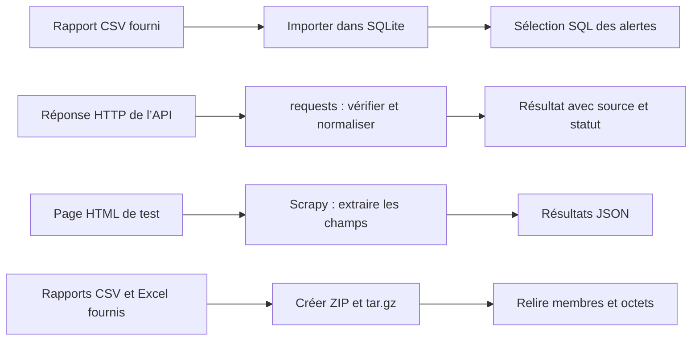

# TP 05 — Enrichir et conserver les rapports du SI

[Retour au parcours](../../README.md) — **100 minutes**, essais et autocorrection compris.

## Mission et production

Conserver un état du rapport et sélectionner les alertes sans refaire l’analyse des logs. Le TP se déroule dans le poste
Linux de formation ; les données du parc restent fictives.

## Comprendre le traitement

Les quatre blocs sont autonomes. Les réponses Web ne sont pas automatiquement ajoutées aux lignes SQLite.



SQLite est un fichier local. Les services Web de test tournent dans le poste ; l’appel public guidé garde une source
distincte.

## Fichiers et démarrage

Compléter spider.py pour Scrapy. Les cas HTTP contrôlés restent locaux au poste Linux, avec des données simulées ; une
interrogation publique guidée complète la géolocalisation. SQLite ne demande pas de serveur de base de données.

```sh
uv run python ateliers/05/depart.py
uv run python outils/verifier.py tp05 --complet
```

Les commandes se lancent à la racine du projet dans le terminal Linux. Les valeurs « À compléter » sont normales au
départ. Complétez les repères TODO et conservez les données de référence. Les lectures, les chemins et une partie des
contrôles sont fournis ; le fichier de départ peut déjà produire des sorties incomplètes. Chaque essai produit un
dossier dans sorties/ ; le vérificateur relance votre code.

## Travailler avec les amorces

Les repères `TODO` désignent le travail à compléter. Lire aussi les lignes fournies : leur rôle doit pouvoir être
expliqué. Garder le dernier tiers de chaque créneau pour lancer, lire les résultats et répondre à la question de
transfert. Les corrigés détaillent les décisions et restent dans des fichiers séparés pour comparer votre version.

## Parcours

1. [Importer un CSV dans SQLite](#sqlite) — 30 min.
2. [API et géolocalisation](#api) — 30 min.
3. [Extraire une page avec Scrapy](#scrapy) — 25 min.
4. [Archives contrôlées](#archives) — 15 min.

<a id="sqlite"></a>

## Importer un CSV dans SQLite — 30 min

Validation, ouverture exclusive, transaction et requêtes de lecture sont fournies. Compléter l’insertion paramétrée et
relier le compteur à la lecture réelle de la base. Lire ensuite importer_csv dans la correction pour comparer la
fonction réutilisable.

**Mise en pratique.** Conserver un état du rapport et sélectionner les alertes sans refaire l’analyse des logs.

**À écrire :** L’insertion paramétrée et le compteur de lignes réellement importées.

**Fourni :** Validation CSV, base neuve, schéma, transaction, SELECT, fermeture et refus du doublon.

**À observer :** Les trois lignes en base, le seuil et le refus d’écrasement.

[Suivre la même IP jusqu’au message](../../docs/fil-donnee.md) permet de relire le résultat de cette étape dans le
parcours complet.

1. Lire rapport_complet.csv. Créer une base neuve incidents.sqlite et la table incidents(ip TEXT PRIMARY KEY, nom TEXT,
   site TEXT, echecs INTEGER).
2. Insérer avec INSERT INTO incidents VALUES (?, ?, ?, ?) et des tuples de valeurs ; regrouper les écritures dans une
   transaction.
3. Vérifier COUNT(*)=3 et SUM(echecs)=6 ; sélectionner echecs >=2 avec un paramètre SQL et ORDER BY ip.
4. Fermer la connexion dans finally. Refuser un second import dans une base existante, sans en changer les octets.

La vérification et la question de transfert sont incluses dans ce temps.

Depuis la racine du projet, lancer seulement cette étape, puis contrôler les résultats :

```sh
# 1. Exécuter votre code pour cette étape
uv run python outils/executer_etape.py tp05 sqlite
# 2. Comparer les résultats et les fichiers au contrat
uv run python outils/verifier.py tp05 --etape sqlite --rapport sorties/tp05/controle-sqlite.json
# 3. Relire le contrôle et le chemin de son essai
uv run python -m json.tool sorties/tp05/controle-sqlite.json
```

Au premier essai, « À revoir » et un code de sortie 1 du vérificateur sont attendus tant que les TODO manquent. Après
modification, relancer les mêmes commandes jusqu’à « Conforme ». Chaque lancement crée un nouvel essai ; ouvrir les
productions dans le champ `dossier` du dernier contrôle, puis comparer aux critères ci-dessous.

<details>
<summary>Exécuter la correction de cette étape</summary>

À utiliser après votre essai pour comparer les choix, sans remplacer votre fichier de départ :

```sh
uv run python outils/executer_etape.py tp05 sqlite --corrige
uv run python outils/verifier.py tp05 --etape sqlite --corrige
```

Lire les commentaires du corrigé et expliquer le rôle de chaque différence avec votre version.

</details>

<details>
<summary>Indice 1 - Piste conceptuelle</summary>

Protégez l’état antérieur avant l’import, puis traitez les insertions comme un ensemble. La validation de la transaction
et la fermeture de la connexion sont deux responsabilités distinctes.

</details>

<details>
<summary>Indice 2 - Pseudo-code</summary>

Pseudo-code à traduire dans les fichiers demandés, à partir des données du TP :

```text
lire et valider les lignes du CSV
réserver exclusivement le fichier de base neuf
ouvrir la connexion SQLite
ESSAYER :
    dans une transaction, créer la table et insérer les valeurs paramétrées
    lire les totaux et sélectionner les alertes avec un seuil paramétré
ENFIN : fermer la connexion
tenter le second import et constater le refus sans modifier la base
construire resultat depuis les données effectivement conservées
```

Repères du code fourni :

with connexion gère la transaction, pas sa fermeture. Le mode xb réserve un fichier neuf. Les structures sont illustrées
dans admin_tools.rapports.importer_csv.

</details>

<details>
<summary>Critères du contrôle de référence</summary>

Les résultats ci-dessous portent sur les données fournies. Les identités, dates et mesures du poste ne sont pas figées ;
leur cohérence est contrôlée.

```json
{
  "importees": 3,
  "alertes": 2,
  "echecs_alertes": 5,
  "base_existante_refusee": true
}
```

</details>

**Question de transfert :** Sur le rapport de référence, lire_alertes(base, 3) remplace le seuil 2. Que doit contenir le
résultat ? Peut-on annoncer moins d’incidents ? Répondre en trois phrases : observation, conclusion, prochaine action.

<details>
<summary>Éléments de réponse</summary>

Une ligne, trois échecs ; la base conserve trois lignes et six échecs. Seul le filtre change. Documenter le seuil et
comparer à période identique avant d’annoncer une amélioration.

</details>

<a id="api"></a>

## API et géolocalisation — 30 min

**Mise en pratique.** Enrichir une IP d’incident en distinguant réponse HTTP, contenu et résultat métier.

**À écrire :** Les appels et statuts demandés dans depart.py.

**Fourni :** Le serveur HTTP local et le client public guidé.

**À observer :** Statut HTTP, contenu, champs et origine des données.

1. Exécuter le client et le serveur fourni dans le terminal du poste Linux. Ici, 127.0.0.1 désigne ce poste distant ;
   depuis votre ordinateur personnel, la même adresse désigne un autre système.
2. Dans le contexte serveur_http fourni, appeler /geo avec params={"ip": "192.0.2.1"} et timeout=3.
3. Vérifier raise_for_status avant json(), puis normaliser ip, pays, ville, statut et source. La source vaut
   simulation_locale.
4. Tester /absent, /invalide et /erreur ; distinguer donnée indisponible, JSON invalide et erreur HTTP.
5. Renseigner les quatre statuts attendus. Refaire l’appel avec une IP du rapport : changer l’entrée ne change pas le
   caractère fictif du résultat.
6. Dans les cinq dernières minutes du même créneau, lancer `uv run python outils/geolocalisation_directe.py 1.1.1.1`.
   Lire le client fourni : HTTPS, délai, statut, champs, IP retournée. Comparer source, date, pays et ville avec la
   simulation. Le pays et la ville ne sont pas des valeurs attendues fixes. N’envoyer aucune IP privée ni les adresses
   de documentation du parc au service public. Si la requête échoue, son statut reste erreur/indisponible : le résultat
   fictif ne remplace pas une localisation réelle.

La vérification et la question de transfert sont incluses dans ce temps.

Depuis la racine du projet, lancer seulement cette étape, puis contrôler les résultats :

```sh
# 1. Exécuter votre code pour cette étape
uv run python outils/executer_etape.py tp05 api
# 2. Comparer les résultats et les fichiers au contrat
uv run python outils/verifier.py tp05 --etape api --rapport sorties/tp05/controle-api.json
# 3. Relire le contrôle et le chemin de son essai
uv run python -m json.tool sorties/tp05/controle-api.json
```

Au premier essai, « À revoir » et un code de sortie 1 du vérificateur sont attendus tant que les TODO manquent. Après
modification, relancer les mêmes commandes jusqu’à « Conforme ». Chaque lancement crée un nouvel essai ; ouvrir les
productions dans le champ `dossier` du dernier contrôle, puis comparer aux critères ci-dessous.

<details>
<summary>Exécuter la correction de cette étape</summary>

À utiliser après votre essai pour comparer les choix, sans remplacer votre fichier de départ :

```sh
uv run python outils/executer_etape.py tp05 api --corrige
uv run python outils/verifier.py tp05 --etape api --corrige
```

Lire les commentaires du corrigé et expliquer le rôle de chaque différence avec votre version.

</details>

<details>
<summary>Indice 1 - Piste conceptuelle</summary>

Une connexion réussie ne suffit pas : distinguez statut HTTP, décodage et contrat métier. L’origine simulée ou publique
reste une information du résultat, y compris en cas d’échec.

</details>

<details>
<summary>Indice 2 - Pseudo-code</summary>

Pseudo-code à traduire dans les fichiers demandés, à partir des données du TP :

```text
pour chaque route locale, initialiser un résultat au statut erreur
ESSAYER : demander la réponse avec paramètres et délai
    vérifier le statut HTTP avant de décoder le JSON
    vérifier structure, champs et succès métier
    renseigner localisation ou indisponibilité selon ce contrat
SI erreur réseau/HTTP/décodage prévue : conserver le statut erreur
conserver ip et source dans chaque résultat
comparer les quatre cas locaux
lancer le client public fourni et comparer source/date/champs observés
```

Repères du code fourni :

Utiliser requests.RequestException et contrôler la structure des données. La référence geolocaliser est dans
admin_tools.services. La partie locale ne demande aucun compte. L’appel public explicite utilise ipwho.is, sans clé, une
requête par essai ; un échec externe conserve un statut non réussi. Voir la
[documentation du fournisseur](https://ipwhois.io/documentation). Budget : traitement et cas locaux 25 min, comparaison
publique guidée 5 min.

</details>

<details>
<summary>Critères du contrôle de référence</summary>

Les résultats ci-dessous portent sur les données fournies. Les identités, dates et mesures du poste ne sont pas figées ;
leur cohérence est contrôlée.

```json
{
  "statuts": [
    "localisee",
    "indisponible",
    "erreur",
    "erreur"
  ],
  "source": "simulation_locale",
  "pays_simule": "Pays fictif"
}
```

</details>

**Question de transfert :** Une ville fournie par une API prouve-t-elle la position d’un utilisateur ?

<details>
<summary>Éléments de réponse</summary>

Non : localisation approximative de l’accès réseau, proxy ou VPN possibles ; ici les lieux sont entièrement simulés.

</details>

<a id="scrapy"></a>

## Extraire une page avec Scrapy — 25 min

**Mise en pratique.** Lire une page locale de statut et identifier les services à examiner.

**À écrire :** Les extractions CSS dans le spider du TP.

**Fourni :** Le serveur local, le pilote et les cartes HTML.

**À observer :** Les services dégradés ou inconnus et les champs absents.

1. Ouvrir donnees/machines.html dans l’éditeur du poste Linux : trois cartes article.machine, état OK, DEGRADE ou
   INCONNU. Le client Scrapy et son serveur tournent dans ce même poste.
2. Dans spider.py, compléter site, etat et message avec des sélecteurs relatifs à carte. Pour le message absent,
   utiliser "non renseigné".
3. Lancer depart.py ; le pilote fournit le serveur, exécute le spider et exporte machines.json.
4. Lire les enregistrements : DNS disponible, API dégradée, VPN inconnu. Le bilan a_examiner doit contenir API et VPN.
5. Expliquer pourquoi un état inconnu doit rester visible et pourquoi un sélecteur peut casser si le HTML change.

La vérification et la question de transfert sont incluses dans ce temps.

Depuis la racine du projet, lancer seulement cette étape, puis contrôler les résultats :

```sh
# 1. Exécuter votre code pour cette étape
uv run python outils/executer_etape.py tp05 scrapy
# 2. Comparer les résultats et les fichiers au contrat
uv run python outils/verifier.py tp05 --etape scrapy --rapport sorties/tp05/controle-scrapy.json
# 3. Relire le contrôle et le chemin de son essai
uv run python -m json.tool sorties/tp05/controle-scrapy.json
```

Au premier essai, « À revoir » et un code de sortie 1 du vérificateur sont attendus tant que les TODO manquent. Après
modification, relancer les mêmes commandes jusqu’à « Conforme ». Chaque lancement crée un nouvel essai ; ouvrir les
productions dans le champ `dossier` du dernier contrôle, puis comparer aux critères ci-dessous.

<details>
<summary>Exécuter la correction de cette étape</summary>

À utiliser après votre essai pour comparer les choix, sans remplacer votre fichier de départ :

```sh
uv run python outils/executer_etape.py tp05 scrapy --corrige
uv run python outils/verifier.py tp05 --etape scrapy --corrige
```

Lire les commentaires du corrigé et expliquer le rôle de chaque différence avec votre version.

</details>

<details>
<summary>Indice 1 - Piste conceptuelle</summary>

Chaque carte définit le périmètre des extractions. Un champ absent reçoit une valeur explicite sans transformer un état
inconnu en état sain.

</details>

<details>
<summary>Indice 2 - Pseudo-code</summary>

Pseudo-code à traduire dans les fichiers demandés, à partir des données du TP :

```text
POUR chaque carte déjà parcourue par le spider fourni :
    extraire site dans cette carte
    extraire etat dans cette même carte
    extraire message ; utiliser la valeur de remplacement s’il est absent
    produire l’enregistrement attendu par le pilote
lancer le pilote puis relire machines.json
sélectionner les services dont l’état demande un examen
construire resultat depuis les enregistrements exportés
```

Repères du code fourni :

Exemples : carte.css(".etat::text").get() ; get() or "non renseigné". La boucle et l’infrastructure sont fournies, les
trois extractions sont à adapter.

</details>

<details>
<summary>Critères du contrôle de référence</summary>

Les résultats ci-dessous portent sur les données fournies. Les identités, dates et mesures du poste ne sont pas figées ;
leur cohérence est contrôlée.

```json
{
  "nombre": 3,
  "sites": [
    "paris",
    "paris",
    "paris"
  ],
  "a_examiner": [
    "API",
    "VPN"
  ],
  "message_absent": "non renseigné"
}
```

</details>

**Question de transfert :** Une absence de message signifie-t-elle que le service fonctionne ?

<details>
<summary>Éléments de réponse</summary>

Non. Elle ne renseigne pas l’état ; conserver les deux informations séparément.

</details>

<a id="archives"></a>

## Archives contrôlées — 15 min

La création et la relecture sont fournies. Compléter les deux comparaisons, puis suivre la fonction archiver pour
identifier format, mode et noms des membres.

**Mise en pratique.** Préparer un dossier de transfert contenant uniquement les rapports prévus.

**À écrire :** Les deux comparaisons de membres et d’octets dans depart.py.

**Fourni :** Les appels de création et de relecture ; archiver montre la référence.

**À observer :** Les membres et leurs octets après fermeture.

1. Contrat : archiver(fichiers, destination) écrit uniquement les fichiers sélectionnés avec leur nom simple ; la source
   doit rester identique.
2. Produire rapport.zip et rapport.tar.gz à partir des deux exports de référence, sans y inclure le projet entier. Les
   deux archives doivent avoir les mêmes deux membres et leurs octets exacts.
3. Contrôler les membres et leur contenu après fermeture, puis compléter les critères. Décrire le risque d’une archive
   extraite sans contrôle des chemins.

La vérification et la question de transfert sont incluses dans ce temps.

Depuis la racine du projet, lancer seulement cette étape, puis contrôler les résultats :

```sh
# 1. Exécuter votre code pour cette étape
uv run python outils/executer_etape.py tp05 archives
# 2. Comparer les résultats et les fichiers au contrat
uv run python outils/verifier.py tp05 --etape archives --rapport sorties/tp05/controle-archives.json
# 3. Relire le contrôle et le chemin de son essai
uv run python -m json.tool sorties/tp05/controle-archives.json
```

Au premier essai, « À revoir » et un code de sortie 1 du vérificateur sont attendus tant que les TODO manquent. Après
modification, relancer les mêmes commandes jusqu’à « Conforme ». Chaque lancement crée un nouvel essai ; ouvrir les
productions dans le champ `dossier` du dernier contrôle, puis comparer aux critères ci-dessous.

<details>
<summary>Exécuter la correction de cette étape</summary>

À utiliser après votre essai pour comparer les choix, sans remplacer votre fichier de départ :

```sh
uv run python outils/executer_etape.py tp05 archives --corrige
uv run python outils/verifier.py tp05 --etape archives --corrige
```

Lire les commentaires du corrigé et expliquer le rôle de chaque différence avec votre version.

</details>

<details>
<summary>Indice 1 - Piste conceptuelle</summary>

La sélection des fichiers précède l’archivage. La preuve porte sur les noms et le contenu relus après fermeture, et la
compression ne garantit pas une réduction de taille.

</details>

<details>
<summary>Indice 2 - Pseudo-code</summary>

Pseudo-code à traduire dans les fichiers demandés, à partir des données du TP :

```text
sélectionner seulement les deux rapports du contrat
POUR chaque format ZIP et tar.gz :
    ouvrir le contexte de création adapté
    ajouter chaque source avec son nom simple
    fermer l’archive
rouvrir les deux archives et comparer leurs listes de membres
relire leurs contenus et les comparer aux octets des sources
construire les critères depuis ces comparaisons
```

Repères du code fourni :

Les contextes de création et les fonctions write/add sont détaillés dans admin_tools.services.archiver. Ne pas extraire
d’archive extérieure pour cet exercice. Répartition : conception 3 min, réalisation 8 min, contrôle et transfert 4 min.
Choisir ZipFile/TarFile et with ; les détails d’appel restent dans les exemples de cours.

</details>

<details>
<summary>Critères du contrôle de référence</summary>

Les résultats ci-dessous portent sur les données fournies. Les identités, dates et mesures du poste ne sont pas figées ;
leur cohérence est contrôlée.

```json
{
  "membres": [
    "rapport_complet.csv",
    "rapport_complet.xlsx"
  ],
  "memes_membres": true,
  "octets_identiques": true
}
```

</details>

**Question de transfert :** Une archive créée est-elle nécessairement plus petite ?

<details>
<summary>Éléments de réponse</summary>

Non : le conteneur et la compression sont deux opérations distinctes.

</details>

## Comprendre la correction

Après votre essai, lire [corrige.py](corrige.py) et les fonctions partagées dans [admin_tools](../../src/admin_tools/).
Comparer les choix et leurs limites. Le corrigé garde ses sorties séparément. [Dépannage](../../docs/depannage.md).

```sh
uv run python ateliers/05/corrige.py
uv run python outils/verifier.py tp05 --corrige --complet
```
