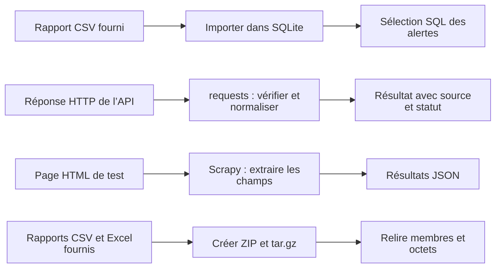
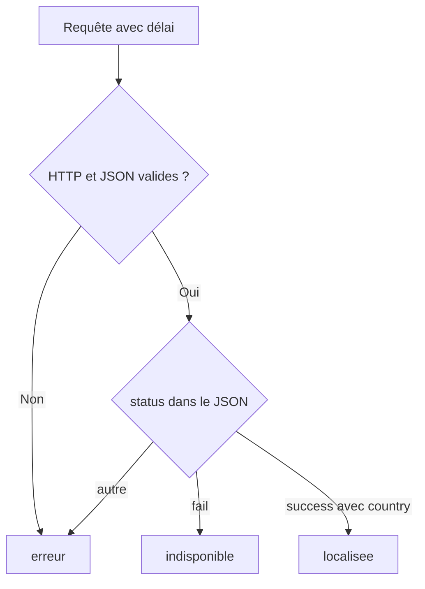

# TP 05 — Enrichir et conserver les rapports du SI

**Première lecture :** [repérer votre travail et les aides fournies](../../docs/lire-le-code.md).

[Retour au parcours](../../README.md) — **100 minutes**, essais et autocorrection compris.

## Mission et production

Conserver un état du rapport et sélectionner les alertes sans refaire l’analyse des logs. Le TP se déroule dans le poste
Linux de formation ; les données du parc restent fictives.

## Comprendre le traitement

Les quatre blocs sont autonomes. Les réponses Web ne sont pas automatiquement ajoutées aux lignes SQLite.



SQLite est un fichier local. Les services Web de test tournent dans le poste ; l’appel public guidé garde une source
distincte.

## Où travailler et quoi modifier

**Commencez par la première ligne du tableau ci-dessous.** Les fichiers existent déjà ; ouvrez-les dans l’éditeur.
Les chemins du tableau sont relatifs à ce dossier de TP. Enregistrez après chaque modification.

| Étape | Fichier à ouvrir | Travail demandé |
| --- | --- | --- |
| [sqlite](#sqlite) | [depart.py](depart.py) | Insérer avec des paramètres et compter depuis la base |
| [api](#api) | [depart.py](depart.py) | Traiter deux réponses métier |
| [scrapy](#scrapy) | [spider.py](spider.py) | Extraire trois champs de chaque carte HTML |
| [archives](#archives) | [depart.py](depart.py) | Comparer le contenu réellement relu |

Les imports, les données de référence, les repères `# ===` et l’enregistrement des résultats sont fournis.
Ne réécrivez pas tout le script et ne remplacez pas les calculs par les résultats attendus.
`TODO` signifie « partie à compléter » ; les exemples et extraits du README sont à lire, pas à copier en bloc.

Toutes les commandes se lancent dans un terminal à la racine du projet, où se trouve `pyproject.toml`.
Si nécessaire, préparez l’environnement avec `uv sync --locked`. Avancez avec le contrôle de chaque étape ;
le contrôle complet n’est demandé qu’à la fin. Un résultat `À revoir` est normal avant de compléter votre code.
Le vérificateur relance l’étape et compare vos productions. Les chemins de sorties changent à chaque essai.

## Voir les données avant de coder

Extrait réel de [donnees/rapport_complet.csv](../../donnees/rapport_complet.csv) :

```csv
ip,nom,site,echecs
192.0.2.1,srv-paris-web-01,paris,3
192.0.2.2,srv-paris-web-02,paris,2
192.0.2.99,inconnu,inconnu,1
```

Ce rapport contient **trois lignes**, dont **deux alertes** au seuil de deux échecs. Il est fourni : terminer le TP
précédent n’est pas nécessaire pour le retrouver.

## Parcours

1. [Importer un CSV dans SQLite](#sqlite) — 30 min.
2. [API et géolocalisation](#api) — 30 min.
3. [Extraire une page avec Scrapy](#scrapy) — 25 min.
4. [Archives contrôlées](#archives) — 15 min.

<a id="sqlite"></a>

## Importer un CSV dans SQLite — 30 min

Validation, ouverture exclusive, transaction et requêtes de lecture sont fournies. Compléter l’insertion paramétrée et
relier le compteur à la lecture réelle de la base. Lire ensuite importer_csv dans la correction pour comparer la
fonction réutilisable.

**Votre objectif :** Insérer avec des paramètres et compter depuis la base.

**Fichier à modifier :** `depart.py`. Repérez le bloc `# === SQLITE`.

**À faire dans l’ordre :**

1. Dans le bloc SQLITE, remplacez la valeur `None` de `requete` par la chaîne
   `"INSERT INTO incidents VALUES (?, ?, ?, ?)"`.
2. Gardez `executemany` et ses paramètres fournis : ne construisez pas la requête par concaténation des valeurs.
3. Dans `resultat`, remplacez la valeur `None` de `importees` par `nombre`, qui vient du `SELECT COUNT(*)`.

**Déjà fourni — à conserver :** Contrôle CSV, base neuve, table, transaction, sélection des alertes, fermeture et refus
de réutilisation.

Depuis la racine du projet, lancer seulement cette étape, puis contrôler les résultats :

```sh
uv run python outils/executer_etape.py tp05 sqlite
uv run python outils/verifier.py tp05 --etape sqlite
```

Au premier essai, « À revoir » et un code de sortie 1 du vérificateur sont attendus tant que les TODO manquent. Après
modification, relancer les mêmes commandes jusqu’à « Conforme ». Chaque lancement crée un nouvel essai ; ouvrir les
productions dans le dossier d’essai indiqué par le dernier contrôle, puis comparer aux critères ci-dessous.

**Étape terminée :** le contrôle affiche `Conforme` et vous pouvez expliquer les modifications réalisées.

<details>
<summary>Exécuter la correction de cette étape</summary>

À utiliser après votre essai pour comparer les choix, sans remplacer votre fichier de départ :

```sh
uv run python outils/executer_etape.py tp05 sqlite --corrige
uv run python outils/verifier.py tp05 --etape sqlite --corrige
```

Lire les commentaires du corrigé et expliquer le rôle de chaque différence avec votre version.

</details>

<details>
<summary>Indice 1 - Piste conceptuelle</summary>

Protégez l’état antérieur avant l’import, puis traitez les insertions comme un ensemble. La validation de la transaction
et la fermeture de la connexion sont deux responsabilités distinctes.

</details>

<details>
<summary>Indice 2 - Pseudo-code</summary>

Ce pseudo-code décrit le traitement complet, y compris les parties déjà fournies. Il sert à comprendre ;
ne réécrivez que les éléments indiqués dans « À faire dans l’ordre ».

```text
lire et valider les lignes du CSV
réserver exclusivement le fichier de base neuf
ouvrir la connexion SQLite
ESSAYER :
    dans une transaction, créer la table et insérer les valeurs paramétrées
    lire les totaux et sélectionner les alertes avec un seuil paramétré
ENFIN : fermer la connexion
tenter le second import et constater le refus sans modifier la base
construire resultat depuis les données effectivement conservées
```

Repères du code fourni :

with connexion gère la transaction, pas sa fermeture. Le mode xb réserve un fichier neuf. Les structures sont illustrées
dans admin_tools.rapports.importer_csv.

</details>

**Repères de réussite sur les données fournies :**

| Champ du bilan | Valeur attendue |
| --- | --- |
| `importees` | `3` |
| `alertes` | `2` |
| `echecs_alertes` | `5` |

<details>
<summary>Critères du contrôle de référence</summary>

Les résultats ci-dessous portent sur les données fournies. Les identités, dates et mesures du poste ne sont pas figées ;
leur cohérence est contrôlée.

```json
{
  "importees": 3,
  "alertes": 2,
  "echecs_alertes": 5,
  "base_existante_refusee": true
}
```

</details>

**Question de transfert :** Sur le rapport de référence, lire_alertes(base, 3) remplace le seuil 2. Que doit contenir le
résultat ? Peut-on annoncer moins d’incidents ? Répondre en trois phrases : observation, conclusion, prochaine action.

<details>
<summary>Éléments de réponse</summary>

Une ligne, trois échecs ; la base conserve trois lignes et six échecs. Seul le filtre change. Documenter le seuil et
comparer à période identique avant d’annoncer une amélioration.

</details>

<a id="api"></a>

## API et géolocalisation — 30 min

### Distinguer HTTP et résultat métier



Un HTTP réussi ne garantit pas une localisation disponible. Les données de ce serveur local sont fictives.

**Votre objectif :** Traiter deux réponses métier.

**Fichier à modifier :** `depart.py`. Repérez le bloc `# === API`.

**À faire dans l’ordre :**

1. Dans `localiser`, dans la branche `status == "fail"`, remplacez `pass` par l’affectation de `"indisponible"` à
   `sortie["statut"]`.
2. Dans la branche de succès, remplacez `pass` par une mise à jour de `sortie` : `pays` vient de `contenu["country"]`,
   `ville` de `contenu.get("city")`, et `statut` vaut `"localisee"`.
3. Gardez l’appel `requests.get`, le délai, `raise_for_status`, le décodage JSON et le `except` fournis. Le pilote
   appelle déjà les quatre routes.

**Déjà fourni — à conserver :** Serveur de simulation, appels HTTP, erreurs de transport/JSON et quatre cas de contrôle.

**Essai public guidé (les cinq dernières minutes) :**

```sh
uv run python outils/geolocalisation_directe.py 1.1.1.1
```

Cet appel exige Internet. Comparez la source, la date et les champs avec la simulation ; pays et ville peuvent varier.
N’utilisez que l’IP publique indiquée pour cet essai. Une erreur reste une erreur : le résultat fictif ne la remplace
pas.

Depuis la racine du projet, lancer seulement cette étape, puis contrôler les résultats :

```sh
uv run python outils/executer_etape.py tp05 api
uv run python outils/verifier.py tp05 --etape api
```

Au premier essai, « À revoir » et un code de sortie 1 du vérificateur sont attendus tant que les TODO manquent. Après
modification, relancer les mêmes commandes jusqu’à « Conforme ». Chaque lancement crée un nouvel essai ; ouvrir les
productions dans le dossier d’essai indiqué par le dernier contrôle, puis comparer aux critères ci-dessous.

**Étape terminée :** le contrôle affiche `Conforme` et vous pouvez expliquer les modifications réalisées.

<details>
<summary>Exécuter la correction de cette étape</summary>

À utiliser après votre essai pour comparer les choix, sans remplacer votre fichier de départ :

```sh
uv run python outils/executer_etape.py tp05 api --corrige
uv run python outils/verifier.py tp05 --etape api --corrige
```

Lire les commentaires du corrigé et expliquer le rôle de chaque différence avec votre version.

</details>

<details>
<summary>Indice 1 - Piste conceptuelle</summary>

Une connexion réussie ne suffit pas : distinguez statut HTTP, décodage et contrat métier. L’origine simulée ou publique
reste une information du résultat, y compris en cas d’échec.

</details>

<details>
<summary>Indice 2 - Pseudo-code</summary>

Ce pseudo-code décrit le traitement complet, y compris les parties déjà fournies. Il sert à comprendre ;
ne réécrivez que les éléments indiqués dans « À faire dans l’ordre ».

```text
pour chaque route locale, initialiser un résultat au statut erreur
ESSAYER : demander la réponse avec paramètres et délai
    vérifier le statut HTTP avant de décoder le JSON
    vérifier structure, champs et succès métier
    renseigner localisation ou indisponibilité selon ce contrat
SI erreur réseau/HTTP/décodage prévue : conserver le statut erreur
conserver ip et source dans chaque résultat
comparer les quatre cas locaux
lancer le client public fourni et comparer source/date/champs observés
```

Repères du code fourni :

Utiliser requests.RequestException et contrôler la structure des données. La référence geolocaliser est dans
admin_tools.services. La partie locale ne demande aucun compte. L’appel public explicite utilise ipwho.is, sans clé, une
requête par essai ; un échec externe conserve un statut non réussi. Voir la
[documentation du fournisseur](https://ipwhois.io/documentation). Budget : traitement et cas locaux 25 min, comparaison
publique guidée 5 min.

</details>

**Repères de réussite sur les données fournies :**

| Champ du bilan | Valeur attendue |
| --- | --- |
| `statuts` | `["localisee", "indisponible", "erreur", "erreur"]` |
| `source` | `"simulation_locale"` |
| `pays_simule` | `"Pays fictif"` |

<details>
<summary>Critères du contrôle de référence</summary>

Les résultats ci-dessous portent sur les données fournies. Les identités, dates et mesures du poste ne sont pas figées ;
leur cohérence est contrôlée.

```json
{
  "statuts": [
    "localisee",
    "indisponible",
    "erreur",
    "erreur"
  ],
  "source": "simulation_locale",
  "pays_simule": "Pays fictif"
}
```

</details>

**Question de transfert :** Une ville fournie par une API prouve-t-elle la position d’un utilisateur ?

<details>
<summary>Éléments de réponse</summary>

Non : localisation approximative de l’accès réseau, proxy ou VPN possibles ; ici les lieux sont entièrement simulés.

</details>

<a id="scrapy"></a>

## Extraire une page avec Scrapy — 25 min

Extrait réel de [machines.html](../../donnees/machines.html), remis en lignes pour la lecture :

```html
<article class="machine">
<h2>API</h2>
<span class="ip">192.0.2.2</span>
<span class="site">paris</span>
<span class="etat">DEGRADE</span>
<p class="message">Latence élevée</p>
</article>
```

| Sélecteur relatif à une carte | Texte extrait sur cette carte |
| --- | --- |
| `.etat::text` | `DEGRADE` |
| `.message::text` | `Latence élevée` |
| `.site::text` | `paris` |

La carte VPN du fichier n’a pas de balise `message` : c’est le cas qui doit produire `non renseigné`.

**Votre objectif :** Extraire trois champs de chaque carte HTML.

**Fichier à modifier :** `spider.py`.

**À faire dans l’ordre :**

1. Dans `parse`, remplacez le `None` de `etat` par `carte.css(".etat::text").get()` ; conservez les textes du HTML.
2. Remplacez le `None` de `message` par une extraction de `.message::text` avec la valeur par défaut `"non renseigné"`
   si la balise manque.
3. Remplacez le `None` de `site` par `carte.css(".site::text").get()`.
4. Utilisez toujours `carte`, pas `response`, pour lire les champs de la machine courante. Le pilote démarre le serveur
   et le spider pour vous.

**Déjà fourni — à conserver :** Boucle sur les cartes, nom/IP, démarrage et export JSON.

Depuis la racine du projet, lancer seulement cette étape, puis contrôler les résultats :

```sh
uv run python outils/executer_etape.py tp05 scrapy
uv run python outils/verifier.py tp05 --etape scrapy
```

Au premier essai, « À revoir » et un code de sortie 1 du vérificateur sont attendus tant que les TODO manquent. Après
modification, relancer les mêmes commandes jusqu’à « Conforme ». Chaque lancement crée un nouvel essai ; ouvrir les
productions dans le dossier d’essai indiqué par le dernier contrôle, puis comparer aux critères ci-dessous.

**Étape terminée :** le contrôle affiche `Conforme` et vous pouvez expliquer les modifications réalisées.

<details>
<summary>Exécuter la correction de cette étape</summary>

À utiliser après votre essai pour comparer les choix, sans remplacer votre fichier de départ :

```sh
uv run python outils/executer_etape.py tp05 scrapy --corrige
uv run python outils/verifier.py tp05 --etape scrapy --corrige
```

Lire les commentaires du corrigé et expliquer le rôle de chaque différence avec votre version.

</details>

<details>
<summary>Indice 1 - Piste conceptuelle</summary>

Chaque carte définit le périmètre des extractions. Un champ absent reçoit une valeur explicite sans transformer un état
inconnu en état sain.

</details>

<details>
<summary>Indice 2 - Pseudo-code</summary>

Ce pseudo-code décrit le traitement complet, y compris les parties déjà fournies. Il sert à comprendre ;
ne réécrivez que les éléments indiqués dans « À faire dans l’ordre ».

```text
POUR chaque carte déjà parcourue par le spider fourni :
    extraire site dans cette carte
    extraire etat dans cette même carte
    extraire message ; utiliser la valeur de remplacement s’il est absent
    produire l’enregistrement attendu par le pilote
lancer le pilote puis relire machines.json
sélectionner les services dont l’état demande un examen
construire resultat depuis les enregistrements exportés
```

Repères du code fourni :

Exemples : carte.css(".etat::text").get() ; get() or "non renseigné". La boucle et l’infrastructure sont fournies, les
trois extractions sont à adapter.

</details>

**Repères de réussite sur les données fournies :**

| Champ du bilan | Valeur attendue |
| --- | --- |
| `nombre` | `3` |
| `sites` | `["paris", "paris", "paris"]` |
| `a_examiner` | `["API", "VPN"]` |

<details>
<summary>Critères du contrôle de référence</summary>

Les résultats ci-dessous portent sur les données fournies. Les identités, dates et mesures du poste ne sont pas figées ;
leur cohérence est contrôlée.

```json
{
  "nombre": 3,
  "sites": [
    "paris",
    "paris",
    "paris"
  ],
  "a_examiner": [
    "API",
    "VPN"
  ],
  "message_absent": "non renseigné"
}
```

</details>

**Question de transfert :** Une absence de message signifie-t-elle que le service fonctionne ?

<details>
<summary>Éléments de réponse</summary>

Non. Elle ne renseigne pas l’état ; conserver les deux informations séparément.

</details>

<a id="archives"></a>

## Archives contrôlées — 15 min

La création et la relecture sont fournies. Compléter les deux comparaisons, puis suivre la fonction archiver pour
identifier format, mode et noms des membres.

**Votre objectif :** Comparer le contenu réellement relu.

**Fichier à modifier :** `depart.py`. Repérez le bloc `# === ARCHIVES`.

**À faire dans l’ordre :**

1. Dans le bloc ARCHIVES, remplacez la valeur `None` de `memes_membres` par la comparaison `noms_zip == noms_tar`.
2. Remplacez la valeur `None` de `octets_identiques` par `identiques`, déjà calculé lors de la relecture du ZIP.
3. Gardez la création et la lecture des deux archives. Ouvrez la fonction `archiver` pour expliquer les noms stockés.

**Déjà fourni — à conserver :** Sélection des deux rapports, création ZIP/TAR.GZ et relecture réelle des octets.

Depuis la racine du projet, lancer seulement cette étape, puis contrôler les résultats :

```sh
uv run python outils/executer_etape.py tp05 archives
uv run python outils/verifier.py tp05 --etape archives
```

Au premier essai, « À revoir » et un code de sortie 1 du vérificateur sont attendus tant que les TODO manquent. Après
modification, relancer les mêmes commandes jusqu’à « Conforme ». Chaque lancement crée un nouvel essai ; ouvrir les
productions dans le dossier d’essai indiqué par le dernier contrôle, puis comparer aux critères ci-dessous.

**Étape terminée :** le contrôle affiche `Conforme` et vous pouvez expliquer les modifications réalisées.

<details>
<summary>Exécuter la correction de cette étape</summary>

À utiliser après votre essai pour comparer les choix, sans remplacer votre fichier de départ :

```sh
uv run python outils/executer_etape.py tp05 archives --corrige
uv run python outils/verifier.py tp05 --etape archives --corrige
```

Lire les commentaires du corrigé et expliquer le rôle de chaque différence avec votre version.

</details>

<details>
<summary>Indice 1 - Piste conceptuelle</summary>

La sélection des fichiers précède l’archivage. La preuve porte sur les noms et le contenu relus après fermeture, et la
compression ne garantit pas une réduction de taille.

</details>

<details>
<summary>Indice 2 - Pseudo-code</summary>

Ce pseudo-code décrit le traitement complet, y compris les parties déjà fournies. Il sert à comprendre ;
ne réécrivez que les éléments indiqués dans « À faire dans l’ordre ».

```text
sélectionner seulement les deux rapports du contrat
POUR chaque format ZIP et tar.gz :
    ouvrir le contexte de création adapté
    ajouter chaque source avec son nom simple
    fermer l’archive
rouvrir les deux archives et comparer leurs listes de membres
relire leurs contenus et les comparer aux octets des sources
construire les critères depuis ces comparaisons
```

Repères du code fourni :

Les contextes de création et les fonctions write/add sont détaillés dans admin_tools.services.archiver. Ne pas extraire
d’archive extérieure pour cet exercice. Répartition : conception 3 min, réalisation 8 min, contrôle et transfert 4 min.
Choisir ZipFile/TarFile et with ; les détails d’appel restent dans les exemples de cours.

</details>

**Repères de réussite sur les données fournies :**

| Champ du bilan | Valeur attendue |
| --- | --- |
| `membres` | `["rapport_complet.csv", "rapport_complet.xlsx"]` |
| `memes_membres` | `true` |
| `octets_identiques` | `true` |

<details>
<summary>Critères du contrôle de référence</summary>

Les résultats ci-dessous portent sur les données fournies. Les identités, dates et mesures du poste ne sont pas figées ;
leur cohérence est contrôlée.

```json
{
  "membres": [
    "rapport_complet.csv",
    "rapport_complet.xlsx"
  ],
  "memes_membres": true,
  "octets_identiques": true
}
```

</details>

**Question de transfert :** Une archive créée est-elle nécessairement plus petite ?

<details>
<summary>Éléments de réponse</summary>

Non : le conteneur et la compression sont deux opérations distinctes.

</details>

## Valider votre travail

Depuis la racine du projet, après avoir terminé les étapes :

```sh
uv run python outils/verifier.py tp05 --complet
```

## Comprendre la correction

Après votre essai, lire [corrige.py](corrige.py) et les fonctions partagées dans [admin_tools](../../src/admin_tools/).
Comparer les choix et leurs limites. Le corrigé garde ses sorties séparément. [Dépannage](../../docs/depannage.md).

```sh
uv run python ateliers/05/corrige.py
uv run python outils/verifier.py tp05 --corrige --complet
```
