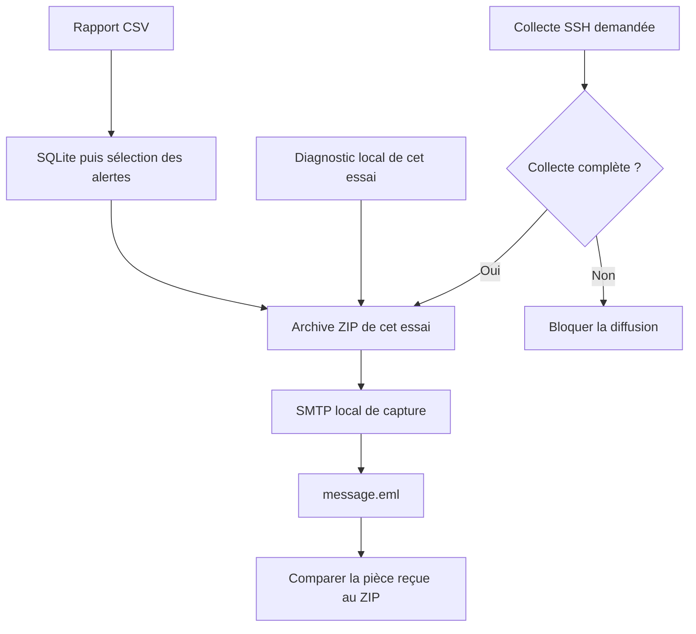
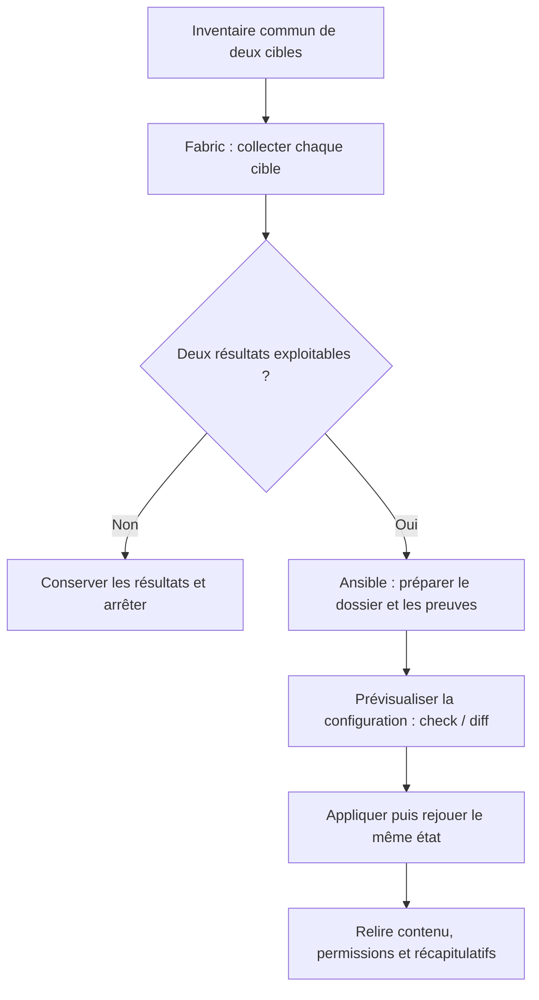
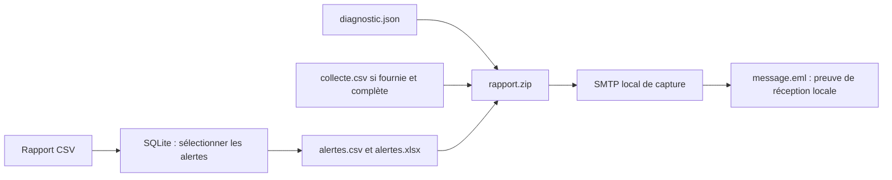

# TP 06 — Collecter à distance et diffuser les alertes

[Retour au parcours](../../README.md) — **70 minutes**, essais et autocorrection compris.

## Mission et production

Assembler les alertes et le diagnostic du même essai, puis vérifier le message capturé. Le TP se déroule dans le poste
Linux de formation ; les données du parc restent fictives.

## Comprendre la chaîne finale

Le dernier bloc réutilise les fonctions validées. Le diagnostic et, si elle est demandée, la collecte complète
appartiennent au même essai.



Sans collecte demandée, le scénario reste local et annonce `non_executee`. La capture SMTP ne livre aucun message à une
boîte externe.

## Où travailler et quoi modifier

**Commencez par la première ligne du tableau ci-dessous.** Les fichiers existent déjà ; ouvrez-les dans l’éditeur.
Les chemins du tableau sont relatifs à ce dossier de TP. Enregistrez après chaque modification.

| Étape | Fichier à ouvrir | Travail demandé |
| --- | --- | --- |
| [email](#email) | [depart.py](depart.py) | Adapter le sujet et contrôler la pièce reçue |
| [distant](#distant) | [mes_collectes.py](mes_collectes.py) | Une extraction disque, puis des manipulations guidées |
| [integration](#integration) | [depart.py](depart.py) | Assembler l’archive, envoyer puis compter |

Les imports, les données de référence, les repères `# ===` et l’enregistrement des résultats sont fournis.
Ne réécrivez pas tout le script et ne remplacez pas les calculs par les résultats attendus.
`TODO` signifie « partie à compléter » ; les exemples et extraits du README sont à lire, pas à copier en bloc.

Toutes les commandes se lancent dans un terminal à la racine du projet, où se trouve `pyproject.toml`.
Si nécessaire, préparez l’environnement avec `uv sync --locked`. Avancez avec le contrôle de chaque étape ;
le contrôle complet n’est demandé qu’à la fin. Un résultat `À revoir` est normal avant de compléter votre code.
Le vérificateur relance l’étape et compare vos productions. Les chemins de sorties changent à chaque essai.

**Environnement :** les étapes `email` et `integration` peuvent tourner localement ; `distant` exige deux cibles Linux
SSH préparées. Les identifiants RustDesk ne sont pas des identifiants SSH.

## Voir les données avant de coder

Extrait réel de [donnees/rapport_complet.csv](../../donnees/rapport_complet.csv) :

```csv
ip,nom,site,echecs
192.0.2.1,srv-paris-web-01,paris,3
192.0.2.2,srv-paris-web-02,paris,2
192.0.2.99,inconnu,inconnu,1
```

Ce rapport contient **trois lignes**, dont **deux alertes** au seuil de deux échecs. Il est fourni : terminer le TP
précédent n’est pas nécessaire pour le retrouver.

## Parcours

1. [Message et pièce jointe](#email) — 15 min.
2. [Fabric et Ansible sur deux machines](#distant) — 40 min.
3. [Chaîne complète de rapport](#integration) — 15 min.

Pour les connexions SSH, suivre le [guide des cibles](../../laboratoire/README.md), puis ajouter --laboratoire à
l’exécution et au contrôle. La préparation des accès est extérieure au budget de quarante minutes.

<a id="email"></a>

## Message et pièce jointe — 15 min

**Votre objectif :** Adapter le sujet et contrôler la pièce reçue.

**Fichier à modifier :** `depart.py`. Repérez le bloc `# === EMAIL`.

**À faire dans l’ordre :**

1. Dans le bloc EMAIL, remplacez le sujet `"À compléter"` par `"Rapport PYX : 2 alertes"`.
2. Dans `resultat`, remplacez `octets_identiques: None` (clé entre guillemets) par la comparaison entre
   `pieces[0].get_payload(decode=True)` et `archive.read_bytes()`.
3. Gardez le serveur SMTP de capture : aucun message ne doit partir vers une vraie boîte mail.

**Déjà fourni — à conserver :** Création ZIP, envoi local, capture, sauvegarde EML et décodage MIME.

Depuis la racine du projet, lancer seulement cette étape, puis contrôler les résultats :

```sh
uv run python outils/executer_etape.py tp06 email
uv run python outils/verifier.py tp06 --etape email
```

Au premier essai, « À revoir » et un code de sortie 1 du vérificateur sont attendus tant que les TODO manquent. Après
modification, relancer les mêmes commandes jusqu’à « Conforme ». Chaque lancement crée un nouvel essai ; ouvrir les
productions dans le dossier d’essai indiqué par le dernier contrôle, puis comparer aux critères ci-dessous.

**Étape terminée :** le contrôle affiche `Conforme` et vous pouvez expliquer les modifications réalisées.

<details>
<summary>Exécuter la correction de cette étape</summary>

À utiliser après votre essai pour comparer les choix, sans remplacer votre fichier de départ :

```sh
uv run python outils/executer_etape.py tp06 email --corrige
uv run python outils/verifier.py tp06 --etape email --corrige
```

Lire les commentaires du corrigé et expliquer le rôle de chaque différence avec votre version.

</details>

<details>
<summary>Indice 1 - Piste conceptuelle</summary>

La pièce jointe doit contenir les octets de l’archive créée. Vérifiez le message reçu par la capture ; la construction
du message seule ne prouve pas sa transmission.

</details>

<details>
<summary>Indice 2 - Pseudo-code</summary>

Ce pseudo-code décrit le traitement complet, y compris les parties déjà fournies. Il sert à comprendre ;
ne réécrivez que les éléments indiqués dans « À faire dans l’ordre ».

```text
créer l’archive de référence avec archiver fourni
construire EmailMessage avec en-têtes et corps demandés
ajouter les octets ZIP comme pièce jointe avec son nom et son type
dans le contexte SMTP local fourni, transmettre le message
enregistrer les octets du message capturé dans message.eml
relire ce message avec le parseur fourni et décoder la pièce jointe
comparer sujet, nom de pièce et octets avec l’archive source
```

Repères du code fourni :

add_attachment(..., maintype="application", subtype="zip", filename="rapport.zip"). La capture est un vrai SMTP local
sans diffusion externe.

</details>

**Repères de réussite sur les données fournies :**

| Champ du bilan | Valeur attendue |
| --- | --- |
| `messages` | `1` |
| `objet` | `"Rapport PYX : 2 alertes"` |
| `piece_jointe` | `"rapport.zip"` |

<details>
<summary>Critères du contrôle de référence</summary>

Les résultats ci-dessous portent sur les données fournies. Les identités, dates et mesures du poste ne sont pas figées ;
leur cohérence est contrôlée.

```json
{
  "messages": 1,
  "objet": "Rapport PYX : 2 alertes",
  "piece_jointe": "rapport.zip",
  "octets_identiques": true
}
```

</details>

**Question de transfert :** L’acceptation SMTP prouve-t-elle que le destinataire a lu le rapport ?

<details>
<summary>Éléments de réponse</summary>

Non : soumission, livraison et lecture sont des étapes différentes.

</details>

<a id="distant"></a>

## Fabric et Ansible sur deux machines — 40 min



La prévisualisation concerne la configuration ; la préparation du dossier et des preuves précède ce contrôle. Le détail
des passages se trouve dans `distant.py`.

Exemple **fictif** de sortie de `df -Pk /` (vos nombres seront différents) :

```text
Filesystem 1024-blocks Used Available Capacity Mounted on
/dev/vda1 100000 42000 58000 42% /
```

| Opération sur `sortie` | Résultat dans cet exemple |
| --- | --- |
| `splitlines()[-1]` | Dernière ligne, sans l’en-tête |
| `split()[4]` sur cette ligne | Texte `42%` (les indices commencent à 0) |
| `rstrip("%")` | Texte `42` |
| `int(...)` | Entier `42`, à conserver dans `pct` |

**Votre objectif :** Une extraction disque, puis des manipulations guidées.

**Fichier à modifier :** `mes_collectes.py`.

**À faire dans l’ordre :**

1. Vérifiez les deux cibles avec `uv run python outils/diagnostic.py --distant`. Si les accès échouent, faites préparer
   les cibles avant cette étape.
2. Dans `collecter_une`, remplacez le `None` de `pct` par le résultat de : dernière ligne de `sortie`, découpage en
   colonnes, colonne d’indice 4, suppression de `%`, conversion avec `int`.
3. Gardez la boucle par cible, la gestion d’erreur et les commandes fournies. Suivez ensuite les points A et B
   ci-dessous : ils font partie de l’exercice.

**Déjà fourni — à conserver :** SSH, Fabric, erreurs par cible, SFTP et pilote Ansible. Les deux cibles doivent être
accessibles.

### Avant le créneau

Exécuter la commande suivante et vérifier les deux cibles :

```sh
uv run python outils/diagnostic.py --distant
```

 Lire l’inventaire : alias, adresse, port,
compte, clé, hôtes connus, Python cible et dossier dédié. La préparation des accès reste extérieure aux 40 minutes.

### A. Collecter avec Fabric - 15 min

1. Après avoir complété `pct`, relire `collecter_une` et `collecter_parc`. Réutiliser connexion fourni ; lire hostname,
   uname -s et df -Pk /. Conserver alias, date UTC, identité, mesure, statut et erreur.
2. Préserver les autres cibles après une exception attendue. Le pilote simule un port fermé local ; aucun serveur réel
   n’est arrêté.
3. Lancer le premier point de contrôle :

```sh
uv run python outils/collecter_parc.py --laboratoire
```

**Point A :** ouvrir le dossier annoncé. collecte.csv contient les deux mesures valides ; collecte-partielle.json
conserve un succès et une erreur ; preuve-collecte.json confirme les quatre critères. Lire execution.log et expliquer le
statut de chaque cible. Cette commande ne lance ni Ansible ni SFTP et ne prépare aucun fichier sur les cibles. Corriger
cette séquence avant de poursuivre.

Répartition : écrire et essayer la collecte 10 min ; observer l’erreur et relire les preuves 5 min.

### B. Maintenir un état avec Ansible - 20 min

1. Lire le playbook fourni laboratoire/rapport.yml : dossier dédié 0700, supervision.ini 0640, seuil_disque_pct=80,
   intervalle_s=60. Identifier la différence entre une commande Fabric et l’état demandé à Ansible.
2. Le contrôle final ci-dessous réutilise vos fonctions et lance le pilote fourni : préparation du dossier, aperçu
   --check --diff --tags configuration, application et répétition.
3. Lire ansible-apercu.txt, ansible-premier.txt, ansible-second.txt et preuve-ansible.json. **Point B :** le fichier est
   identique avant/après aperçu, son contenu/mode sont relus après application et le second passage donne changed=0. Un
   fichier déjà conforme peut donner changed=0 dès le premier passage. Essayer un seuil de 85 dans les variables de
   l’inventaire Ansible généré, prévisualiser le diff puis rétablir 80 pour la référence. Aucun service réel ne consomme
   ce fichier.
4. Dans le passage guidé, repérer le module script qui transfère controle_cible.py et relire preuve-scripts.json : les
   identités correspondent à Fabric. Puis observer client.get dans admin_tools.logs_distants.telecharger_logs : les deux
   logs fictifs sont réellement reçus par SFTP. Lire preuve-logs.json et auth-collecte.log : quatre événements, deux
   succès et deux échecs pour 192.0.2.42. Les sources, empreintes et frontières restent visibles ; un transfert
   incomplet bloque le regroupement complet. Réutiliser la regex du TP04, sans réécrire le pilote.

Répartition : configuration, aperçu, application et relecture 15 min ; script distant et transfert des logs guidés 5
min.

### Contrôle complet et explication - 5 min

Depuis la racine du projet, lancer seulement cette étape, puis contrôler les résultats :

```sh
uv run python outils/executer_etape.py tp06 distant --laboratoire
uv run python outils/verifier.py tp06 --etape distant --laboratoire
```

Au premier essai, « À revoir » et un code de sortie 1 du vérificateur sont attendus tant que les TODO manquent. Après
modification, relancer les mêmes commandes jusqu’à « Conforme ». Chaque lancement crée un nouvel essai ; ouvrir les
productions dans le dossier d’essai indiqué par le dernier contrôle, puis comparer aux critères ci-dessous.

**Étape terminée :** le contrôle affiche `Conforme` et vous pouvez expliquer les modifications réalisées.

<details>
<summary>Exécuter la correction de cette étape</summary>

À utiliser après votre essai pour comparer les choix, sans remplacer votre fichier de départ :

```sh
uv run python outils/executer_etape.py tp06 distant --corrige --laboratoire
uv run python outils/verifier.py tp06 --etape distant --corrige --laboratoire
```

Lire les commentaires du corrigé et expliquer le rôle de chaque différence avec votre version.

</details>

Ce contrôle rejoue la collecte et les passages Ansible dans un nouvel essai. Relire le dossier qu’il annonce pour
rapprocher les preuves du même essai. Expliquer Point A (observations par cible) puis Point B (état réellement relu) et
répondre à la question de transfert.

La vérification et la question de transfert sont incluses dans ces 40 minutes.

<details>
<summary>Indice 1 - Piste conceptuelle</summary>

La collecte conserve une observation ou une erreur pour chaque cible ; la configuration vise un état. Les preuves de ces
deux séquences sont relues séparément, puis rapprochées dans un même essai.

</details>

<details>
<summary>Indice 2 - Pseudo-code</summary>

Ce pseudo-code décrit le traitement complet, y compris les parties déjà fournies. Il sert à comprendre ;
ne réécrivez que les éléments indiqués dans « À faire dans l’ordre ».

```text
FONCTION collecter_une(cible, inventaire) :
    ouvrir la connexion fournie et exécuter les commandes demandées
    extraire identité, système et pourcentage disque ; valider les valeurs
    renvoyer la ligne complète datée au statut ok
FONCTION collecter_parc(cibles, inventaire) :
    POUR chaque cible :
        ESSAYER collecter_une
        SI exception attendue : créer une ligne datée au statut erreur
        conserver la ligne et poursuivre les autres cibles
lancer le point Fabric et relire ses quatre critères
utiliser le pilote Ansible fourni pour aperçu, application et répétition
relire contenu/mode et les preuves SFTP/script du même essai
```

Repères du code fourni :

Autonomie encadrée : collecte et boucle d’erreurs amorcées dans mes_collectes.py, mesure disque à compléter, contrat et
connexion fournis ; écriture CSV, essai partiel, transfert SFTP des logs et pilotage Ansible fournis. Indices si
nécessaire : datetime.now(timezone.utc), client.run(..., hide=True, timeout=3, in_stream=False), dernière ligne de df,
int(...rstrip("%")); traiter OSError, SSHException, UnexpectedExit, CommandTimedOut, TimeoutError, ValueError et
IndexError dans la boucle, jamais masquer toutes les exceptions. Correction dans solution_collecte.py. Le module copy
supporte check/diff. La préparation préalable concerne uniquement le dossier dédié ; le mode check du module file ne
créerait pas le dossier nécessaire à la copie.

</details>

**Repères de réussite sur les données fournies :**

| Champ du bilan | Valeur attendue |
| --- | --- |
| `cibles_attendues` | `true` |
| `systemes_linux` | `true` |
| `disques_valides` | `true` |

<details>
<summary>Critères du contrôle de référence</summary>

Les résultats ci-dessous portent sur les données fournies. Les identités, dates et mesures du poste ne sont pas figées ;
leur cohérence est contrôlée.

```json
{
  "cibles_attendues": true,
  "systemes_linux": true,
  "disques_valides": true,
  "echec_partiel_visible": true,
  "premier_reussi": true,
  "second_sans_changement": true,
  "contenus_conformes": true,
  "permissions_conformes": true,
  "apercu_sans_modification": true,
  "logs_telecharges": 2,
  "evenements_logs": 4,
  "echecs_logs": 2,
  "scripts_executes": 2
}
```

</details>

**Question de transfert :** Deux alias pointent vers le même hôte et le même port : a-t-on administré deux machines ?

<details>
<summary>Éléments de réponse</summary>

Non. Le kit refuse cette configuration. Deux points d’accès distincts doivent correspondre aux deux cibles prévues ; un
accès au bureau distant ne garantit pas l’accès SSH entre postes.

</details>

<a id="integration"></a>

## Chaîne complète de rapport — 15 min

Import, filtre, export, diagnostic et journal sont fournis. Compléter l’archive, l’envoi et le compteur de messages ;
expliquer pourquoi une étape échouée empêche l’envoi. Consacrer 5 min à la lecture, 5 min aux appels et 5 min au
contrôle.

### Ce qui entre dans le ZIP final



Le diagnostic est toujours joint ; la collecte dépend du parcours réalisé. Le journal, les clés et l’inventaire SSH
restent hors du ZIP.

**Votre objectif :** Assembler l’archive, envoyer puis compter.

**Fichier à modifier :** `depart.py`. Repérez le bloc `# === INTEGRATION`.

**À faire dans l’ordre :**

1. Dans le bloc INTEGRATION, remplacez `archive = None` par l’appel
   `archiver([*fichiers, *complements], dossier / "rapport.zip")`.
2. Dans le bloc `with serveur_smtp()`, avant `if capture.messages:`, appelez `envoyer_archive(archive, port, sujet=...)`
   avec une f-string au format `Rapport PYX : {len(alertes)} alertes`.
3. Dans le bilan, remplacez la valeur `None` de `messages` par `nombre_messages`.
4. Conservez les autres fonctions fournies et leur ordre. Sans collecte distante, le diagnostic doit indiquer
   `non_executee` ; cela ne valide pas l’étape SSH.

**Déjà fourni — à conserver :** Import, filtre, exports, diagnostic, journal et capture SMTP ; fonctions réutilisées via
mes_fonctions.py.

| Fichier produit dans l’étape | Utilité | Dans le ZIP ? |
| --- | --- | --- |
| `alertes.csv`, `alertes.xlsx` | Deux alertes sur les données de référence | Oui |
| `diagnostic.json` | Contexte du poste et portée de la collecte | Oui |
| `collecte.csv` | Mesures des deux cibles, si collecte complète fournie | Seulement si disponible et validée |
| `execution.log` | Trace technique du traitement | Non |
| `message.eml` | Message reçu par le SMTP local | Non |

Les options `--source` et `--collecte` permettent de réutiliser des productions précédentes. Une source absente ou une
collecte explicitement fournie mais incomplète bloque la diffusion. Le TP utilise par défaut les données de référence.

Depuis la racine du projet, lancer seulement cette étape, puis contrôler les résultats :

```sh
uv run python outils/executer_etape.py tp06 integration
uv run python outils/verifier.py tp06 --etape integration
```

Au premier essai, « À revoir » et un code de sortie 1 du vérificateur sont attendus tant que les TODO manquent. Après
modification, relancer les mêmes commandes jusqu’à « Conforme ». Chaque lancement crée un nouvel essai ; ouvrir les
productions dans le dossier d’essai indiqué par le dernier contrôle, puis comparer aux critères ci-dessous.

**Étape terminée :** le contrôle affiche `Conforme` et vous pouvez expliquer les modifications réalisées.

<details>
<summary>Exécuter la correction de cette étape</summary>

À utiliser après votre essai pour comparer les choix, sans remplacer votre fichier de départ :

```sh
uv run python outils/executer_etape.py tp06 integration --corrige
uv run python outils/verifier.py tp06 --etape integration --corrige
```

Lire les commentaires du corrigé et expliquer le rôle de chaque différence avec votre version.

</details>

<details>
<summary>Indice 1 - Piste conceptuelle</summary>

L’ordre des opérations conditionne la diffusion. Une donnée absente ou une collecte demandée incomplète doit bloquer
l’envoi ; les pièces représentent toutes le même essai.

</details>

<details>
<summary>Indice 2 - Pseudo-code</summary>

Ce pseudo-code décrit le traitement complet, y compris les parties déjà fournies. Il sert à comprendre ;
ne réécrivez que les éléments indiqués dans « À faire dans l’ordre ».

```text
dans les contextes de journal et SMTP local fournis :
    importer la source dans une base neuve
    lire les alertes au seuil puis exporter leurs deux rapports
    sélectionner la collecte de cet essai ou celle explicitement demandée
    faire valider et joindre le diagnostic par la fonction fournie
    archiver seulement rapports et compléments validés
    transmettre au SMTP de capture et conserver message.eml
    journaliser import, archive et soumission dans execution.log
relire la pièce capturée et les membres du ZIP
construire les critères depuis les preuves et tester une source absente
```

Repères du code fourni :

Assemblage guidé de quinze minutes : fonctions de traitement et diagnostic fournis, appels et sélection des pièces à
compléter. Le diagnostic courant est produit à chaque essai ; la collecte ne doit pas provenir implicitement d’une
ancienne sortie. Le scénario autonome est outils/rapport_final.py.

</details>

**Repères de réussite sur les données fournies :**

| Champ du bilan | Valeur attendue |
| --- | --- |
| `importees` | `3` |
| `alertes` | `2` |
| `echecs_alertes` | `5` |

<details>
<summary>Critères du contrôle de référence</summary>

Les résultats ci-dessous portent sur les données fournies. Les identités, dates et mesures du poste ne sont pas figées ;
leur cohérence est contrôlée.

```json
{
  "importees": 3,
  "alertes": 2,
  "echecs_alertes": 5,
  "rapport_archive": true,
  "diagnostic_archive": true,
  "collecte_archivee_si_executee": true,
  "messages": 1
}
```

</details>

**Question de transfert :** La collecte demandée est donnees/transfert/collecte-partielle.csv. Quelle preuve conserver
et faut-il envoyer le rapport final ? Répondre en trois phrases : observation, conclusion, prochaine action.

<details>
<summary>Éléments de réponse</summary>

Conserver le succès de srv-a et le TimeoutError de srv-b ; la collecte est incomplète. Selon le contrat du cours,
bloquer le message final, diagnostiquer la cible puis refaire une collecte complète. Un code timeout ne prouve pas que
l’hôte est arrêté.

</details>

## Valider votre travail

Depuis la racine du projet, après avoir terminé les étapes :

```sh
uv run python outils/verifier.py tp06 --complet --laboratoire
```

Sans cibles SSH disponibles, utilisez la même commande sans `--laboratoire` : les étapes locales seront contrôlées,
mais l’étape distante restera explicitement non vérifiée. Ne considérez pas ce parcours comme une validation de SSH.
Avant de quitter le poste distant, lancez `uv run python outils/sauvegarder.py` et récupérez le fichier annoncé.

## Comprendre la correction

Après votre essai, lire [corrige.py](corrige.py) et les fonctions partagées dans [admin_tools](../../src/admin_tools/).
Comparer les choix et leurs limites. Le corrigé garde ses sorties séparément. [Dépannage](../../docs/depannage.md).

```sh
uv run python ateliers/06/corrige.py
uv run python outils/verifier.py tp06 --corrige --complet
```

Ajouter --laboratoire pour inclure les connexions et le rapport distant. Utiliser --etape integration sans cette option
pour travailler seulement l’assemblage local.
