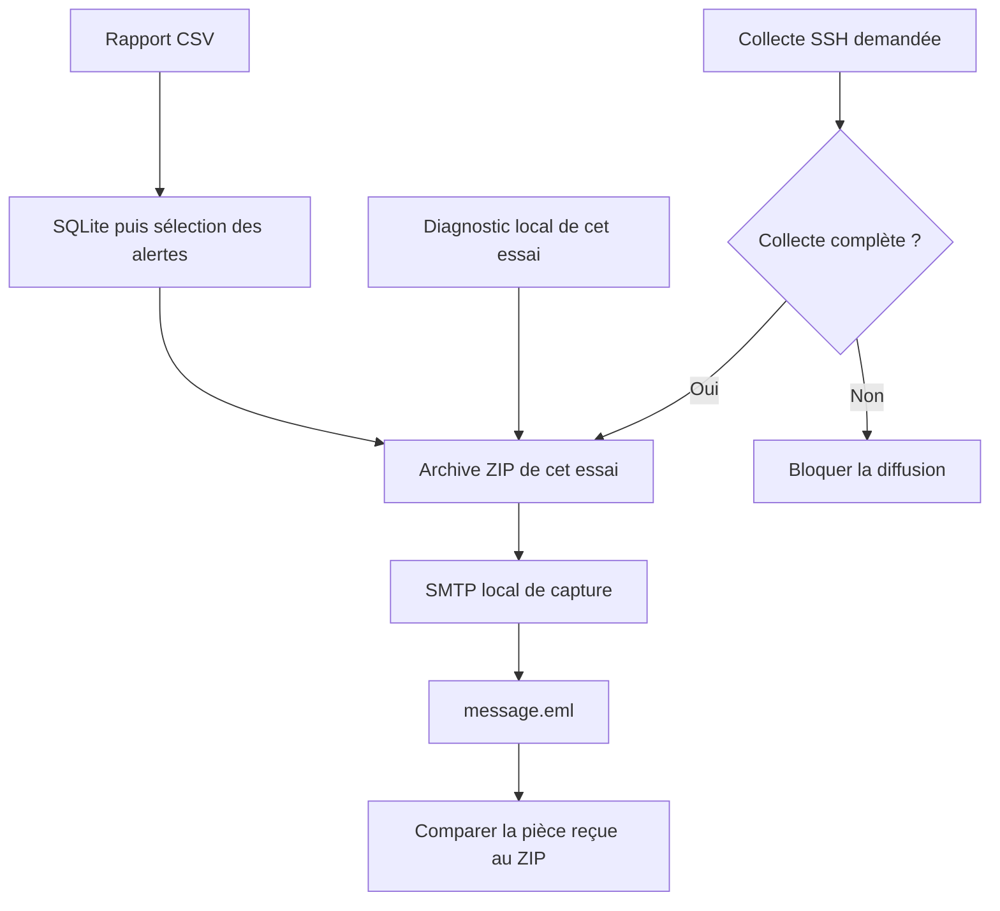
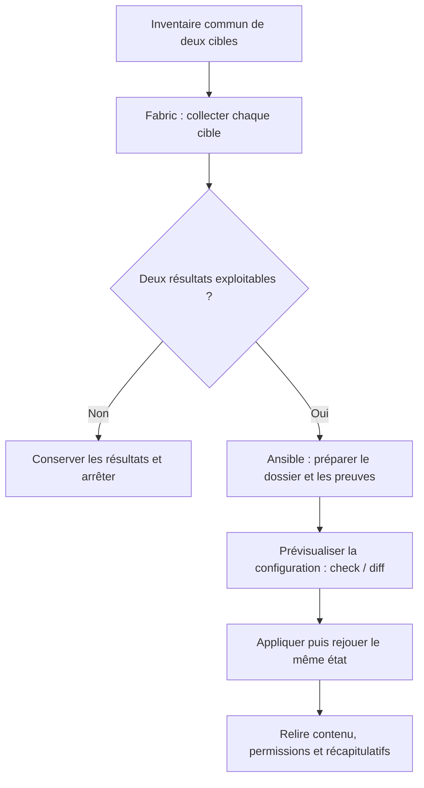

# TP 06 — Collecter à distance et diffuser les alertes

[Retour au parcours](../../README.md) — **70 minutes**, essais et autocorrection compris.

## Mission et production

Assembler les alertes et le diagnostic du même essai, puis vérifier le message capturé. Le TP se déroule dans le poste
Linux de formation ; les données du parc restent fictives.

## Comprendre la chaîne finale

Le dernier bloc réutilise les fonctions validées. Le diagnostic et, si elle est demandée, la collecte complète
appartiennent au même essai.



Sans collecte demandée, le scénario reste local et annonce `non_executee`. La capture SMTP ne livre aucun message à une
boîte externe.

## Fichiers et démarrage

Compléter mes_collectes.py (collecte unitaire et erreurs par cible), puis lire distant.py et mes_fonctions.py. L’option
--laboratoire signifie exécuter les accès SSH configurés et Ansible natif ; Docker n’est utilisé que si les cibles de
secours ont été choisies. Sans cette option, la partie distante est explicitement non exécutée.

```sh
uv run python ateliers/06/depart.py
uv run python outils/verifier.py tp06 --complet
```

Les commandes se lancent à la racine du projet dans le terminal Linux. Les valeurs « À compléter » sont normales au
départ. Complétez les repères TODO et conservez les données de référence. Les lectures, les chemins et une partie des
contrôles sont fournis ; le fichier de départ peut déjà produire des sorties incomplètes. Chaque essai produit un
dossier dans sorties/ ; le vérificateur relance votre code.

## Travailler avec les amorces

Les repères `TODO` désignent le travail à compléter. Lire aussi les lignes fournies : leur rôle doit pouvoir être
expliqué. Garder le dernier tiers de chaque créneau pour lancer, lire les résultats et répondre à la question de
transfert. Les corrigés détaillent les décisions et restent dans des fichiers séparés pour comparer votre version.

## Parcours

1. [Message et pièce jointe](#email) — 15 min.
2. [Fabric et Ansible sur deux machines](#distant) — 40 min.
3. [Chaîne complète de rapport](#integration) — 15 min.

Pour les connexions SSH, suivre le [guide des cibles](../../laboratoire/README.md), puis ajouter --laboratoire à
l’exécution et au contrôle. La préparation des accès est extérieure au budget de quarante minutes.

<a id="email"></a>

## Message et pièce jointe — 15 min

**Mise en pratique.** Transmettre un rapport d’alerte et vérifier la pièce effectivement reçue.

**À écrire :** Le sujet du message et la comparaison des octets de la pièce jointe.

**Fourni :** Création ZIP, construction/envoi du message, SMTP de capture et relecture MIME.

**À observer :** Le sujet et les octets réellement reçus.

1. Créer rapport.zip depuis le CSV de référence avec archiver fourni.
2. Lire envoyer_archive dans admin_tools.services ; repérer EmailMessage : expéditeur, destinataire local, sujet
   "Rapport PYX : 2 alertes", corps expliquant le seuil, puis pièce ZIP en octets.
3. Suivre l’envoi fourni dans serveur_smtp() avec smtplib.SMTP("127.0.0.1", port, timeout=5).send_message(message).
4. Enregistrer capture.messages[0] dans message.eml ; relire son sujet et sa pièce jointe, comparer les octets avec le
   ZIP.

La vérification et la question de transfert sont incluses dans ce temps.

Depuis la racine du projet, lancer seulement cette étape, puis contrôler les résultats :

```sh
# 1. Exécuter votre code pour cette étape
uv run python outils/executer_etape.py tp06 email
# 2. Comparer les résultats et les fichiers au contrat
uv run python outils/verifier.py tp06 --etape email --rapport sorties/tp06/controle-email.json
# 3. Relire le contrôle et le chemin de son essai
uv run python -m json.tool sorties/tp06/controle-email.json
```

Au premier essai, « À revoir » et un code de sortie 1 du vérificateur sont attendus tant que les TODO manquent. Après
modification, relancer les mêmes commandes jusqu’à « Conforme ». Chaque lancement crée un nouvel essai ; ouvrir les
productions dans le champ `dossier` du dernier contrôle, puis comparer aux critères ci-dessous.

<details>
<summary>Exécuter la correction de cette étape</summary>

À utiliser après votre essai pour comparer les choix, sans remplacer votre fichier de départ :

```sh
uv run python outils/executer_etape.py tp06 email --corrige
uv run python outils/verifier.py tp06 --etape email --corrige
```

Lire les commentaires du corrigé et expliquer le rôle de chaque différence avec votre version.

</details>

<details>
<summary>Indice 1 - Piste conceptuelle</summary>

La pièce jointe doit contenir les octets de l’archive créée. Vérifiez le message reçu par la capture ; la construction
du message seule ne prouve pas sa transmission.

</details>

<details>
<summary>Indice 2 - Pseudo-code</summary>

Pseudo-code à traduire dans les fichiers demandés, à partir des données du TP :

```text
créer l’archive de référence avec archiver fourni
construire EmailMessage avec en-têtes et corps demandés
ajouter les octets ZIP comme pièce jointe avec son nom et son type
dans le contexte SMTP local fourni, transmettre le message
enregistrer les octets du message capturé dans message.eml
relire ce message avec le parseur fourni et décoder la pièce jointe
comparer sujet, nom de pièce et octets avec l’archive source
```

Repères du code fourni :

add_attachment(..., maintype="application", subtype="zip", filename="rapport.zip"). La capture est un vrai SMTP local
sans diffusion externe.

</details>

<details>
<summary>Critères du contrôle de référence</summary>

Les résultats ci-dessous portent sur les données fournies. Les identités, dates et mesures du poste ne sont pas figées ;
leur cohérence est contrôlée.

```json
{
  "messages": 1,
  "objet": "Rapport PYX : 2 alertes",
  "piece_jointe": "rapport.zip",
  "octets_identiques": true
}
```

</details>

**Question de transfert :** L’acceptation SMTP prouve-t-elle que le destinataire a lu le rapport ?

<details>
<summary>Éléments de réponse</summary>

Non : soumission, livraison et lecture sont des étapes différentes.

</details>

<a id="distant"></a>

## Fabric et Ansible sur deux machines — 40 min



La prévisualisation concerne la configuration ; la préparation du dossier et des preuves précède ce contrôle. Le détail
des passages se trouve dans `distant.py`.

**Mise en pratique.** Collecter deux cibles Linux, puis déployer une configuration de supervision contrôlée.

**À écrire :** L’extraction du pourcentage disque dans mes_collectes.py.

**Fourni :** Collecte Fabric, boucle d’erreurs, connexion SSH, points de contrôle, SFTP et pilote Ansible.

**À observer :** La collecte, les erreurs par cible, l’aperçu et l’état relu.

### Avant le créneau

Exécuter la commande suivante et vérifier les deux cibles :

```sh
uv run python outils/diagnostic.py --distant
```

 Lire l’inventaire : alias, adresse, port,
compte, clé, hôtes connus, Python cible et dossier dédié. La préparation des accès reste extérieure aux 40 minutes.

### A. Collecter avec Fabric - 15 min

1. Dans mes_collectes.py, lire collecter_une et collecter_parc fournis, puis compléter l’extraction du pourcentage
   disque. Réutiliser connexion fourni ; lire hostname, uname -s et df -Pk /. Conserver alias, date UTC, identité,
   mesure, statut et erreur.
2. Préserver les autres cibles après une exception attendue. Le pilote simule un port fermé local ; aucun serveur réel
   n’est arrêté.
3. Lancer le premier point de contrôle :

```sh
uv run python outils/collecter_parc.py --laboratoire
```

**Point A :** ouvrir le dossier annoncé. collecte.csv contient les deux mesures valides ; collecte-partielle.json
conserve un succès et une erreur ; preuve-collecte.json confirme les quatre critères. Lire execution.log et expliquer le
statut de chaque cible. Cette commande ne lance ni Ansible ni SFTP et ne prépare aucun fichier sur les cibles. Corriger
cette séquence avant de poursuivre.

Répartition : écrire et essayer la collecte 10 min ; observer l’erreur et relire les preuves 5 min.

### B. Maintenir un état avec Ansible - 20 min

1. Lire le playbook fourni laboratoire/rapport.yml : dossier dédié 0700, supervision.ini 0640, seuil_disque_pct=80,
   intervalle_s=60. Identifier la différence entre une commande Fabric et l’état demandé à Ansible.
2. Le contrôle final ci-dessous réutilise vos fonctions et lance le pilote fourni : préparation du dossier, aperçu
   --check --diff --tags configuration, application et répétition.
3. Lire ansible-apercu.txt, ansible-premier.txt, ansible-second.txt et preuve-ansible.json. **Point B :** le fichier est
   identique avant/après aperçu, son contenu/mode sont relus après application et le second passage donne changed=0. Un
   fichier déjà conforme peut donner changed=0 dès le premier passage. Essayer un seuil de 85 dans les variables de
   l’inventaire Ansible généré, prévisualiser le diff puis rétablir 80 pour la référence. Aucun service réel ne consomme
   ce fichier.
4. Dans le passage guidé, repérer le module script qui transfère controle_cible.py et relire preuve-scripts.json : les
   identités correspondent à Fabric. Puis observer client.get dans admin_tools.logs_distants.telecharger_logs : les deux
   logs fictifs sont réellement reçus par SFTP. Lire preuve-logs.json et auth-collecte.log : quatre événements, deux
   succès et deux échecs pour 192.0.2.42. Les sources, empreintes et frontières restent visibles ; un transfert
   incomplet bloque le regroupement complet. Réutiliser la regex du TP04, sans réécrire le pilote.

Répartition : configuration, aperçu, application et relecture 15 min ; script distant et transfert des logs guidés 5
min.

### Contrôle complet et explication - 5 min

Depuis la racine du projet, lancer seulement cette étape, puis contrôler les résultats :

```sh
# 1. Exécuter votre code pour cette étape
uv run python outils/executer_etape.py tp06 distant --laboratoire
# 2. Comparer les résultats et les fichiers au contrat
uv run python outils/verifier.py tp06 --etape distant --laboratoire --rapport sorties/tp06/controle-distant.json
# 3. Relire le contrôle et le chemin de son essai
uv run python -m json.tool sorties/tp06/controle-distant.json
```

Au premier essai, « À revoir » et un code de sortie 1 du vérificateur sont attendus tant que les TODO manquent. Après
modification, relancer les mêmes commandes jusqu’à « Conforme ». Chaque lancement crée un nouvel essai ; ouvrir les
productions dans le champ `dossier` du dernier contrôle, puis comparer aux critères ci-dessous.

<details>
<summary>Exécuter la correction de cette étape</summary>

À utiliser après votre essai pour comparer les choix, sans remplacer votre fichier de départ :

```sh
uv run python outils/executer_etape.py tp06 distant --corrige --laboratoire
uv run python outils/verifier.py tp06 --etape distant --corrige --laboratoire
```

Lire les commentaires du corrigé et expliquer le rôle de chaque différence avec votre version.

</details>

Ce contrôle rejoue la collecte et les passages Ansible dans un nouvel essai. Relire le dossier qu’il annonce pour
rapprocher les preuves du même essai. Expliquer Point A (observations par cible) puis Point B (état réellement relu) et
répondre à la question de transfert.

La vérification et la question de transfert sont incluses dans ces 40 minutes.

<details>
<summary>Indice 1 - Piste conceptuelle</summary>

La collecte conserve une observation ou une erreur pour chaque cible ; la configuration vise un état. Les preuves de ces
deux séquences sont relues séparément, puis rapprochées dans un même essai.

</details>

<details>
<summary>Indice 2 - Pseudo-code</summary>

Pseudo-code à traduire dans les fichiers demandés, à partir des données du TP :

```text
FONCTION collecter_une(cible, inventaire) :
    ouvrir la connexion fournie et exécuter les commandes demandées
    extraire identité, système et pourcentage disque ; valider les valeurs
    renvoyer la ligne complète datée au statut ok
FONCTION collecter_parc(cibles, inventaire) :
    POUR chaque cible :
        ESSAYER collecter_une
        SI exception attendue : créer une ligne datée au statut erreur
        conserver la ligne et poursuivre les autres cibles
lancer le point Fabric et relire ses quatre critères
utiliser le pilote Ansible fourni pour aperçu, application et répétition
relire contenu/mode et les preuves SFTP/script du même essai
```

Repères du code fourni :

Autonomie encadrée : collecte et boucle d’erreurs amorcées dans mes_collectes.py, mesure disque à compléter, contrat et
connexion fournis ; écriture CSV, essai partiel, transfert SFTP des logs et pilotage Ansible fournis. Indices si
nécessaire : datetime.now(timezone.utc), client.run(..., hide=True, timeout=3, in_stream=False), dernière ligne de df,
int(...rstrip("%")); traiter OSError, SSHException, UnexpectedExit, CommandTimedOut, TimeoutError, ValueError et
IndexError dans la boucle, jamais masquer toutes les exceptions. Correction dans solution_collecte.py. Le module copy
supporte check/diff. La préparation préalable concerne uniquement le dossier dédié ; le mode check du module file ne
créerait pas le dossier nécessaire à la copie.

</details>

<details>
<summary>Critères du contrôle de référence</summary>

Les résultats ci-dessous portent sur les données fournies. Les identités, dates et mesures du poste ne sont pas figées ;
leur cohérence est contrôlée.

```json
{
  "cibles_attendues": true,
  "systemes_linux": true,
  "disques_valides": true,
  "echec_partiel_visible": true,
  "premier_reussi": true,
  "second_sans_changement": true,
  "contenus_conformes": true,
  "permissions_conformes": true,
  "apercu_sans_modification": true,
  "logs_telecharges": 2,
  "evenements_logs": 4,
  "echecs_logs": 2,
  "scripts_executes": 2
}
```

</details>

**Question de transfert :** Deux alias pointent vers le même hôte et le même port : a-t-on administré deux machines ?

<details>
<summary>Éléments de réponse</summary>

Non. Le kit refuse cette configuration. Deux points d’accès distincts doivent correspondre aux deux cibles prévues ; un
accès au bureau distant ne garantit pas l’accès SSH entre postes.

</details>

<a id="integration"></a>

## Chaîne complète de rapport — 15 min

Import, filtre, export, diagnostic et journal sont fournis. Compléter l’archive, l’envoi et le compteur de messages ;
expliquer pourquoi une étape échouée empêche l’envoi. Consacrer 5 min à la lecture, 5 min aux appels et 5 min au
contrôle.

**Mise en pratique.** Assembler les alertes et le diagnostic du même essai, puis vérifier le message capturé.

**À écrire :** Les appels d’archive/envoi et le compteur de messages dans depart.py.

**Fourni :** mes_fonctions.py, import, filtre, exports, diagnostic, journal et SMTP local.

**À observer :** La portée, les membres du ZIP et le message du même essai.

1. Relire mes_fonctions.py ; reprendre vos fonctions validées ou conserver celles fournies. La source par défaut est le
   rapport de référence. --source permet de reprendre votre rapport_complet.csv du TP 04.
2. Assembler importer_csv, lire_alertes(seuil=2) et exporter. joindre_diagnostic fourni ajoute diagnostic.json : poste,
   utilisateur, date, volume et portée de la collecte distante.
3. Archiver les exports et complements ensemble. Si --laboratoire a exécuté la collecte, le fichier distant/collecte.csv
   du même essai est joint. --collecte permet de joindre une collecte complète précédente. Une collecte explicitement
   fournie mais absente ou partielle bloque la diffusion.
4. Envoyer uniquement au SMTP de capture ; enregistrer message.eml. Relire la pièce jointe et le ZIP : alertes.csv,
   alertes.xlsx, diagnostic.json et, si exécutée, collecte.csv. Aucun inventaire ni clé SSH ne rejoint cette sélection.
   Tracer import, archive et soumission SMTP dans execution.log avec logging ; garder ce journal hors du ZIP métier. Le
   journal fourni ferme le fichier et propage une erreur après l’avoir tracée.
5. Vérifier trois lignes en base et deux alertes sur la référence. Sans collecte SSH, diagnostic.json doit annoncer
   non_executee ; cela ne valide pas la partie distante. Ne pas joindre les IP sources des logs aux noms des cibles sans
   une règle de correspondance.
6. Essayer une source absente : aucun envoi. Décrire la décision à prendre si une seule cible a répondu. Avant de fermer
   le poste distant, lancer outils/sauvegarder.py et récupérer l’archive sur votre ordinateur.

La vérification et la question de transfert sont incluses dans ce temps.

Depuis la racine du projet, lancer seulement cette étape, puis contrôler les résultats :

```sh
# 1. Exécuter votre code pour cette étape
uv run python outils/executer_etape.py tp06 integration
# 2. Comparer les résultats et les fichiers au contrat
uv run python outils/verifier.py tp06 --etape integration --rapport sorties/tp06/controle-integration.json
# 3. Relire le contrôle et le chemin de son essai
uv run python -m json.tool sorties/tp06/controle-integration.json
```

Au premier essai, « À revoir » et un code de sortie 1 du vérificateur sont attendus tant que les TODO manquent. Après
modification, relancer les mêmes commandes jusqu’à « Conforme ». Chaque lancement crée un nouvel essai ; ouvrir les
productions dans le champ `dossier` du dernier contrôle, puis comparer aux critères ci-dessous.

<details>
<summary>Exécuter la correction de cette étape</summary>

À utiliser après votre essai pour comparer les choix, sans remplacer votre fichier de départ :

```sh
uv run python outils/executer_etape.py tp06 integration --corrige
uv run python outils/verifier.py tp06 --etape integration --corrige
```

Lire les commentaires du corrigé et expliquer le rôle de chaque différence avec votre version.

</details>

<details>
<summary>Indice 1 - Piste conceptuelle</summary>

L’ordre des opérations conditionne la diffusion. Une donnée absente ou une collecte demandée incomplète doit bloquer
l’envoi ; les pièces représentent toutes le même essai.

</details>

<details>
<summary>Indice 2 - Pseudo-code</summary>

Pseudo-code à traduire dans les fichiers demandés, à partir des données du TP :

```text
dans les contextes de journal et SMTP local fournis :
    importer la source dans une base neuve
    lire les alertes au seuil puis exporter leurs deux rapports
    sélectionner la collecte de cet essai ou celle explicitement demandée
    faire valider et joindre le diagnostic par la fonction fournie
    archiver seulement rapports et compléments validés
    transmettre au SMTP de capture et conserver message.eml
    journaliser import, archive et soumission dans execution.log
relire la pièce capturée et les membres du ZIP
construire les critères depuis les preuves et tester une source absente
```

Repères du code fourni :

Assemblage guidé de quinze minutes : fonctions de traitement et diagnostic fournis, appels et sélection des pièces à
compléter. Le diagnostic courant est produit à chaque essai ; la collecte ne doit pas provenir implicitement d’une
ancienne sortie. Le scénario autonome est outils/rapport_final.py.

</details>

<details>
<summary>Critères du contrôle de référence</summary>

Les résultats ci-dessous portent sur les données fournies. Les identités, dates et mesures du poste ne sont pas figées ;
leur cohérence est contrôlée.

```json
{
  "importees": 3,
  "alertes": 2,
  "echecs_alertes": 5,
  "rapport_archive": true,
  "diagnostic_archive": true,
  "collecte_archivee_si_executee": true,
  "messages": 1
}
```

</details>

**Question de transfert :** La collecte demandée est donnees/transfert/collecte-partielle.csv. Quelle preuve conserver
et faut-il envoyer le rapport final ? Répondre en trois phrases : observation, conclusion, prochaine action.

<details>
<summary>Éléments de réponse</summary>

Conserver le succès de srv-a et le TimeoutError de srv-b ; la collecte est incomplète. Selon le contrat du cours,
bloquer le message final, diagnostiquer la cible puis refaire une collecte complète. Un code timeout ne prouve pas que
l’hôte est arrêté.

</details>

## Comprendre la correction

Après votre essai, lire [corrige.py](corrige.py) et les fonctions partagées dans [admin_tools](../../src/admin_tools/).
Comparer les choix et leurs limites. Le corrigé garde ses sorties séparément. [Dépannage](../../docs/depannage.md).

```sh
uv run python ateliers/06/corrige.py
uv run python outils/verifier.py tp06 --corrige --complet
```

Ajouter --laboratoire pour inclure les connexions et le rapport distant. Utiliser --etape integration sans cette option
pour travailler seulement l’assemblage local.
