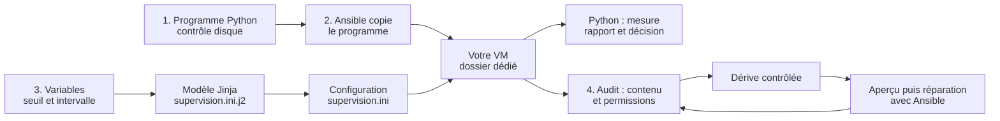

# Atelier 07 — Déployer un contrôle disque avec Ansible

[Retour au parcours](../../README.md) — **Un après-midi complet : 3 h 30, pause comprise.**

## Votre mission

Vous avez une VM Linux et les accès SSH préparés au TP6. Vous allez construire un contrôle disque Python,
puis **écrire et vérifier son déploiement avec Ansible**.

**À faire maintenant :** commencez par [depart.py](depart.py), puis suivez les quatre étapes de ce README.
Toutes les commandes se lancent depuis la racine du projet, où se trouve `pyproject.toml`.

| Étape | Durée visée | Votre travail | Production |
| --- | --- | --- | --- |
| 1. Construire le contrôle Python | 45 min | Calcul, décision, rapport et code de sortie | Programme validé sur trois simulations |
| 2. Déployer avec un playbook | 50 min | Dossiers, copie de fichiers et permissions | Programme et INI dans `~/pyx-tp07-ansible` |
| Pause | 15 min | Faire une pause | Reprendre à l’étape 3 |
| 3. Paramétrer avec un template | 50 min | Variables, modèle Jinja et validation | Décisions comparées, paramètres invalides refusés |
| 4. Vérifier et réparer deux incidents | 50 min | Audit, aperçu, dérive et fichier absent | Fichiers restaurés et état stable : `changed=0` |

Les quatre étapes totalisent 3 h 15 de travail, soit environ deux ateliers habituels de 100 minutes.
La pause de 15 minutes porte la durée à 3 h 30, par exemple de 14 h à 17 h 30.
Les durées incluent essais, erreurs, explications, correction et contrôle final.
Cet approfondissement complète le parcours principal ;
il peut aussi être repris après la formation. Il ne remplace pas un des six TP.

## Comprendre ce qui se passe



Le contrôleur et la cible sont **deux rôles dans votre même VM**. Ansible réutilise SSH vers `127.0.0.1`.
Le dossier `~/pyx-tp07-ansible` est distinct de `~/pyx-tp06`.
Aucun service système n’est configuré ; le fichier INI est consommé par votre programme Python.

Un lancement du programme effectue **un seul contrôle**.
`intervalle_s=60` est une valeur de configuration : il ne crée ni boucle ni planification.

## Préparer — dans le temps de l’étape 1

Si nécessaire, synchronisez l’environnement :

```sh
uv sync --locked
uv run python outils/diagnostic.py --distant
```

Le diagnostic doit confirmer la cible SSH du TP6.
Si les accès du TP6 sont déjà prêts, conservez-les : il n’est pas nécessaire de recréer de clé ou d’inventaire.

Si Ansible ou SSH échoue, résoudre le problème avant l’étape 2 avec le
[guide du laboratoire](../../laboratoire/README.md). L’étape 1 fonctionne sans SSH, avec les données fournies.

## Étape 1 — Construire le contrôle Python — 45 min

**Objectif :** obtenir une décision juste et un rapport vérifiable, avant de déployer quoi que ce soit.

**Fichier à modifier :** [depart.py](depart.py). Complétez les quatre TODO.
La lecture INI, les arguments, la mesure et l’écriture sont fournis dans [support.py](support.py).

| TODO | Fonction | Ce que vous devez écrire |
| --- | --- | --- |
| 1 | `calculer_pourcentage` | Remplacer `None` par `utilise / total * 100` |
| 2 | `choisir_statut` | Un `if/else` : `ALERTE` si la mesure atteint le seuil ; `OK` sinon |
| 3 | `construire_rapport` | Conserver la variable `statut` dans le dictionnaire |
| 4 | `choisir_code` | Le code `1` pour `ALERTE` ; le cas `OK` est fourni |

Avant chaque essai, prédisez la décision. Les trois fichiers contiennent un total fictif de 1000 octets :

| Fichier dans `donnees/` | Utilisé | Pourcentage | Seuil | Statut / code |
| --- | --- | --- | --- | --- |
| `disque-normal.json` | 420 | 42 % | 80 | `OK` / 0 |
| `disque-limite.json` | 800 | 80 % | 80 | `ALERTE` / 1 |
| `disque-alerte.json` | 850 | 85 % | 80 | `ALERTE` / 1 |

La simulation ne remplit pas le disque. Le rapport indique `origine_mesure: "simulation"`.

### Exécuter et contrôler

```sh
uv run python ateliers/07/depart.py \
  --config ateliers/07/donnees/supervision.exemple.ini \
  --simulation ateliers/07/donnees/disque-normal.json
uv run python ateliers/07/verifier.py --etape 1
```

**Attendu :** `OK : 42.00 % utilisés ; seuil 80 %.`, puis les contrôles `Conforme`.
Avant modification, `À compléter : TODO 1...` est attendu et aucun rapport n’est créé.

Pour isoler une fonction pendant votre travail :

```sh
uv run python ateliers/07/verifier.py --etape calcul
uv run python ateliers/07/verifier.py --etape decision
uv run python ateliers/07/verifier.py --etape rapport
uv run python ateliers/07/verifier.py --etape codes
```

### Vérifier votre compréhension

Remplacez le fichier normal par le fichier d’alerte, puis ajoutez `--seuil 90`.
Voici les deux commandes complètes :

```sh
uv run python ateliers/07/depart.py \
  --config ateliers/07/donnees/supervision.exemple.ini \
  --simulation ateliers/07/donnees/disque-alerte.json
uv run python ateliers/07/depart.py \
  --config ateliers/07/donnees/supervision.exemple.ini \
  --simulation ateliers/07/donnees/disque-alerte.json --seuil 90
```

Ouvrez les rapports dont le programme affiche les chemins :
la mesure doit rester à 85 %, tandis que le seuil passe de 80 à 90 et la décision de `ALERTE` à `OK`.

**Terminé :** les contrôles Python passent et vous expliquez l’égalité au seuil, le code 1
et l’intérêt de conserver machine, date UTC, chemin et origine de la mesure.

<details>
<summary>Indice : calcul et condition</summary>

Calculez avant d’arrondir. `79.96` reste inférieur à 80, même si un affichage arrondi donne `80.0`.
`>=` inclut l’égalité. Gardez les lignes `return` après le calcul ou la condition.

</details>

<details>
<summary>Correction Python et explications</summary>

Lire [corrige.py](corrige.py), puis contrôler sans remplacer votre fichier :

```sh
uv run python ateliers/07/verifier.py --corrige --etape 1
```

Chaque fonction du corrigé explique sa règle. Un code 1 signifie ici que la mesure a réussi
et atteint le seuil ; un code 2 signale une erreur empêchant le contrôle.

</details>

## Étape 2 — Écrire et appliquer le playbook — 50 min

**Objectif :** installer votre programme dans un dossier dédié en décrivant un état avec Ansible.

### A. Préparer et lire l’inventaire — 10 min

```sh
uv run python ateliers/07/preparer_ansible.py
```

Ouvrez `sorties/tp07/ansible/inventaire-ansible.json`. Ce fichier réutilise les accès du TP6 ;
il ne crée aucune clé et ne modifie pas les accès SSH.

| Élément de l’inventaire | À retrouver |
| --- | --- |
| `ansible_host` | `127.0.0.1` : votre VM actuelle |
| `ansible_user`, port et clé | Le compte et les accès déjà préparés |
| `ansible_python_interpreter` | Le Python qui permet à Ansible d’exécuter ses modules |
| `dossier_deploiement` | `~/pyx-tp07-ansible`, sous forme de chemin absolu |
| `fichier_controle`, `fichier_support` | Vos sources à copier sur la cible |

Expliquez pourquoi `127.0.0.1` convient ici et pourquoi ce même inventaire ne désignerait pas votre VM
si vous exécutiez Ansible depuis votre ordinateur personnel.

### B. Compléter le playbook — 20 min

**Fichier :** [ansible/deployer.yml](ansible/deployer.yml).
Remplacez uniquement les deux blocs `ansible.builtin.fail` des TODO 5 et 6.
Conservez les noms de tâches, les boucles et la validation fournis.

| TODO | Module à utiliser | Paramètres à écrire |
| --- | --- | --- |
| 5 | `ansible.builtin.file` | `path: "{{ item }}"`, `state: directory`, `mode: '0700'` |
| 6 | `ansible.builtin.copy` | `src: "{{ item.source }}"`, `dest: "{{ dossier_deploiement }}/{{ item.nom }}"`, `mode: '0600'` |

`loop` exécute la même tâche pour chaque élément ; `item` désigne l’élément courant.
Les permissions sont des chaînes entre guillemets : `'0700'`, `'0600'`, `'0640'`.

Le mode `copie`, défini dans [ansible/variables.yml](ansible/variables.yml), garde la tâche du template inactive.
Le TODO 7 peut donc rester incomplet pendant cette étape.

### C. Vérifier la syntaxe, appliquer et relire — 20 min

```sh
uv run ansible-playbook -i sorties/tp07/ansible/inventaire-ansible.json \
  ateliers/07/ansible/deployer.yml --syntax-check
uv run ansible-playbook -i sorties/tp07/ansible/inventaire-ansible.json \
  ateliers/07/ansible/deployer.yml
uv run python ateliers/07/verifier.py --etape 2
```

**Attendu dans votre dossier personnel :**

```text
pyx-tp07-ansible/           permissions 0700
├── controle_disque.py     permissions 0600
├── support.py             permissions 0600
├── supervision.ini        permissions 0640
└── rapports/              permissions 0700
```

Ouvrez `supervision.ini` dans VS Code. Il contient `seuil_disque_pct=80`.
Les scripts sont lancés avec Python ; ils n’ont pas besoin du droit d’exécution.

Lancez maintenant **la copie déployée**, avec sa propre configuration et les mêmes données de simulation :

```sh
uv run python ~/pyx-tp07-ansible/controle_disque.py \
  --config ~/pyx-tp07-ansible/supervision.ini \
  --simulation ateliers/07/donnees/disque-normal.json
```

**Attendu :** `OK` à 42 %. Le chemin du rapport doit commencer par `~/pyx-tp07-ansible/rapports/`.
Retrouvez les sources dans le projet et leur copie dans votre dossier personnel.
La copie reste inchangée si vous éditez une source : il faut rejouer le playbook pour la mettre à jour.

**Terminé :** le vérificateur confirme les contenus copiés et les permissions.
Vous expliquez la différence entre le chemin `src` sur le contrôleur et `dest` sur la cible.

<details>
<summary>Indice : remplacer un bloc, pas seulement son nom</summary>

Pour le TODO 5, retirez `ansible.builtin.fail` et sa ligne `msg`, puis écrivez :

```yaml
      ansible.builtin.file:
        path: "{{ item }}"
        state: directory
        mode: '0700'
```

Gardez la boucle existante au même niveau d’indentation que le nom du module.

</details>

<details>
<summary>Lire la correction commentée du déploiement</summary>

Le fichier [ansible/corrige/deployer.yml](ansible/corrige/deployer.yml) contient les tâches complètes.
Les commentaires expliquent la copie, les permissions et les variantes de configuration.
Pour contrôler la correction dans un essai isolé :

```sh
uv run python ateliers/07/verifier.py --corrige --etape 2
```

Les vérificateurs des étapes 2 à 4 réutilisent SSH mais créent leur propre dossier d’essai.
Ils ne remplacent ni vos sources, ni le déploiement manuel dans votre dossier personnel.

</details>

## Étape 3 — Générer la configuration avec un template — 50 min

**Objectif :** changer une variable et constater son effet sur la configuration, puis sur le résultat Python.

### A. Compléter le template et sa tâche — 15 min

Dans [ansible/templates/supervision.ini.j2](ansible/templates/supervision.ini.j2) :

- TODO 8 : remplacer `TODO_SEUIL` par `{{ seuil_disque_pct }}`.
- TODO 9 : remplacer `TODO_INTERVALLE` par `{{ intervalle_s }}`.

Dans [ansible/deployer.yml](ansible/deployer.yml), remplacez le bloc `fail` du TODO 7 :

```yaml
      ansible.builtin.template:
        src: "{{ fichier_modele }}"
        dest: "{{ dossier_deploiement }}/supervision.ini"
        mode: '0640'
```

Gardez le `when` fourni. Dans [ansible/variables.yml](ansible/variables.yml), remplacez
`mode_configuration: copie` par `mode_configuration: template`. Conservez le seuil 80 pour le premier essai.

Le module `copy` transfère un contenu existant ; `template` remplace les expressions Jinja avec les variables.
[Référence du module template](https://docs.ansible.com/projects/ansible/latest/collections/ansible/builtin/template_module.html).

### B. Déployer 80, puis 90 et comparer — 20 min

```sh
uv run ansible-playbook -i sorties/tp07/ansible/inventaire-ansible.json \
  ateliers/07/ansible/deployer.yml --check --diff
uv run ansible-playbook -i sorties/tp07/ansible/inventaire-ansible.json \
  ateliers/07/ansible/deployer.yml
uv run python ~/pyx-tp07-ansible/controle_disque.py \
  --config ~/pyx-tp07-ansible/supervision.ini \
  --simulation ateliers/07/donnees/disque-alerte.json
```

Avec le seuil 80, la simulation à 85 % produit `ALERTE`, code 1.
Changez ensuite **uniquement** `seuil_disque_pct: 80` en `seuil_disque_pct: 90` dans les variables,
puis relancez les trois commandes. Ouvrez l’INI déployé et les rapports annoncés par Python.

| Même mesure | Variable | Fichier déployé | Décision |
| --- | --- | --- | --- |
| 85 % | `seuil_disque_pct: 80` | `seuil_disque_pct=80` | `ALERTE`, code 1 |
| 85 % | `seuil_disque_pct: 90` | `seuil_disque_pct=90` | `OK`, code 0 |

Vous ne modifiez ni le programme Python ni le fichier déployé à la main dans cette étape.

### C. Tester un autre paramètre et deux erreurs — 15 min

Gardez le seuil 90 et passez `intervalle_s: 60` à `intervalle_s: 120`, puis appliquez :

```sh
uv run ansible-playbook -i sorties/tp07/ansible/inventaire-ansible.json \
  ateliers/07/ansible/deployer.yml
```

**Attendu :** `intervalle_s=120` dans l’INI. Relancer Python effectue toujours un seul contrôle :
une variable ne crée pas de planification. Expliquez ce qu’il faudrait ajouter pour des contrôles périodiques.

Dans les variables, essayez `seuil_disque_pct: 101`, puis lancez le playbook.
**Échec attendu :** la première assertion refuse la valeur, avant toute écriture.
Relisez le fichier déployé : il doit conserver 90.

Essayez ensuite `seuil_disque_pct: "80"` et relancez la même commande.
**Échec attendu :** une chaîne de caractères n’est pas un entier, même si elle contient des chiffres.
L’INI doit toujours conserver le seuil 90 et l’intervalle 120.

| Valeur dans YAML | Type / validité | Résultat attendu |
| --- | --- | --- |
| `seuil_disque_pct: 90` | Entier valide | Configuration déployée |
| `seuil_disque_pct: 101` | Entier hors limites | Refus avant écriture |
| `seuil_disque_pct: "80"` | Chaîne, type incorrect | Refus avant écriture |

Remettez ensuite le seuil à **80** et l’intervalle à **60**, puis appliquez avant l’étape 4 :

```sh
uv run ansible-playbook -i sorties/tp07/ansible/inventaire-ansible.json \
  ateliers/07/ansible/deployer.yml
uv run python ateliers/07/verifier.py --etape 3
```

**Terminé :** template, décisions 80/90, intervalle 120 et refus des deux erreurs sont conformes.
Le vérificateur utilise des valeurs contrôlées dans son essai ; il ne modifie pas `variables.yml`.

<details>
<summary>Indice : YAML, Jinja et INI sont trois formats différents</summary>

Dans les variables YAML : `seuil_disque_pct: 90`.
Dans le modèle : `seuil_disque_pct={{ seuil_disque_pct }}`.
Dans le fichier généré : `seuil_disque_pct=90`.

Garder une date qui change à chaque rendu empêcherait le fichier de rester identique au second passage.

</details>

<details>
<summary>Lire et contrôler la correction du template</summary>

Lire [le modèle corrigé](ansible/corrige/templates/supervision.ini.j2), puis les tâches du playbook corrigé.

```sh
uv run python ateliers/07/verifier.py --corrige --etape 3
```

Le test exécute réellement Ansible, relit les fichiers et lance le programme déployé sur la même simulation.

</details>

## Étape 4 — Prouver l’idempotence et réparer deux incidents — 50 min

**Objectif :** distinguer une exécution réussie, un état réellement conforme et un état stable au second passage.

### A. Compléter l’audit et vérifier l’état initial — 10 min

**Fichier :** [ansible/audit.yml](ansible/audit.yml).

- TODO 10 : remplacer `'0000'` par `'0640'` dans le contrôle des permissions.
- TODO 11 : remplacer la condition `false` par le contrôle suivant, avec la même indentation :

```yaml
          - >-
            ('seuil_disque_pct=' ~ (seuil_disque_pct | string))
            in (contenu.content | b64decode).splitlines()
```

`stat` lit les métadonnées ; `slurp` lit le contenu en base64 ; `assert` vérifie la règle.
Cette condition cherche une **ligne complète**, pour ne pas confondre un seuil de 80 et un seuil de 800.
Les tâches fournies au début de l’audit vérifient aussi l’existence et le mode 0600 des deux programmes.
L’audit lit les fichiers sans les modifier ; il ne contrôle pas l’espace disque réel.

```sh
uv run ansible-playbook -i sorties/tp07/ansible/inventaire-ansible.json \
  ateliers/07/ansible/audit.yml
uv run ansible-playbook -i sorties/tp07/ansible/inventaire-ansible.json \
  ateliers/07/ansible/deployer.yml
```

**Attendu :** audit conforme et second déploiement `changed=0`, `failed=0`, `unreachable=0`.
Si une tâche change encore, lire son nom et expliquer ce qu’elle modifie.

### B. Introduire une dérive et la constater — 10 min

```sh
uv run python ateliers/07/provoquer_derive.py
uv run ansible-playbook -i sorties/tp07/ansible/inventaire-ansible.json \
  ateliers/07/ansible/audit.yml
```

Le premier outil sauvegarde l’INI, puis modifie seulement ce fichier de démonstration :
seuil 10 et permissions 0600. L’audit doit **échouer** : c’est l’échec attendu du scénario.

Ouvrez le fichier pour constater la dérive. Avant de réparer, prédisez les deux écarts qu’Ansible devra corriger.

### C. Prévisualiser, réparer et rejouer — 10 min

```sh
uv run ansible-playbook -i sorties/tp07/ansible/inventaire-ansible.json \
  ateliers/07/ansible/deployer.yml --check --diff
```

L’aperçu doit annoncer un changement. Relisez l’INI : le seuil reste à 10,
car l’aperçu n’a pas appliqué la réparation. Le mode check dépend des modules utilisés ;
[documentation des modes check/diff](https://docs.ansible.com/projects/ansible/latest/playbook_guide/playbooks_checkmode.html).

Appliquez ensuite, contrôlez réellement et rejouez :

```sh
uv run ansible-playbook -i sorties/tp07/ansible/inventaire-ansible.json \
  ateliers/07/ansible/deployer.yml
uv run ansible-playbook -i sorties/tp07/ansible/inventaire-ansible.json \
  ateliers/07/ansible/audit.yml
uv run ansible-playbook -i sorties/tp07/ansible/inventaire-ansible.json \
  ateliers/07/ansible/deployer.yml
uv run python ateliers/07/verifier.py --etape 4
```

**Attendu :** seuil 80 et mode 0640 rétablis, audit conforme, puis `changed=0`.
Le vérificateur conserve les journaux et le bilan dans le dossier qu’il annonce.

### D. Restaurer un fichier manquant — 15 min

Le premier incident portait sur la configuration. Le second porte sur un programme nécessaire au contrôle.
L’outil déplace `support.py` dans une sauvegarde ; il ne supprime aucun fichier et laisse vos sources intactes.

```sh
uv run python ateliers/07/provoquer_derive.py --fichier-absent
uv run ansible-playbook -i sorties/tp07/ansible/inventaire-ansible.json \
  ateliers/07/ansible/audit.yml
```

**Échec attendu :** l’audit signale un programme absent. Lisez le nom de la tâche et du fichier en échec.
Prédisez le module qui va le restaurer : `copy` ou `template` ?

```sh
uv run ansible-playbook -i sorties/tp07/ansible/inventaire-ansible.json \
  ateliers/07/ansible/deployer.yml --check --diff
uv run ansible-playbook -i sorties/tp07/ansible/inventaire-ansible.json \
  ateliers/07/ansible/deployer.yml
uv run ansible-playbook -i sorties/tp07/ansible/inventaire-ansible.json \
  ateliers/07/ansible/audit.yml
uv run ansible-playbook -i sorties/tp07/ansible/inventaire-ansible.json \
  ateliers/07/ansible/deployer.yml
uv run python ateliers/07/verifier.py --etape 4
```

**Attendu :** l’aperçu prévoit la copie, le déploiement recrée `support.py`, l’audit passe,
puis le dernier passage affiche `changed=0`. Aucun fichier n’est recopié à la main.
L’audit vérifie existence, permissions et valeurs INI ; le vérificateur compare aussi les copies aux sources.

### E. Faire le point et contrôler l’ensemble — 5 min

Expliquez avec vos propres fichiers :

1. Où se trouve l’état souhaité, et où se trouve l’état réel ?
2. Pourquoi l’audit échoue-t-il après une modification manuelle ?
3. Pourquoi `changed=0` et la relecture du fichier sont-ils deux preuves complémentaires ?
4. Quel module restaure `support.py` et à partir de quel fichier ?

<details>
<summary>Afficher les réponses et l’explication</summary>

L’état souhaité vient du playbook, des variables et du modèle. L’état réel est le fichier présent sur la VM.
Une modification manuelle crée une différence ; l’audit la constate, le déploiement la corrige.

`changed=0` signifie que ce passage n’a appliqué aucune modification.
L’audit vérifie les valeurs et permissions attendues : l’un ne remplace pas l’autre.
Le code 1 du programme Python signifie une alerte disque ; ce n’est pas le résultat d’une commande Ansible.
Le module `copy` restaure `support.py` depuis la source indiquée par l’inventaire :
le programme déployé est reproductible à partir du projet.

</details>

<details>
<summary>Lire et contrôler la correction de l’audit</summary>

Lire [ansible/corrige/audit.yml](ansible/corrige/audit.yml). Les commentaires expliquent les contrôles de fichier
et le décodage du contenu.

```sh
uv run python ateliers/07/verifier.py --corrige --etape 4
```

La correction est exercée dans un dossier distinct de votre déploiement manuel.

</details>

## Contrôle final et récupération des fichiers

```sh
uv run python ateliers/07/verifier.py --etape tous
uv run python outils/sauvegarder.py
```

**Réussite :** les quatre étapes sont conformes.
Ouvrez les bilans et journaux annoncés, puis récupérez l’archive de sauvegarde depuis votre VM.

Vos sources et les preuves des vérificateurs sont dans le projet.
Le déploiement manuel `~/pyx-tp07-ansible` est extérieur au projet ; les fichiers de référence, les variables
et les playbooks permettent de le reconstruire.

`outils/verifier.py tous` reste le contrôle des six TP principaux : cet atelier possède son propre vérificateur.

| Message | Signification | Action |
| --- | --- | --- |
| `À compléter : TODO...` | Fonction Python incomplète | Compléter le bloc nommé |
| `TODO 5/6/7` dans Ansible | Tâche de départ encore présente | Remplacer le bloc `fail` indiqué |
| Inventaire absent | Accès du TP6 indisponibles | Reprendre le guide du laboratoire |
| `unreachable` | La connexion SSH a échoué | Relancer le diagnostic distant |
| Audit en échec après dérive | Écart attendu avec l’état souhaité | Aperçu, application puis audit |
| `changed>0` à chaque passage | Une tâche continue de modifier l’état | Lire la tâche et comparer les fichiers |

## Variante locale explicite

Sur Linux/macOS, l’atelier Ansible peut aussi fonctionner sans SSH :

```sh
uv run python ateliers/07/preparer_ansible.py --local
uv run python ateliers/07/verifier.py --etape tous --local
```

Le mode `local` exécute les modules sur le poste actuel ; il ne valide pas SSH.
Dans la VM préparée au TP6, suivez le parcours SSH par défaut.
Sur Windows, la partie Ansible s’exécute dans Linux sous WSL ou dans la VM.
