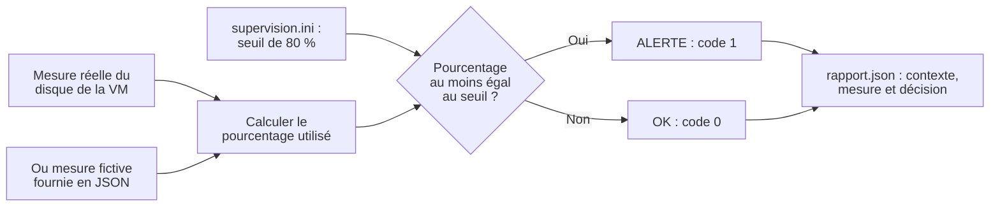

# Atelier 7 optionnel — Contrôler le disque de votre VM

[Retour au parcours](../../README.md) — **35 à 45 minutes**, contrôles et correction compris.

## Ce que vous allez faire

Au TP6, Ansible a créé `~/pyx-tp06/supervision.ini`. Ce fichier contient un seuil disque de 80 %.
Vous allez maintenant utiliser ce seuil pour répondre à une question : **faut-il déclencher une alerte ?**

**À faire maintenant :** ouvrez [depart.py](depart.py). Complétez ses **quatre TODO**, dans l’ordre indiqué ci-dessous.
Toutes les commandes se lancent depuis la racine du projet, où se trouve `pyproject.toml`.

**Production :** un affichage `OK` ou `ALERTE`, un rapport JSON daté et un code de fin utilisable par un autre
programme. La mesure réelle porte sur le volume contenant `/`, dans la machine qui exécute Python.

La lecture INI, les arguments, la mesure et l’écriture JSON sont fournis dans [support.py](support.py).
Vous réutilisez des fonctions, une condition et un dictionnaire ; aucune nouvelle bibliothèque n’est nécessaire.

## Voir les entrées et la sortie



Un fichier ou un argument invalide produit **une erreur et le code 2**, sans rapport de réussite.
L’alerte utilise le code 1 par convention dans **ce script** : ce n’est pas une exception Python.

### Configuration

Le TP6 produit ce contenu ; une copie de référence est fournie dans
[donnees/supervision.exemple.ini](donnees/supervision.exemple.ini) :

```ini
[supervision]
cible=vm-locale
seuil_disque_pct=80
intervalle_s=60
```

Cet atelier lit `seuil_disque_pct`. Il réalise **un seul contrôle par lancement** : `intervalle_s=60` ne crée pas
automatiquement une surveillance périodique. La configuration est uniquement lue.

### Mesures fictives

Les fichiers contiennent deux nombres, exprimés en octets. Exemple de
[disque-normal.json](donnees/disque-normal.json) :

```json
{
  "total": 1000,
  "utilise": 420
}
```

| Fichier | Total | Utilisé | Pourcentage | Décision au seuil 80 | Code |
| --- | --- | --- | --- | --- | --- |
| `disque-normal.json` | 1000 | 420 | 42 % | `OK` | 0 |
| `disque-alerte.json` | 1000 | 850 | 85 % | `ALERTE` | 1 |
| `disque-limite.json` | 1000 | 800 | 80 % | `ALERTE` | 1 |

Ces essais ne remplissent pas le disque. Le rapport indique `origine_mesure: "simulation"` pour éviter de confondre
ces nombres avec une observation réelle.

## Commencer — 5 minutes

L’atelier peut être réalisé après le TP6 sur votre VM. Les simulations fonctionnent aussi sur votre ordinateur avec
la configuration de référence : aucun accès SSH ni changement de service n’est nécessaire ici.

Si l’environnement Python n’est pas encore prêt, lancez `uv sync --locked`. Puis essayez le squelette :

```sh
uv run python ateliers/07/depart.py --config ateliers/07/donnees/supervision.exemple.ini \
  --simulation ateliers/07/donnees/disque-normal.json
```

Avant modification, `À compléter : TODO 1...` et le code 2 sont attendus. Aucun rapport n’est créé tant qu’un TODO
manque. Ouvrez `depart.py` et commencez par le bloc `# === 1. CALCUL`.

## 1. Calculer le pourcentage — 5 minutes

**Dans `calculer_pourcentage` :** remplacez le `None` de `pourcentage` par le calcul utilisant `utilise` et `total`.
Pour 420 octets utilisés sur 1000, vous devez obtenir `42.0`. Gardez la ligne `return pourcentage`.

```sh
uv run python ateliers/07/verifier.py --etape calcul
```

**Terminé :** les six calculs sont `Conforme`. N’arrondissez pas avant de comparer au seuil : `79.96` reste inférieur
à 80, même si un affichage arrondi à une décimale donnerait `80.0`.

<details>
<summary>Afficher un indice</summary>

Divisez la partie utilisée par le total, puis multipliez par 100. Exemple analogue : `25 / 200 * 100` vaut `12.5`.
Le code fourni vérifie déjà que le total est positif : vous n’avez pas à traiter la division par zéro ici.

</details>

## 2. Décider selon le seuil — 5 minutes

**Dans `choisir_statut` :** remplacez la ligne `statut = None` par un `if/else`.
Si `pourcentage` atteint ou dépasse `seuil`, affectez `"ALERTE"` à `statut`. Sinon, affectez `"OK"`.
Gardez la ligne `return statut` après la condition.

```sh
uv run python ateliers/07/verifier.py --etape decision
```

**Terminé :** les six décisions sont `Conforme`, notamment l’égalité au seuil et le changement de seuil.

<details>
<summary>Afficher un indice</summary>

Utilisez `>=` pour inclure l’égalité. Les deux affectations doivent être indentées dans leur branche ;
le `return` reste après le `if/else`.

</details>

## 3. Compléter le rapport — 5 minutes

**Dans `construire_rapport` :** remplacez uniquement le `None` de `"statut"` par la variable `statut`. Les autres champs
et la copie `**observation` sont fournis. N’écrivez pas toujours `"OK"` : la décision varie selon la mesure.

```sh
uv run python ateliers/07/verifier.py --etape rapport
```

**Terminé :** le rapport conserve la décision et le contexte ; le dictionnaire d’observation original reste inchangé.

## 4. Choisir le code de fin — 5 minutes

**Dans `choisir_code` :** remplacez le `None` de la branche `ALERTE` par `1`.
La branche `OK` et le `return` sont déjà écrits. Le pilote fourni transforme ce retour en code de fin du programme.

```sh
uv run python ateliers/07/verifier.py --etape codes
```

**Terminé :** les codes et les essais complets sont `Conforme`. Ce contrôle exécute votre script, relit ses JSON et
vérifie aussi le seuil modifié, la limite, la précision, les erreurs et la conservation des fichiers existants.

## 5. Exécuter et lire les résultats — 10 minutes

### Essai normal, puis alerte

```sh
uv run python ateliers/07/depart.py --config ateliers/07/donnees/supervision.exemple.ini \
  --simulation ateliers/07/donnees/disque-normal.json
uv run python ateliers/07/depart.py --config ateliers/07/donnees/supervision.exemple.ini \
  --simulation ateliers/07/donnees/disque-alerte.json
```

Vous devez lire successivement `OK : 42.00 % utilisés ; seuil 80 %.` et `ALERTE : 85.00 % utilisés ; seuil 80 %.`
Après chaque lancement, le programme affiche le chemin du rapport. Ouvrez ce fichier dans VS Code.
Les commandes de ce README sont indépendantes : un code 1 d’alerte n’empêche pas de lancer l’essai suivant.

Extrait d’un rapport pour la simulation d’alerte ; machine et date sont celles de votre essai :

```json
{
  "hostname": "votre-vm",
  "origine_mesure": "simulation",
  "total_octets": 1000,
  "utilise_octets": 850,
  "pourcentage_utilise": 85.0,
  "seuil_disque_pct": 80,
  "statut": "ALERTE"
}
```

### Changer le seuil pour cet essai

```sh
uv run python ateliers/07/depart.py --config ateliers/07/donnees/supervision.exemple.ini \
  --simulation ateliers/07/donnees/disque-alerte.json --seuil 90
```

Attendu : `OK : 85.00 % utilisés ; seuil 90 %.` Le fichier INI reste à 80 : `--seuil` remplace sa valeur pour ce
lancement.

### Observer réellement votre VM

Après le TP6, cette commande lit automatiquement `~/pyx-tp06/supervision.ini` :

```sh
uv run python ateliers/07/depart.py
```

Le pourcentage dépend de votre VM. Le rapport doit indiquer `origine_mesure: "reelle"`, votre machine, une date UTC et
le chemin mesuré. Un `OK` concerne seulement ce disque et ce seuil ; il ne prouve pas que tous les services
fonctionnent.

Si le fichier du TP6 n’est pas disponible, observez le disque avec la configuration de référence :

```sh
uv run python ateliers/07/depart.py --config ateliers/07/donnees/supervision.exemple.ini
```

### Vérification finale

```sh
uv run python ateliers/07/verifier.py
```

**Réussite :** `Atelier 7 — OK`, sans modifier les données de référence pour faire passer les contrôles.
L’atelier optionnel possède son propre vérificateur ; `outils/verifier.py tous` reste le contrôle des six TP principaux.

## Retrouver vos fichiers et comprendre les erreurs

Par défaut, chaque lancement réussi crée `sorties/tp07/essai-…/rapport.json`. Les essais précédents restent disponibles.
`--sortie CHEMIN.json` choisit un nouveau fichier ; un fichier déjà présent est refusé pour conserver sa preuve.
La sauvegarde habituelle `uv run python outils/sauvegarder.py` inclut votre atelier modifié et ses résultats.

| Message ou code | Signification | Prochaine action |
| --- | --- | --- |
| `À compléter : TODO …` | Une fonction manque | Compléter le TODO nommé, puis relancer son contrôle |
| `ALERTE`, code 1 | Mesure réussie, seuil atteint | Relire le contexte et décider d’une investigation |
| Fichier INI absent, code 2 | Configuration indisponible | Utiliser `--config` avec l’exemple fourni ou retrouver le fichier du TP6 |
| Argument invalide, code 2 | Le seuil doit être un entier de 1 à 100 | Corriger l’argument ; l’égalité au seuil déclenche l’alerte |
| Rapport déjà présent, code 2 | L’écriture aurait effacé un résultat | Omettre `--sortie` pour créer automatiquement un nouvel essai |

## Faire le point — 5 minutes

**Question :** avec 80 % utilisés et un seuil de 80, quelle décision et quel code attendez-vous ? Le fichier est-il
contrôlé à nouveau toutes les 60 secondes parce que l’INI contient `intervalle_s=60` ?

<details>
<summary>Afficher la réponse et l’explication</summary>

La décision est `ALERTE`, avec le code 1 : la règle inclut l’égalité. La mesure a réussi.
Le programme termine après une observation ; lire un intervalle ne programme pas une répétition.
Il faudrait ajouter une boucle ou une planification pour effectuer un contrôle périodique.

</details>

<details>
<summary>Lire et exécuter la correction commentée</summary>

Lire [corrige.py](corrige.py), puis comparer chacune de ses quatre fonctions à votre version :

```sh
uv run python ateliers/07/corrige.py --config ateliers/07/donnees/supervision.exemple.ini \
  --simulation ateliers/07/donnees/disque-normal.json
uv run python ateliers/07/verifier.py --corrige
```

Le corrigé ne remplace pas `depart.py`. Expliquez le calcul, l’opérateur `>=`, le contexte du rapport et la différence
entre une alerte et une erreur empêchant de produire une mesure.

</details>
