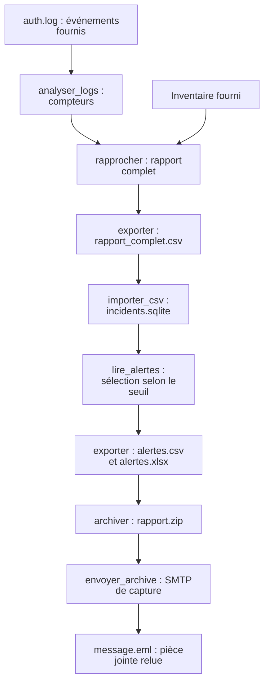

# Suivre une donnée de bout en bout

[Accueil](../README.md) - [Mémo](memo-python-uv.md)

Une démonstration fournie reprend les fonctions utilisées aux TP04, TP05 et TP06. Elle se regarde en cinq minutes dans
le bilan final ; aucun nouveau TP ni code supplémentaire à écrire.

```sh
uv run python outils/suivre_donnee.py
```

Le script crée un nouvel essai dans sorties/fil-donnee/, avec trace.json, les rapports, une base SQLite, un ZIP et
message.eml. Le SMTP reste local et aucun accès SSH n’est lancé. Chaque nouvelle exécution crée un nouvel essai.

## Voir le chemin de la donnée



Le seuil change la sélection, pas le rapport complet ni les lignes conservées dans la base.

## La même observation à chaque étape

| Étape | Ce que devient 192.0.2.1 | Fichier à relire |
| --- | --- | --- |
| Journal fourni | Trois Failed password et un Accepted publickey | donnees/auth.log |
| Analyse | Le compteur des échecs vaut 3 ; le succès reste un autre événement | trace.json |
| Rapprochement | IP source connue : srv-paris-web-01, site paris, 3 échecs | rapport_complet.csv |
| Conservation | La même ligne est stockée dans incidents | incidents.sqlite |
| Sélection | 3 est supérieur ou égal au seuil 2 : cette ligne devient une alerte | alertes.csv |
| Archive | alertes.csv et alertes.xlsx sont les deux membres du ZIP | rapport.zip |
| Transmission | La pièce reçue a les mêmes octets que rapport.zip | message.eml |

Les journaux parlent d’une connexion vers srv-bastion. L’IP après from est la source : le rapprochement nomme cette
source connue, pas la cible du journal. Il ne s’agit pas d’une identité de personne ni d’une preuve d’intrusion.

Le rapport complet conserve trois IP et six échecs. Au seuil 2, la sélection conserve deux IP et cinq échecs. 192.0.2.99
reste inconnue dans le rapport complet, même si son unique échec ne déclenche pas d’alerte.

## Relire la preuve

Dans trace.json, comparer compteur_echecs, rapport_complet.echecs et sqlite.echecs : les trois valeurs valent 3.
Vérifier ensuite csv_archive_identique et smtp.octets_identiques. Une valeur vraie indique une comparaison effectivement
réalisée dans cet essai.

Avant de lancer, prédire ce qui change avec un seuil de 4 : aucune ligne n’est sélectionnée ; les trois lignes et les
six échecs du rapport complet et de la base restent conservés. Le script conserve volontairement le seuil 2 comme
référence. Ce raisonnement réutilise la question de transfert du TP05.

## Les fonctions réutilisées

La démonstration utilise analyser_logs, rapprocher, exporter, importer_csv, lire_alertes, archiver et envoyer_archive.
Lire [suivre_donnee.py](../outils/suivre_donnee.py) pour repérer leurs entrées et leurs résultats. Les ateliers restent
autonomes : leurs données fournies permettent de les refaire séparément.
