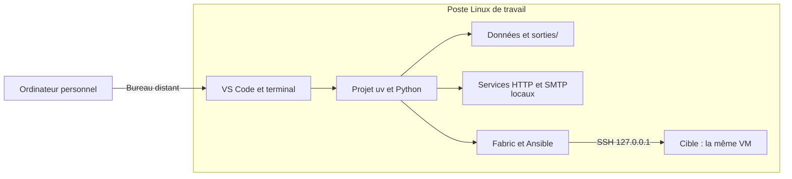

# Installer le projet dans le poste Linux

[Retour à l’accueil](../README.md)

## Situer les machines et les fichiers



`localhost` désigne la machine où le programme s’exécute. L’accès au bureau et les accès SSH sont deux vérifications
distinctes.

## 1. Entrer dans le poste de formation

Utilisez les informations de connexion reçues pour ouvrir votre poste Linux. Ouvrez un terminal dans ce poste et
vérifiez où vous travaillez :

```sh
hostname
id
pwd
```

Le terminal personnel et le terminal du poste distant exécutent les commandes sur des machines différentes.

## 2. Récupérer le projet complet

Transférez ou téléchargez l’archive du cours dans votre dossier utilisateur, décompressez-la, puis ouvrez le dossier
formation-python dans VS Code. Le projet complet contient pyproject.toml, uv.lock, ateliers/, donnees/, src/ et outils/.
Gardez-les ensemble.

Dans le terminal intégré de VS Code, placez-vous dans ce dossier. La commande suivante doit trouver le projet :

```sh
ls pyproject.toml uv.lock
```

## 3. Installer uv si nécessaire

Si uv --version fonctionne, passez à la suite. Sinon, dans le terminal Linux :

```sh
curl -LsSf https://astral.sh/uv/install.sh | sh
```

Rouvrez le terminal, puis vérifiez uv --version. L’installation concerne votre compte utilisateur. Autres méthodes :
[documentation de uv](https://docs.astral.sh/uv/getting-started/installation/).

## 4. Préparer Python, les bibliothèques et Ansible

Depuis la racine du projet :

```sh
uv sync --locked
uv run python outils/diagnostic.py
uv run python outils/bienvenue.py
uv run ansible-playbook --version
```

uv télécharge Python **3.13.13**, crée .venv et installe les versions verrouillées, dont Ansible sur Linux. Le groupe
distant est inclus par défaut. Le premier téléchargement demande Internet. Le Python système et un éventuel Anaconda
restent distincts ; utilisez uv run pour les scripts du cours.

Le diagnostic contrôle les imports, les données et l’écriture dans sorties/. Il affiche le poste, l’interpréteur du
projet et la disponibilité d’Ansible natif. Les accès SSH ne sont pas encore validés à cette étape.

## 5. Choisir l’interpréteur de VS Code

Dans le VS Code du poste Linux, installez l’extension Python si elle manque, puis utilisez
**Python: Select Interpreter** pour choisir .venv/bin/python. Enregistrez vos modifications et lancez les scripts depuis
le terminal intégré avec les commandes des énoncés.

## 6. Préparer les connexions avant le TP 06

Suivez le [guide de préparation SSH locale](../laboratoire/README.md), puis vérifiez :

```sh
uv run python outils/diagnostic.py --distant
```

Un accès au bureau distant ne garantit pas un accès SSH aux cibles. Docker n’est nécessaire que si les cibles
configurées de secours ont été choisies ; le contrôleur Ansible reste dans votre projet uv.

## 7. Faire le premier essai

Ouvrez le [TP 01](../ateliers/01/README.md) :

```sh
uv run python ateliers/01/depart.py
```

« À compléter » est attendu. Les résultats sont dans sorties/. Le [dépannage](depannage.md) aide à identifier une erreur
de dossier, d’interpréteur ou de téléchargement.

## Reprendre sur un ordinateur personnel

Pour installer uv et VS Code sur Windows, macOS ou Linux, suivez la
[procédure locale du README](../README.md#démarrer-sur-votre-ordinateur-personnel).
Elle permet de démarrer le TP 01 sans cible distante et précise les limites de Windows natif.

Les diagnostics Linux et les opérations d’administration du parcours complet nécessitent un environnement adapté ;
les commandes locales du premier TP ne valident pas les accès SSH. Après récupération de votre sauvegarde,
recréez `.venv` avec `uv sync --locked` et adaptez l’inventaire si les accès de formation ne sont plus disponibles.
