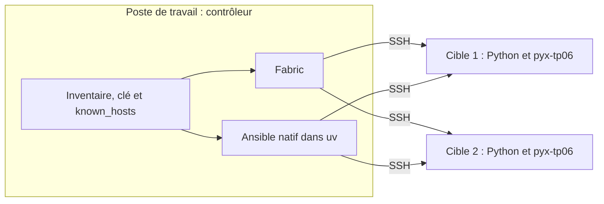
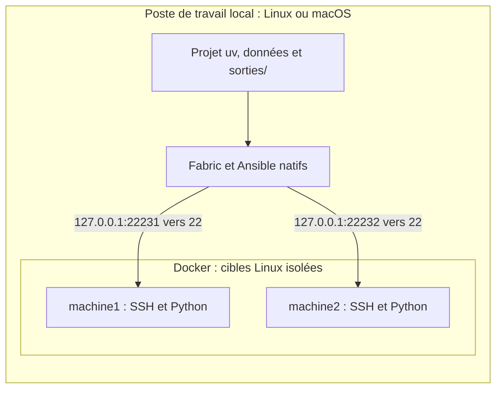

# Configurer les deux cibles SSH du TP 06

[Retour au TP 06](../ateliers/06/README.md)

Fabric et Ansible s’exécutent dans le projet uv du poste Linux. Ils utilisent le même inventaire pour deux cibles Linux
distinctes. Les accès et les clés d’hôte sont préparés avant le créneau de pratique. Les étapes locales du TP restent
utilisables sans connexion SSH.

## Situer le contrôleur et les cibles



Le Python uv exécute les outils sur le contrôleur. Le Python des cibles exécute les tâches transférées ; sa version peut
être différente.

## Utiliser les accès de l’exercice

Un bureau Linux accessible à distance n’implique pas que SSH soit ouvert sur toutes les machines. Utilisez les deux
cibles prévues avec les accès de l’exercice. Le modèle [inventaire.exemple.json](inventaire.exemple.json) montre le
format ; ses adresses d’illustration ne sont pas des accès utilisables.

La configuration locale contient :

```text
.labo/
  inventaire.json
  id_ed25519
  known_hosts
```

L’inventaire indique pour chaque cible : nom, hote, port, utilisateur, python et dossier_tp. Les chemins cle et
known_hosts sont relatifs à l’inventaire lorsqu’ils ne sont pas absolus. Le dossier cible se termine par pyx-tp06 et
doit être accessible au compte configuré. Le Python cible est vérifié sur cette machine ; il peut différer du Python uv
du contrôleur.

Vous pouvez utiliser un autre emplacement en définissant PYX_INVENTAIRE vers le fichier JSON concerné. Deux alias d’un
même hôte et port sont refusés. Ne copiez pas les clés privées dans les exercices ni dans une archive partagée.

## Vérifier les prérequis

Depuis la racine du projet, dans le terminal Linux :

```sh
uv sync --locked
uv run ansible-playbook --version
uv run python outils/diagnostic.py --distant
```

Le dernier contrôle doit confirmer les deux accès Linux. Les clés d’hôte inconnues sont refusées ; l’authentification du
client et l’identité du serveur sont deux vérifications différentes.

## Exécuter le TP

```sh
uv run python ateliers/06/depart.py --laboratoire
uv run python outils/verifier.py tp06 --complet --laboratoire
```

--laboratoire signifie exécuter Fabric et Ansible sur les accès configurés, quelle que soit l’origine des cibles. Le
pilote distant.py est fourni : il produit collecte.csv, collecte-partielle.json, un inventaire Ansible généré, les
comptes rendus d’aperçu et d’application et preuve-ansible.json.

Le test d’échec utilise un port local réservé sans serveur ; il n’arrête aucune machine. Les mesures concernent chaque
cible au moment du relevé.

## Observer l’état souhaité

Le [playbook](rapport.yml) assure le dossier dédié et rapport.txt avec le mode 0644. Il ne supprime pas ce fichier avant
chaque essai. Le premier passage peut déjà indiquer changed=0 ; le second passage identique doit conserver cet état.

Lisez les les comptes rendus d’aperçu et d’application et preuve-ansible.json. Le pilote relit réellement le contenu et
les permissions via SSH. Après une modification exploratoire, rétablissez « Collecte système : poste prêt. » avant le
contrôle de référence.

La chaîne finale joint la collecte du même essai au diagnostic et aux alertes. Une collecte explicitement fournie mais
partielle bloque la diffusion. Sans --laboratoire, diagnostic.json indique que la collecte distante n’a pas été
exécutée.

## Secours : deux cibles Docker

Si deux hôtes accessibles ne sont pas disponibles, ce secours fournit deux cibles locales isolées. Docker doit être
disponible dans le poste Linux ; Ansible reste natif.



Ce secours peut aussi être préparé sur un ordinateur personnel Linux ou macOS. Les services HTTP et SMTP des autres TP
restent dans le poste qui exécute le projet. Les mesures des cibles décrivent les conteneurs.

```sh
docker info
uv run python outils/laboratoire.py preparer
uv run python outils/diagnostic.py --distant
```

Le script crée deux cibles SSH, leurs clés et l’inventaire .labo/inventaire.json. Les services écoutent sur
127.0.0.1:22231 et 127.0.0.1:22232. Un inventaire personnalisé existant est conservé : le script refuse de le remplacer.

Les noms machine1 et machine2 et le compte apprenant sont propres à ce secours. Le contrôleur Ansible n’est pas
conteneurisé. df mesure le système de fichiers des conteneurs.

```sh
uv run python outils/laboratoire.py statut
uv run python outils/laboratoire.py arreter
```

L’arrêt retire seulement les conteneurs et le réseau de ce secours ; images et clés restent disponibles. Aucun arrêt
n’est nécessaire pour les cibles fournies par les accès de formation.

## Comparer avec la solution

```sh
uv run python ateliers/06/corrige.py --laboratoire
uv run python outils/verifier.py tp06 --corrige --complet --laboratoire
```

Sans cibles disponibles, travailler sans --laboratoire et constater la portée locale. Cela ne valide pas
l’administration de plusieurs machines.

Le pilote TP06 prépare deux auth.log fictifs dans les dossiers dédiés, les récupère réellement par SFTP et écrit
auth-collecte.log et preuve-logs.json : deux sources, quatre événements, deux échecs pour 192.0.2.42 et deux succès.
Vérifier les fichiers reçus, la concaténation et le manifeste. Aucun journal système personnel n’est transféré.

Le module Ansible script transfère et exécute controle_cible.py sur chaque cible. preuve-scripts.json doit correspondre
aux identités de collecte.csv. Ce contrôle ne lit que l’identité ; changed_when: false décrit son absence de changement
d’état, et ne signifie pas que le script n’est pas rejoué. La capture des résultats reste dans le dossier dédié.
