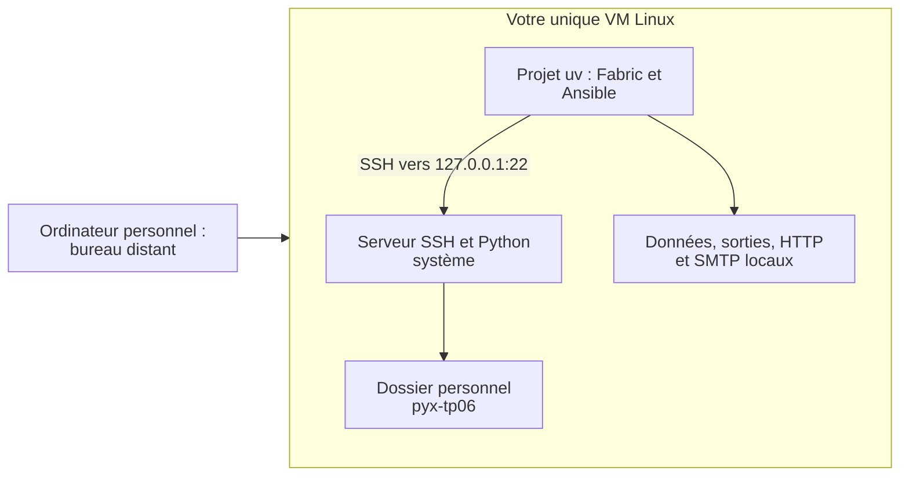
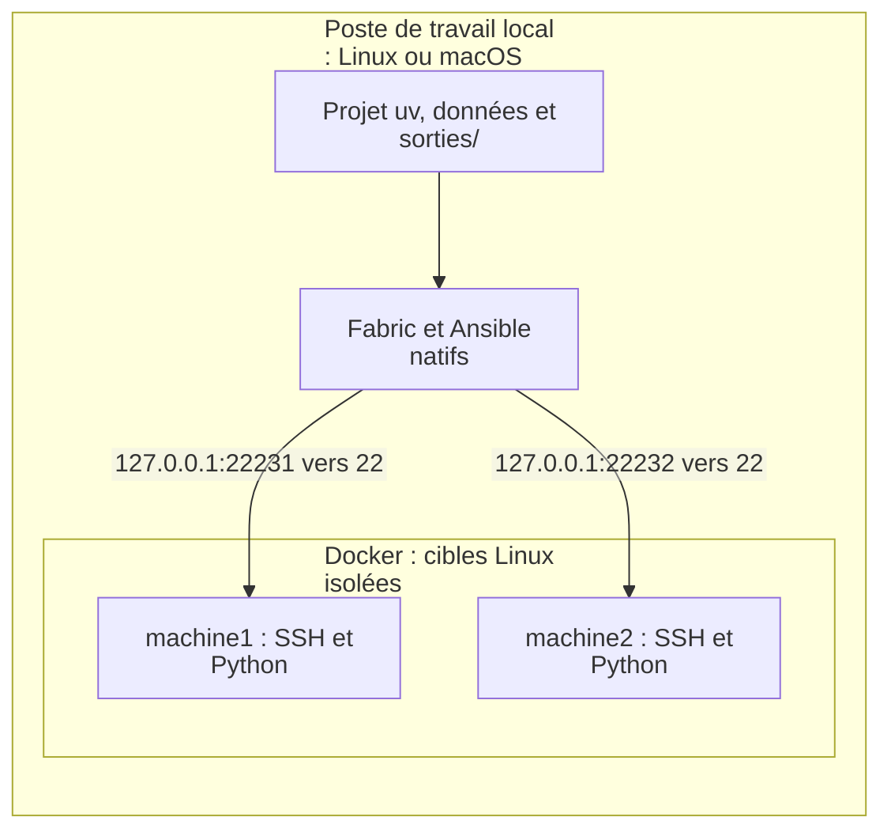

# Configurer SSH sur votre VM Linux

[Retour au TP 06](../ateliers/06/README.md)

**Une VM par étudiant suffit.** Elle joue deux rôles : contrôleur (uv, Fabric et Ansible) et cible SSH
(`127.0.0.1`, la même VM). C’est une vraie connexion SSH, mais pas une administration entre deux machines distinctes.
La variante à deux cibles reste facultative pour illustrer le passage à un parc.

## Comprendre les deux rôles



`localhost` désigne la machine où tourne le programme. Lancez donc toutes les commandes suivantes **dans la VM**.
Les identifiants du portail ou de RustDesk ne configurent ni le compte Linux ni SSH.

## Préparer le serveur SSH avant le TP

La préparation est hors du créneau de 40 minutes. Il faut connaître le compte Linux et disposer de l’aide de
l’administrateur pour installer/démarrer SSH si nécessaire. Sur Debian ou Ubuntu avec systemd :

```sh
sudo apt-get update
sudo apt-get install -y openssh-server python3
sudo systemctl start ssh
```

Si `sudo` est refusé ou si la VM n’utilise pas systemd, faites préparer le service par l’assistance avant de poursuivre.
Aucun accès aux VM des autres participants n’est nécessaire.

## Préparer la clé et l’inventaire local

Depuis la racine du projet, sous votre compte Linux habituel :

```sh
uv sync --locked
uv run python outils/preparer_ssh_local.py
uv run python outils/diagnostic.py --distant
```

Le script génère une clé dédiée dans `.labo/`, ajoute sa clé publique à votre `~/.ssh/authorized_keys` sans effacer
les clés existantes et lit les clés publiques du serveur dans `/etc/ssh/`. Il teste SSH avant d’écrire l’inventaire.
Le service doit écouter sur le port 22. Il refuse de remplacer un inventaire déjà présent.
Si un ancien inventaire à deux cibles existe, déplacez-le sous un autre nom pour le conserver avant de relancer.

Le contrôle doit annoncer **1 cible SSH configurée : OK** (le message utilise la forme `cible(s)`).
Le modèle [inventaire.exemple.json](inventaire.exemple.json) illustre les champs ; le script renseigne automatiquement
votre utilisateur et votre dossier personnel. Les noms `user` du modèle sont des exemples à remplacer.

```text
.labo/
  inventaire.json
  id_ed25519_local
  id_ed25519_local.pub
  known_hosts_local
```

Ces fichiers restent locaux et sont exclus de Git et de la sauvegarde étudiante. Vous pouvez utiliser un autre
inventaire avec `PYX_INVENTAIRE`. Les chemins de clé relatifs sont résolus depuis le fichier d’inventaire.

## Ce que vérifie le TP

```sh
uv run python outils/collecter_parc.py --laboratoire
uv run python outils/verifier.py tp06 --complet --laboratoire
```

Complétez d’abord les fichiers indiqués dans le TP. Pour exécuter la référence, ajoutez `--corrige` au vérificateur.
`--laboratoire` signifie « exécuter SSH et Ansible », même si la cible est la VM elle-même.

| Preuve | Une cible locale | Variante à deux cibles |
| --- | --- | --- |
| `collecte.csv` | Une mesure Linux | Deux mesures Linux |
| `preuve-scripts.json` | Une identité relue | Deux identités relues |
| Logs transférés par SFTP | Un fichier, deux événements | Deux fichiers, quatre événements |
| Échecs / succès dans ces logs fictifs | Un / un | Deux / deux |
| Essai d’erreur contrôlée | Une réussite et un port fermé simulé | Même scénario contrôlé |

Le port fermé est créé sur le contrôleur ; ce n’est pas une deuxième VM. Aucun serveur réel n’est arrêté.
Les contrôles comparent le résultat à **toutes les cibles déclarées**, pas à un nombre fixé à deux.

Le playbook prépare `~/pyx-tp06`, puis y écrit `supervision.ini` en mode `0640`, avec un seuil disque de 80
et un intervalle de 60 secondes. Il crée aussi les preuves et un journal fictif pour le transfert SFTP.
L’aperçu de configuration ne modifie pas ce fichier ; l’application le met en conformité et la répétition doit
indiquer `changed=0`. La préparation des preuves précède l’aperçu.

Sans `--laboratoire`, la chaîne produit seulement le rapport local : cela ne valide pas SSH, même sur une seule VM.

## Facultatif : administrer deux cibles Docker

Cette variante illustre un parc de plusieurs machines ; elle n’est pas nécessaire au TP obligatoire. Docker doit être
disponible. Gardez votre inventaire local en le déplaçant avant de préparer cette variante ; ne le supprimez pas.



Ce secours peut aussi être préparé sur un ordinateur personnel Linux ou macOS. Les services HTTP et SMTP des autres TP
restent dans le poste qui exécute le projet. Les mesures des cibles décrivent les conteneurs.

```sh
docker info
uv run python outils/laboratoire.py preparer
uv run python outils/diagnostic.py --distant
```

Le script crée deux cibles SSH, leurs clés et l’inventaire .labo/inventaire.json. Les services écoutent sur
127.0.0.1:22231 et 127.0.0.1:22232. Un inventaire personnalisé existant est conservé : le script refuse de le remplacer.

Les noms machine1 et machine2 et le compte apprenant sont propres à ce secours. Le contrôleur Ansible n’est pas
conteneurisé. df mesure le système de fichiers des conteneurs.

```sh
uv run python outils/laboratoire.py statut
uv run python outils/laboratoire.py arreter
```

L’arrêt retire seulement les conteneurs et le réseau de ce secours ; images et clés restent disponibles. Aucun arrêt
n’est nécessaire pour les cibles fournies par les accès de formation.

## Passer de la VM à un parc

Le modèle [inventaire.deux-cibles.exemple.json](inventaire.deux-cibles.exemple.json) montre deux entrées. Chaque
nouvelle cible a son adresse, son compte, ses clés d’hôte et son Python. La boucle de collecte et le playbook parcourent
déjà l’inventaire ; aucune duplication du code n’est nécessaire. Deux alias du même hôte et port sont refusés. La
disponibilité réseau et l’identité de chaque machine restent à vérifier dans une vraie administration distante.
